## Overview

The **Communication Console** section allows users to configure and add new workflows or conversations on the DIKSHA Tara WhatsApp Bot. Thus, state administrators can use this section to roll-out various use cases to its users through the DIKSHA Tara WhatsApp Bot, for example - administrative surveys for teachers, assessments for students.

## Prerequisite

<table>
<tr>
  <th>Image with instructions</th>
</tr>
<tr>
  <td>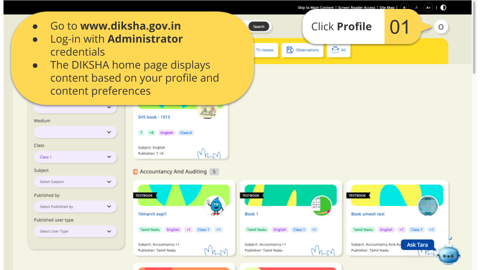</td>
</tr>
</table>

### Adding a Conversation 

To add a new conversation in the ODK form: 

<table>
<tr>
  <th>Image with instructions</th>
</tr>
<tr>
  <td>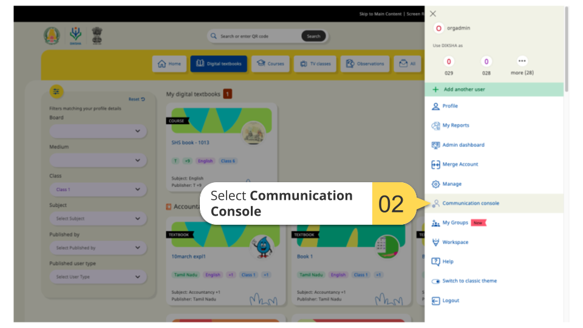</td>
</tr>
<tr>
  <td>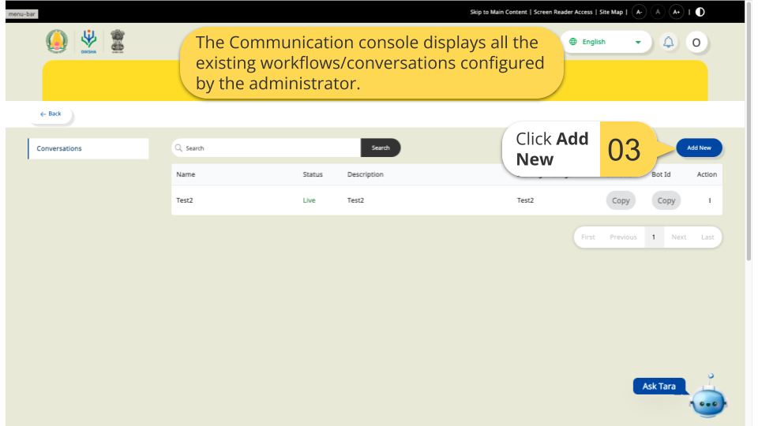</td>
</tr>
<tr>
  <td>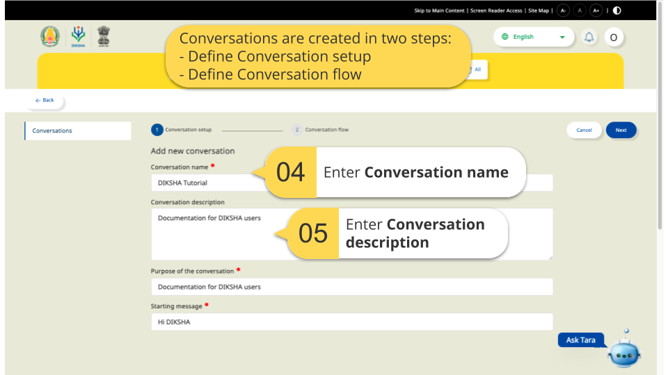</td>
</tr>
<tr>
  <td>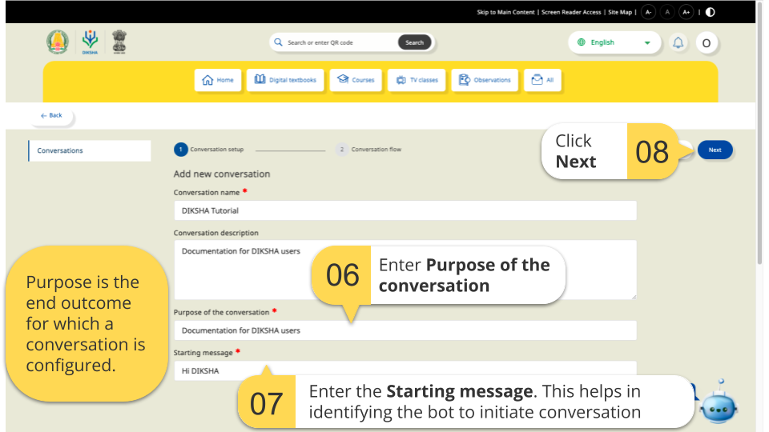</td>
</tr>
<tr>
  <td>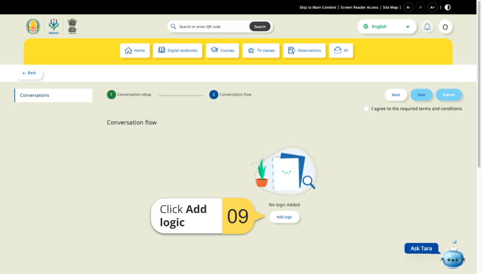</td>
</tr>
<tr>
  <td>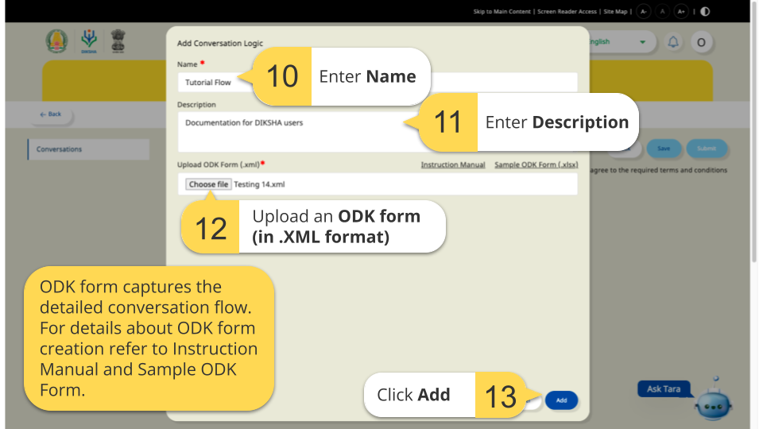</td>
</tr>
<tr>
  <td>For details about ODK form creation refer to <a target="_blank" href="https://preprodall.blob.core.windows.net/uci/UCI%20_%20ODK%20Instruction%20Manual.pdf">Instruction Manual</a> and <a target="_blank" href= "https://preprodall.blob.core.windows.net/uci/Sample_ODK.xlsx">Sample ODK Form </a></td>
</tr>
<tr>
  <td>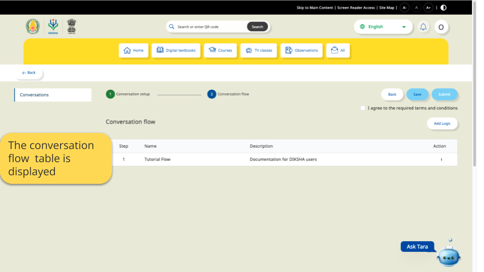</td>
</tr>
<tr>
  <td>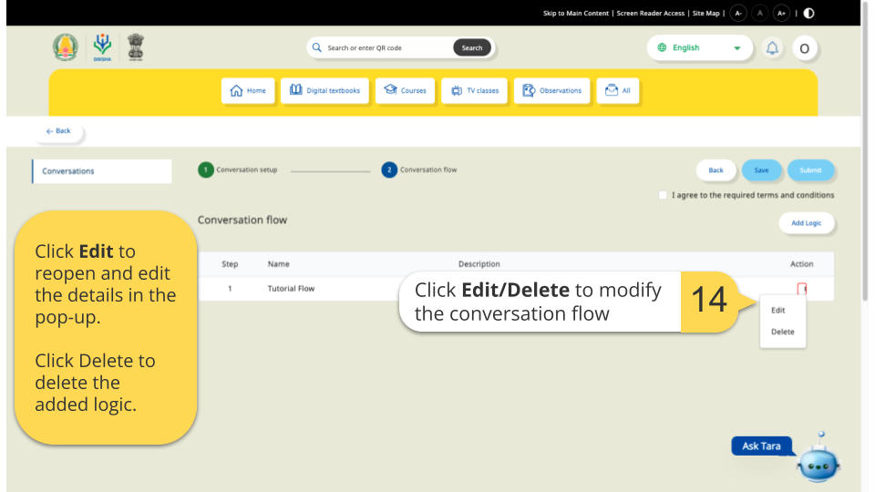</td>
</tr>
<tr>
  <td>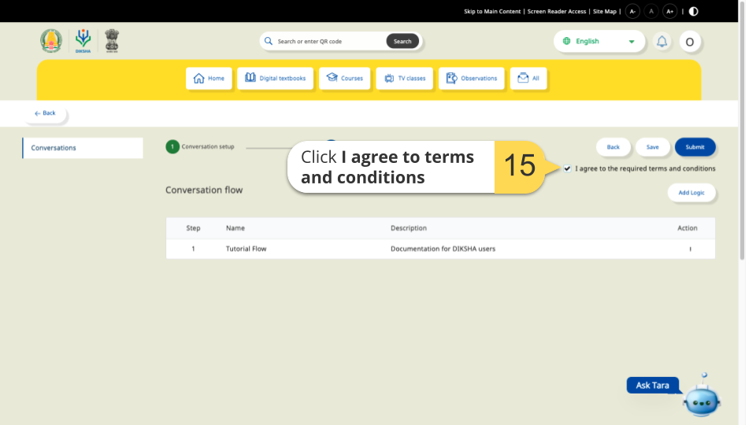</td>
</tr>
<tr>
  <td>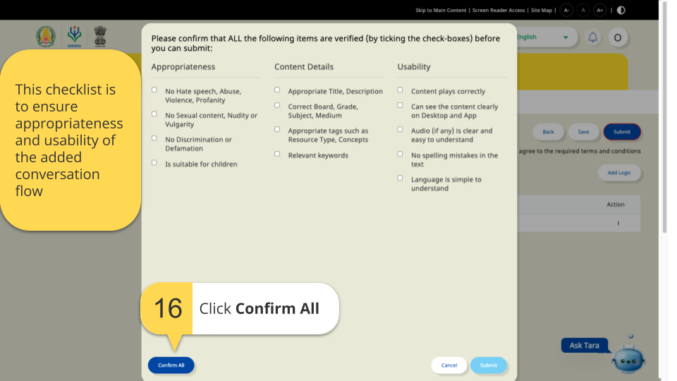</td>
</tr>
<tr>
  <td>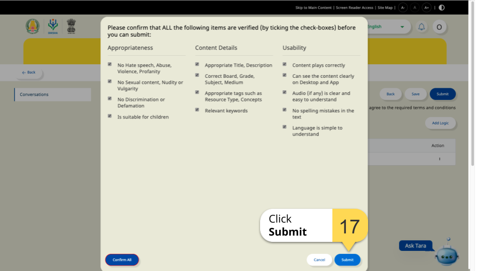</td>
</tr>
<tr>
  <td>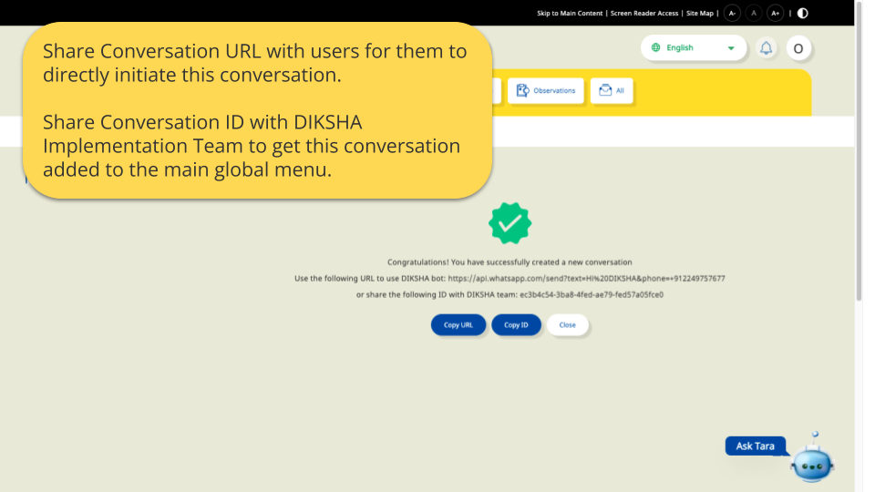</td>
</tr>
</table>

## Modifying a Conversation

Admin can edit, delete and disable a conversation.

### Edit a Conversation

To update any existing conversation  

<table>
<tr>
  <th>Image with instructions</th>
</tr>
<tr>
  <td>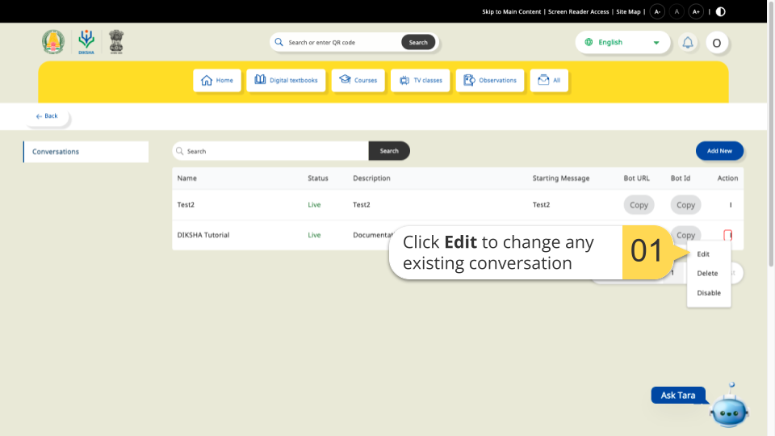</td>
</tr>
</table>

### Delete a Conversation

To delete any existing conversation  

<table>
<tr>
  <th>Image with instructions</th>
</tr>
<tr>
  <td>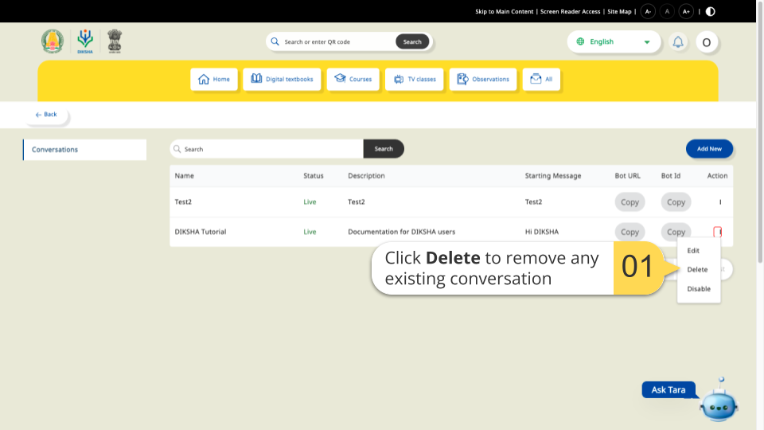</td>
</tr>
</table>

### Disable a Conversation

To enable or disable any existing conversation  

<table>
<tr>
  <th>Image with instructions</th>
</tr>
<tr>
  <td>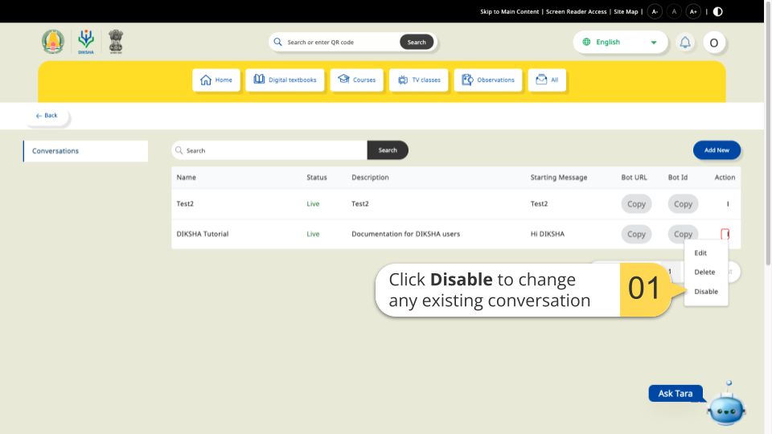</td>
</tr>
<tr>
  <td>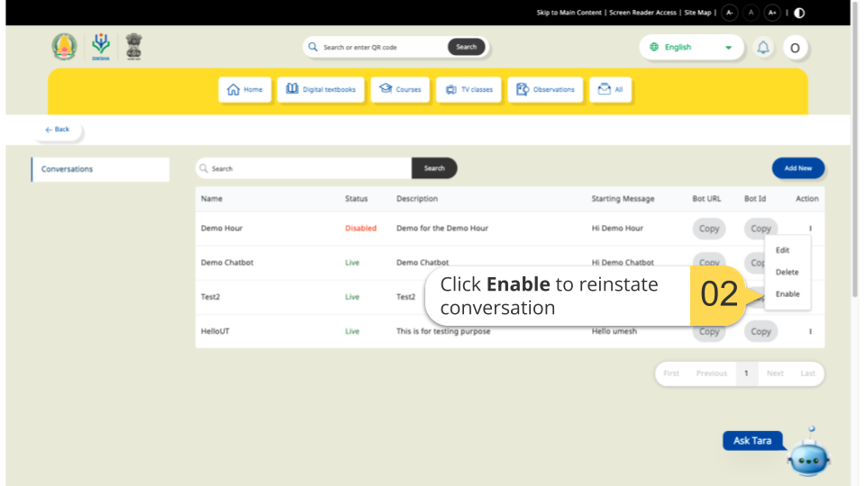</td>
</tr>
</table>
