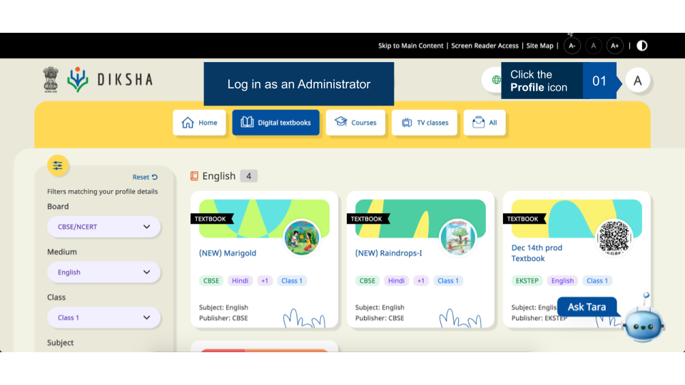
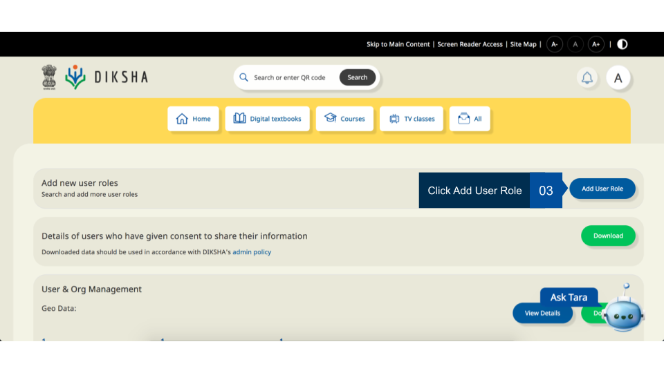
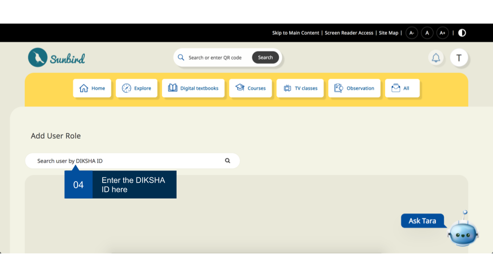
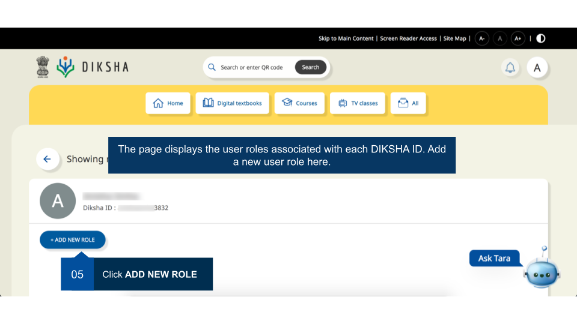
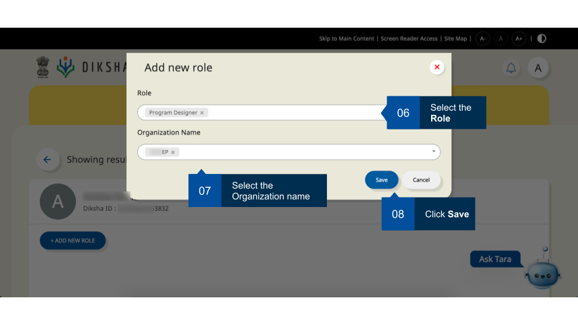
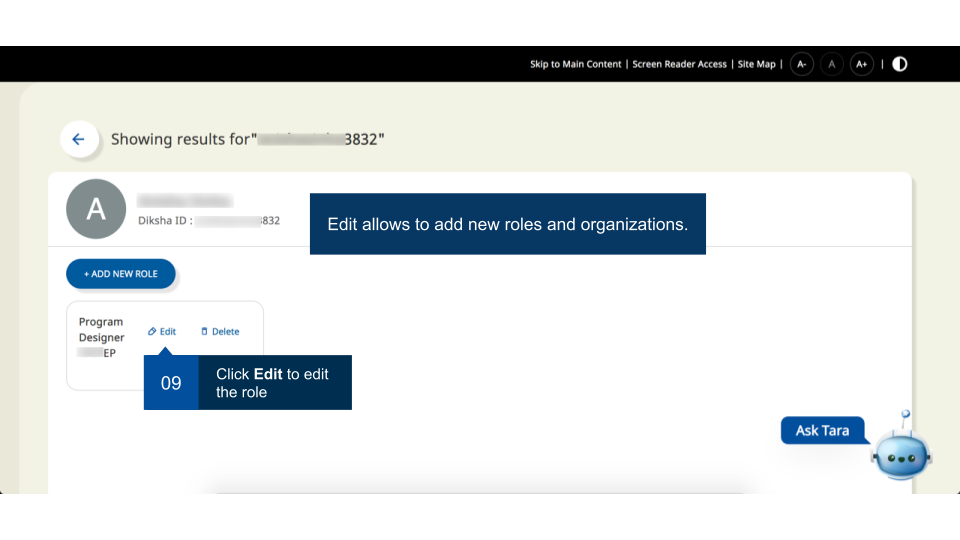
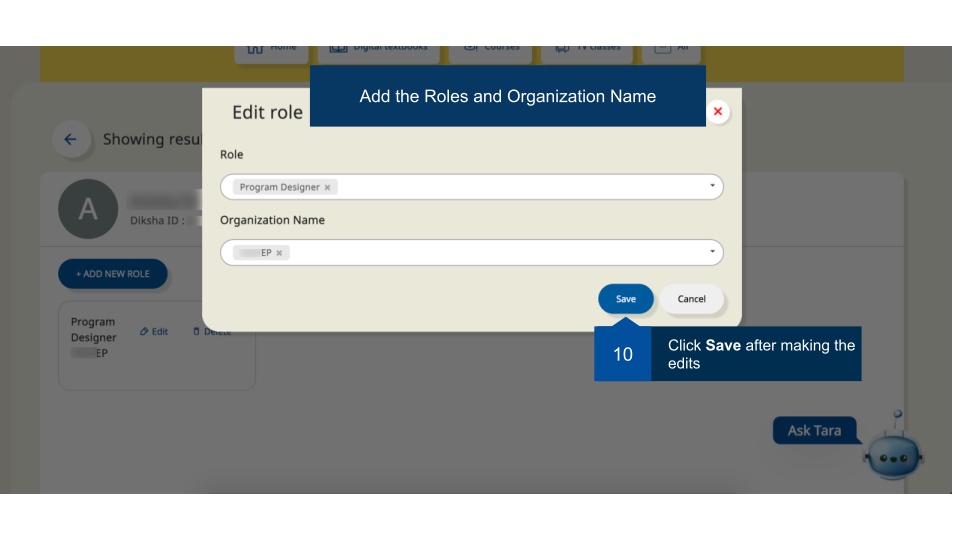
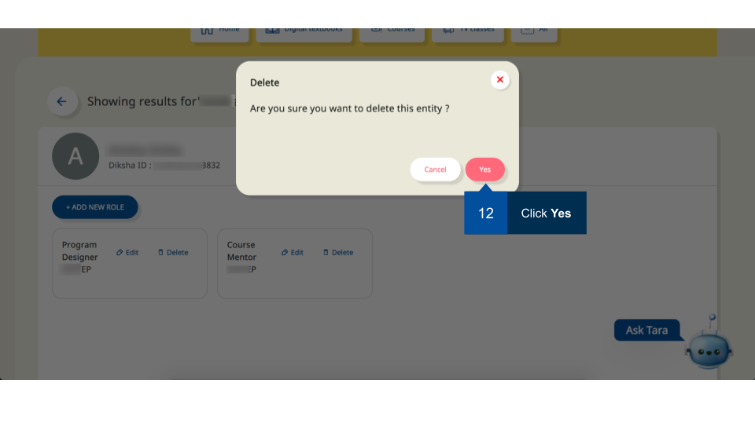

An organisation Administrator can assign one or multiple roles to the users. 

## Prerequisites

Log in to DIKSHA with administrator credentials.

### [Search user](./searching-user.html) and Assign Roles   

<table>
<tr>
  <th>Image with instructions</th></tr>
   <tr> <td></td></tr>
   <tr> <td></td></tr>
   <tr> <td></td></tr>
   <tr> <td></td></tr>
   <tr> <td></td></tr>
   <tr> <td></td></tr>
   <tr> <td></td></tr>
   <tr> <td></td></tr>
   <tr> <td></td></tr>
   <tr> <td></td></tr>
</table>