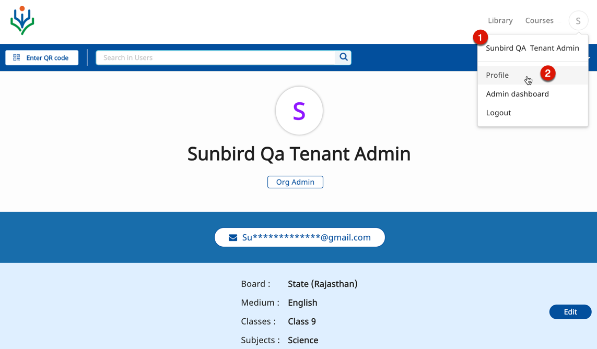

One of the many responsibilities of the state organization administrator (root org admin) on DIKSHA is to manage users by assigning and updating roles and responsibilities to users, and updating user details as required within an organization. The administrator can assign more than one role to a user.

## Prerequisites

<table>
  <tr>
    <th style="width:35%;">Step</th>
    <th style="width:65%;">Screen</th>
  </tr>
  <tr>
    <td>1. Log in as an administrator  2. Click the <b>Profile</b> tab from the profile menu </td>
    <td></td> 
  </tr>
    </table>    

## Uploading User

A State administrator can upload a list of valid State users for DIKSHA. When a user signs up on DIKSHA, the system validates if the credentials submitted by the user match the credentials uploaded by the administrator. If both the credentials match, the user is verified as a state registered user. To know more refer [Uploading User](./uploading-user.html){:target="_blank"}

## Searching for User

The administrator can search for users. To know more refer [Searching user](./searching-user.html){:target="_blank"} 

## Assigning User Roles

An organisation Administrator can assign roles to the users. To know more refer [Assigning User Roles](./assigning-user-role.html){:target="_blank"}

## User and Organisation Data

The State admin can view school data that has been successfully created for the State. This data comprises summary of districts, blocks and schools. These details are present under the **Manage** option which only the state admin has the rights to view. To know more refer [User and Organisation Data](./user-location.html){:target="_blank"}
