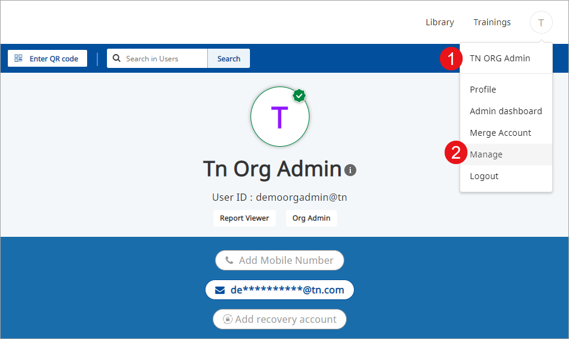
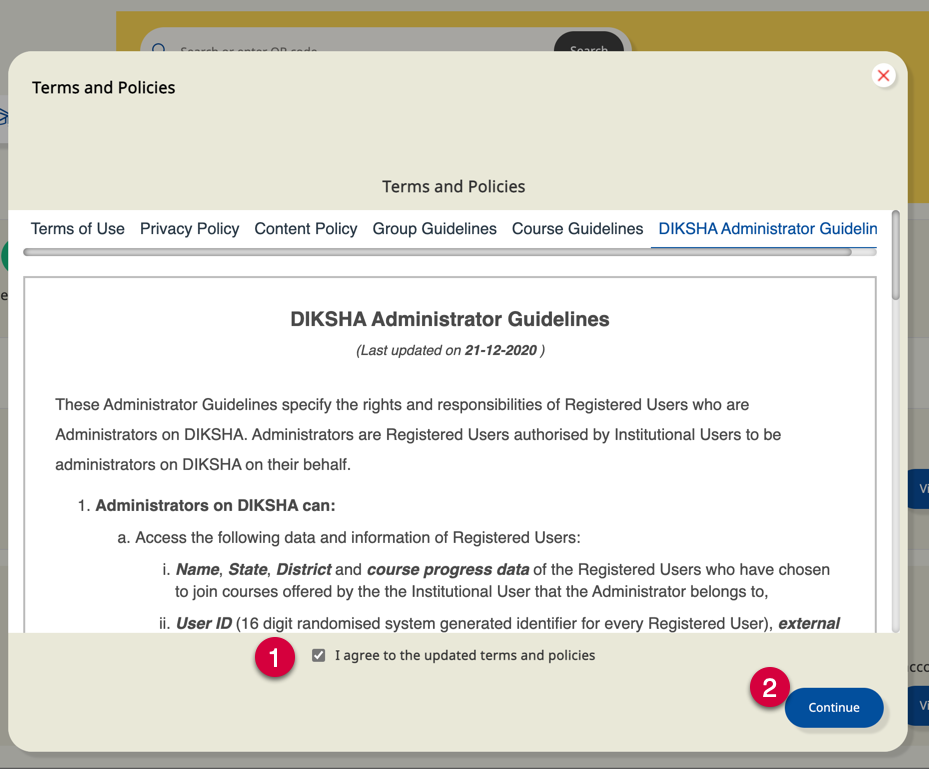
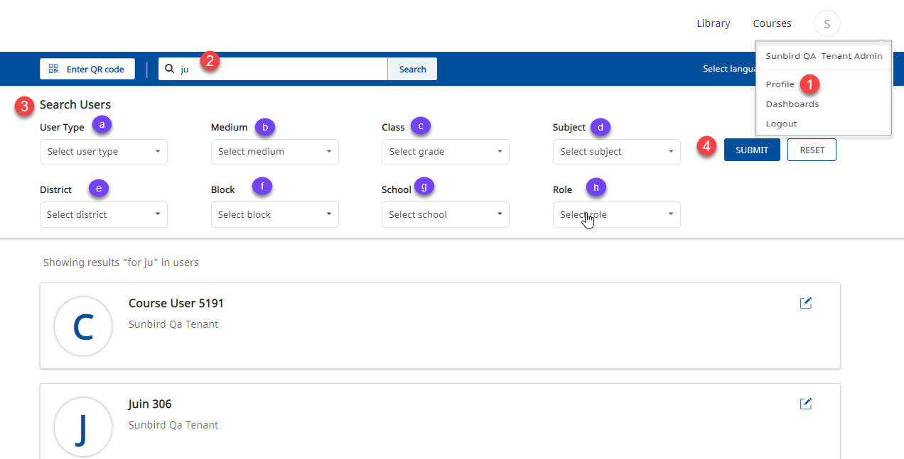

The organization administrator can search for users on the <b>Profile</b> tab

## Prerequisites

<table>
  <tr>
    <th style="width:35%;">Step</th>
    <th style="width:65%;">Screen</th>
  </tr>
  <tr>
    <td>1. Log in as an administrator 
     2. Click <b>Manage</b> from the profile menu, a Terms and Policies pop-up is displayed </td>
    <td></td>
  </tr>
  <tr>
    <td>On <b>Terms and Policies</b> pop-up,   
     1. Select the check box
       2. Click <b>Continue</b> to accept the DIKSHA adminitrator guidelines </td>
    <td></td>
  </tr>
    </table>    

### Searching a User

<table>
  <tr>
    <th style="width:35%;">Step</th>
    <th style="width:65%;">Screen</th>
  </tr>
  <tr>
    <td> 1. Click <b>Profile</b> 
     2. You can search for user details by typing the user name in the search box 3. You can also apply the following filters for your search:
     &emsp;a. User type
     &emsp;b. Medium
     &emsp;c. Class
     &emsp;d. Subject
     &emsp;e. Block
     &emsp;f. District
     &emsp;g. School
     &emsp;h. Role
     4. Click <b>Submit</b> to apply the filters Search results are displayed accordingly</td>
    <td></td>
  </tr>
</table>

