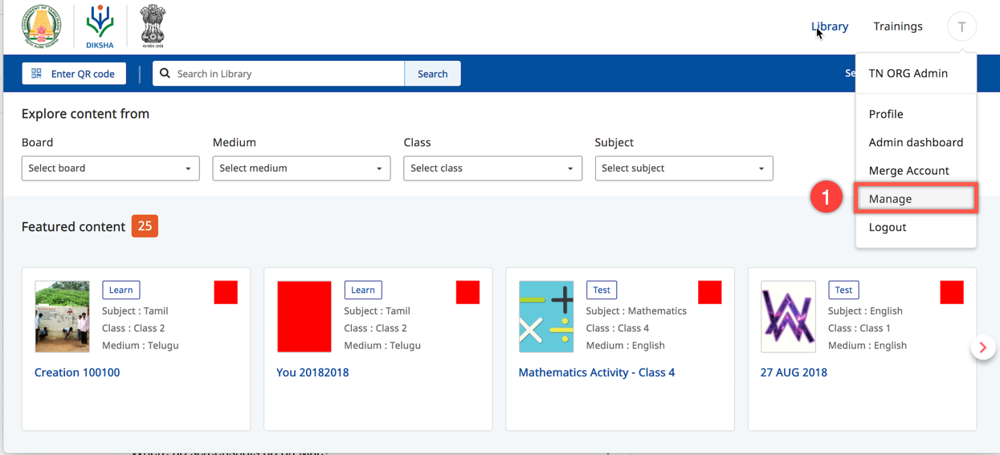
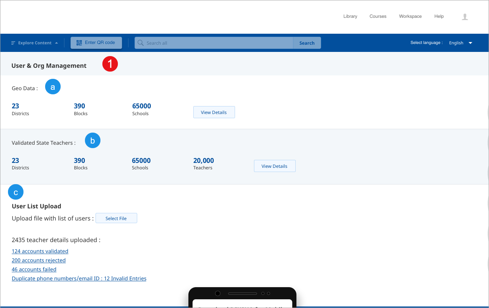
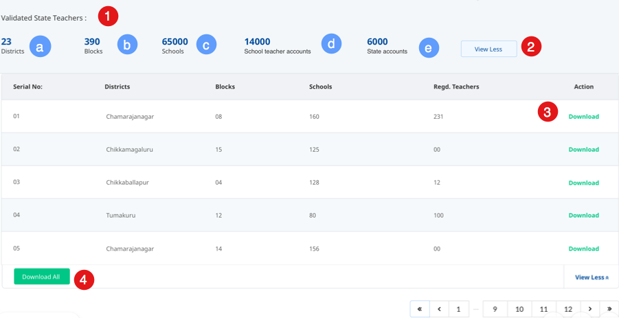
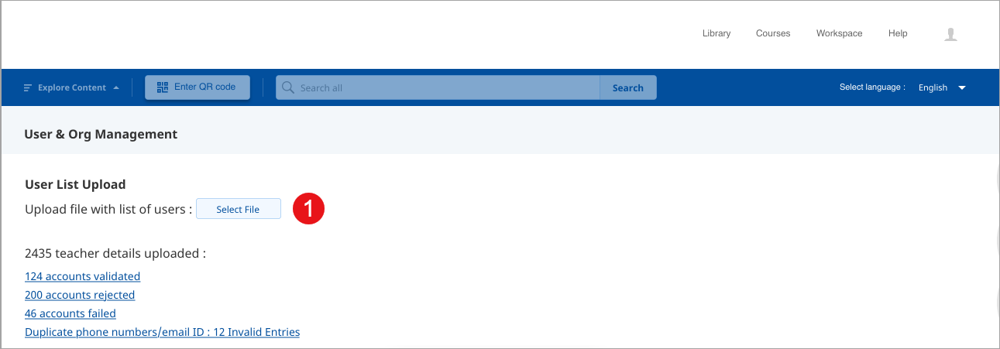
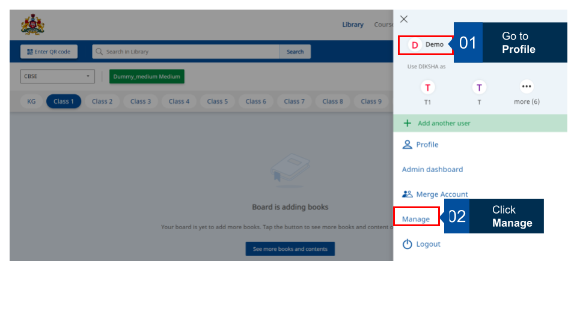
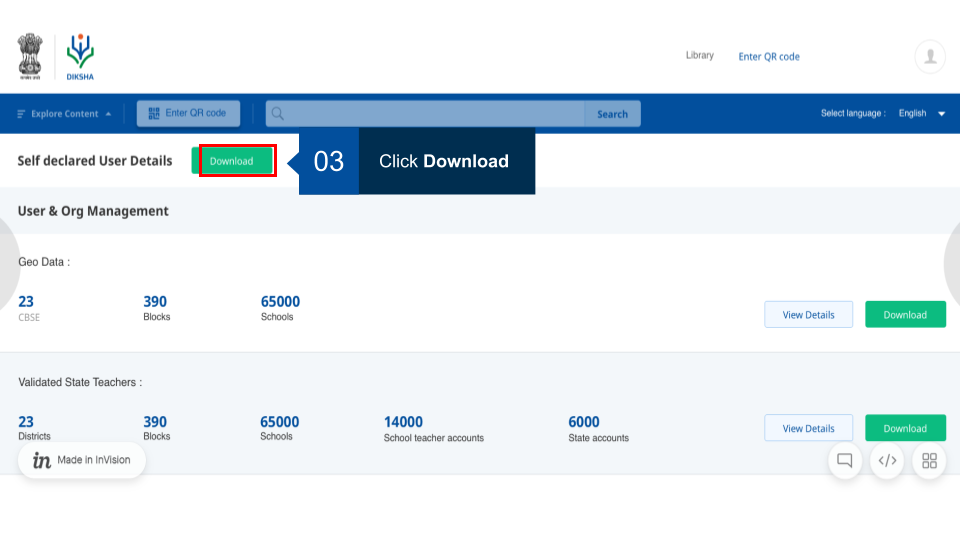

---

title: User and Organisation Data
description: user organisation data 
keywords: user data, organisation data
showSidebar: true
allowSearch: true
order: 4

---

The State Admin can view school data that has been successfully created for the State. This data comprises summary of districts, blocks and schools. These details are present under the Manage option which only the State admin has the rights to view. 

The State Admins can download the school data for a state in the form of a csv file.

<table>
  <tr>
    <th style="width:35%;">Step</th>
    <th style="width:65%;">Screen</th>
  </tr>
  <tr>
    <td>1. Log in as an administrator 
     2. Click <b>Manage</b> from the profile menu, a Terms and Policies pop-up is displayed </td>
    <td></td>
  </tr>
  <tr>
    <td>On <b>Terms and Policies</b> pop-up,  
     1. Select the check box
       2. Click <b>Continue</b> to accept the DIKSHA adminitrator guidelines </td>
    <td></td>
  </tr>
    </table>    

<table>
  <tr>
    <th style="width:35%;">Step</th>
    <th style="width:65%;">Screen</th>
  </tr>
  <tr>
    <td>1. Log in as an administrator 
       2. Click the <b>Manage</b> option from the profile menu, a Terms and Policies pop-up is displayed</td>
    <td></td>
  </tr>
  <tr>
    <td>On <b>Terms and Policies</b> pop-up,   
     1. Select the check box
       2. Click <b>Continue</b> to accept the DIKSHA adminitrator guidelines </td>
    <td></td>
  </tr>
  <tr>
    <td>1. You can update:
     a. Geo Location 
     b. Validated State Teachers
     c. Upload User List</td>
    <td></td>
  </tr>
</table> 

### Viewing Validated Teacher Data

<table>
  <tr>
    <th style="width:35%;">Step</th>
    <th style="width:65%;">Screen</th>
  </tr>
  <tr>
    <td>1. You can view the following details under Validated State Teachers:
     &emsp;a. Districts
     &emsp;b. Blocks
     &emsp;c. Schools
     &emsp;d. School teacher accounts
     &emsp;e. State accounts
     2. Click <b>View more</b>/<b>View less</b> for detailed of all districts, blocks, schools, and teachers
     3. Click the <b>Download</b> to download the teacher details of that district
     4. Click the <b>Download All</b> button to download details of all teachers</td>
    <td></td>
  </tr>
</table>

### Uploading State User

<table>
  <tr>
    <th style="width:35%;">Step</th>
    <th style="width:65%;">Screen</th>
  </tr>
  <tr>
    <td>1. Click <b>Select file</b> to upload the list of State teachers</td>
    <td></td>
  </tr>
</table>

## Download Self-declared Teacher Details

A State administrator can download details declared by teachers themselves in the Self Declaration Form. The download button is not activated if there is no self-declared teacher data or if there are no data updates.

<table>
  <tr>
    <th style="width:65%;">Screen</th>
  </tr>
  <tr><td></td></tr>
  <tr><td></td></tr>
</table>

**Note:** If there is no data or no data update, the **Download** button is not active.  

### Merging DIKSHA ID and State user account 

There is an option to merge the registered DIKSHA logged-in user account and the verified State user account. The user’s profile course progress will be added to the merged State account.  If the logged-in user also manages other users, the profile history and the list of all the managed users will be added to and can be viewed as a combined list from the user’s State account when the two are successfully merged.  
A logged-in registered user can have a maximum of 30 managed users under their profile.
