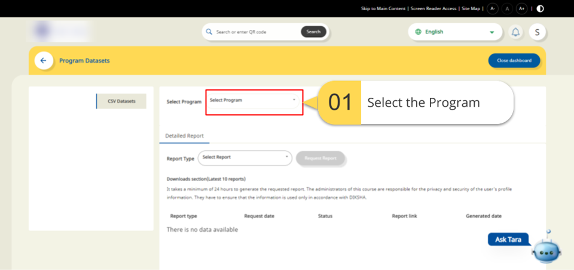
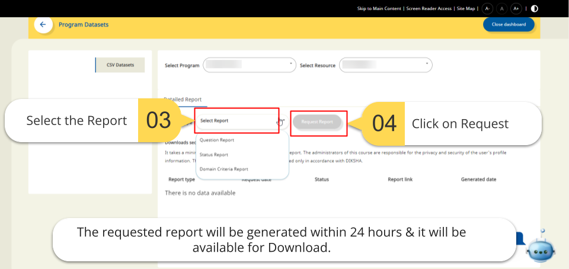
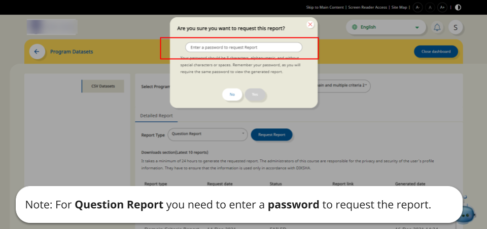
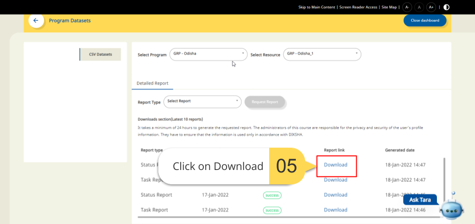

## Overview

Reports in the program dashboard are generated on-demand based on user requests. The requested report is generated within 24 hours. Reports are dependent on the selection of the program and resources. There are four kinds of detailed reports:
- Task Detail Report
- Status Report 
- Question Report
- Domain Criteria Report

### Detailed reports:

| **Report name**         | **What does it contain?**                                        | **Who can request for the report?**                                             | **Additional instructions**                                      |
|:----------------------- |:------------------------------------------------------------ |:------------------------------------------------------------ |:------------------------------------------------------------ |
| Task Detail Report | This contains user-level project data information without the user’s Personally Identifiable Information(PII). | Program Manager who is mapped to a Program that has Improvement project resources. | This report is exclusive for Improvement Projects. The program manager needs to give the password to the report before requesting it. |
| Status Report | This contains user-level resource progress information without the user’s Personally Identifiable Information(PII). | Program Manager and Program Designer who is mapped to a Program. | Status Report is available for the following resources mapped in a program: Observations, Improvement Projects, Survey. |
| Question Report | This contains user wise data of responses for each question in the observation or survey form without the user’s Personally Identifiable Information(PII). | Program Manager who is mapped to the Program containing the observation/survey form. | The Question report is available for observations and surveys. The program manager needs to create a password for the report before requesting it. |
| Domain criteria Report | This contains user-wise data of the levels obtained on each domain and criteria specifically for observation form with rubrics. This doesn’t have any user’s Personally Identifiable Information(PII). | Program Manager who is mapped to the Program containing rubric based observation. | The Domain criteria report is available only for the rubric based observations. |

### Accessing reports

<table>
  <tr>
    <th style="width:35%;">Image with instructions</th>
 </tr>
 <tr>
  <td>
  </td>
  </tr>
  <tr>
  <td>
  </td>
  </tr> 
  <tr>
  <td>
  </td>
  </tr>
  <tr>
  <td>
  </td>
  </tr> 
    <tr>
  <td>
  </td>
  </tr> 
  </table>

