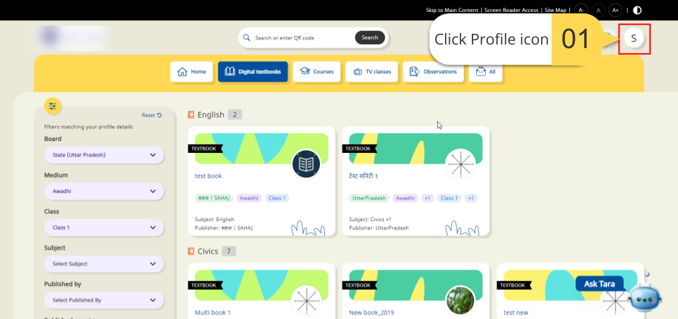
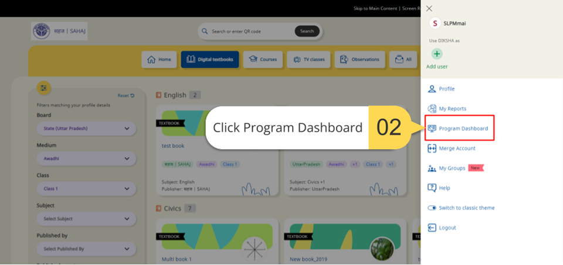
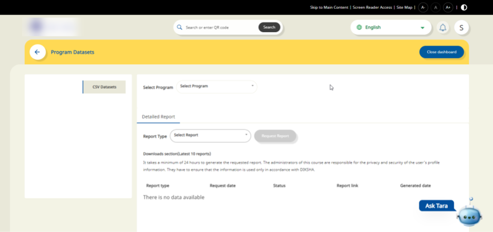

## Overview

Program Dashboards are accessible to anyone who has Program Manager and Program Designer rights on DIKSHA platform. To access program's report, the Program Manager and Designer need to be mapped to that Program.
For Eg: Program Manager A has access to the Program data, only they are mapped as a Program Manager for Program.
These reports are generated on-demand based on user requests. The requested report is generated within 24 hours.

### Accessing the Program Dashboard

<table>
  <tr>
    <th style="width:35%;">Image with instructions</th>
 </tr>
 <tr>
  <td></td>
  </tr>
  <tr>
  <td></td>
  </tr> 
  <tr>
  <td></td>
  </tr> 
  </table>
