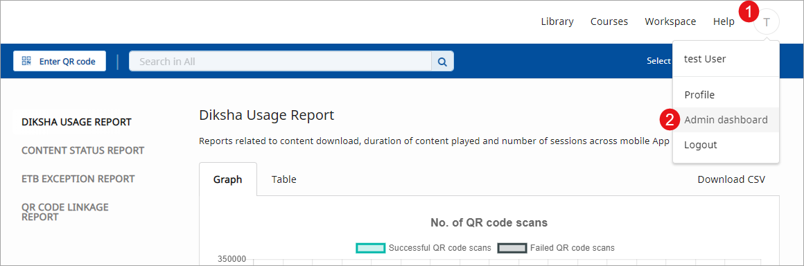
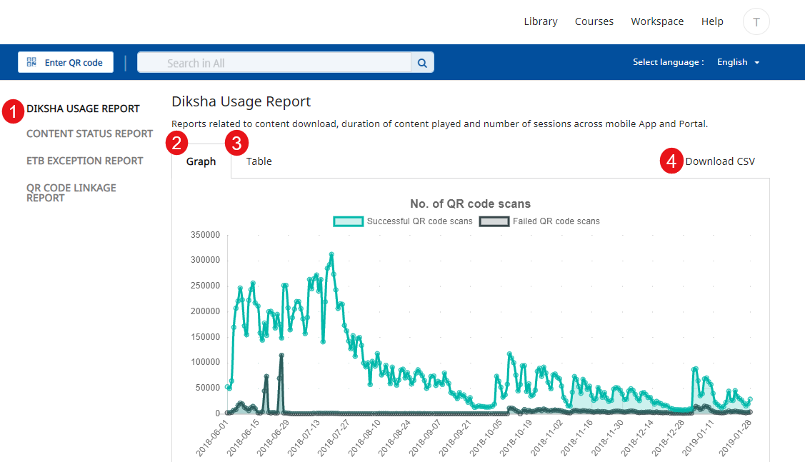

## Overview

The **Administrator Dashboard** provides State administrators and report viewers a unified view of the organization's content creation and consumption patterns. It has graphical representations, detailed data in tabular format and summary reports of integrated data for different scenarios, per geography and location. State administrators and report viewers also have the option to download the reports as a CSV file. 
At a high level, the dashboard helps state administrators and report viewers:

* gauge and assess the value, popularity and acceptance of content created and used on the DIKSHA portal
* view the number of QR code scanned
* view the number of contents downloaded and played
* get details of QR codes currently available in textbooks. 

At the granular level, the dashboard provides data on the number of content resources created, reviewed, published and consumed. 

## Prerequisite

<table>
  <tr>
    <th style="width:35%;">Step</th>
    <th style="width:65%;">Screen</th>
  </tr>
  <tr>
    <td>1. Log in as a State administrator or report viewer
     2. Click <b>Admin Dashboard</b> from the profile drop-down 
      </td>
      <td></td>
  </tr>
</table>

### Accessing the Reports 

To access the reports:

<table>
  <tr>
    <th style="width:35%;">Step</th>
    <th style="width:65%;">Screen</th>
  </tr>
  <tr>
    <td>1. Click any reports
     2. Click <b>Graphs</b> to view the report in a graphical format
     3. Click <b>Tables</b> to view the report in a tabular format
     4. Click <b>Download CSV</b> to download a <a href="/help/administrator/view-dashboard/report.html" target="_blank">report</a> as a CSV file format.
     To know more about the reports
    , refer to the <a href="/help/administrator/view-dashboard/report.html" target="_blank">Report</a> page
    </td>
  <td></td>
  </tr>
</table> 

