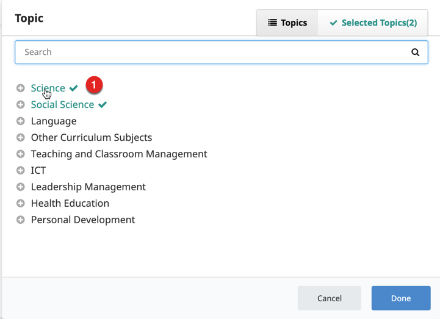
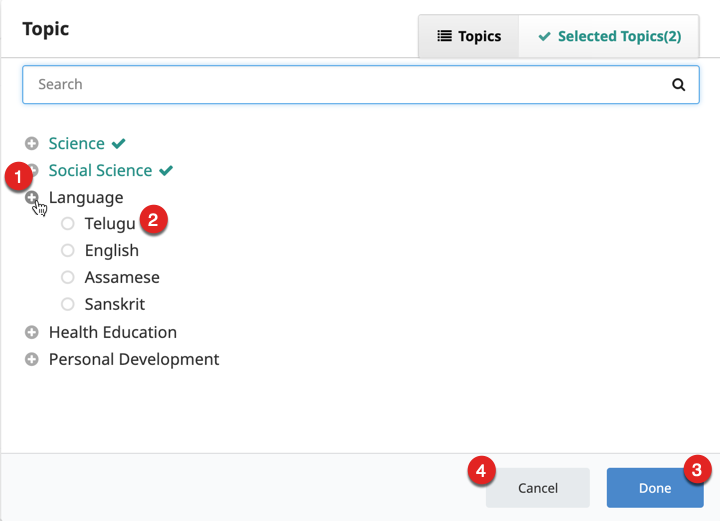

This section details how to search for, select, and delete topics.

## Selecting Topics

<table>
  <tr>
    <th style="width:35%;">Step</th>
    <th style="width:65%;">Screen</th>
  </tr> 
  <tr>
      <td>1. Click any topic to select it
    </td>
    <td></td>
  </tr> 
  <tr>
  <td>1. The <b>+</b> icon on the left indicates that the topic is further expandable. Click the <b>+</b> icon to expand the topic  2. Click to select the topics  3. Click <b>Done</b> to add the selected topics  4. Click <b>Cancel</b> to discard the selection and go back to the content details page</td>
    <td></td>
  </tr>
</table>

