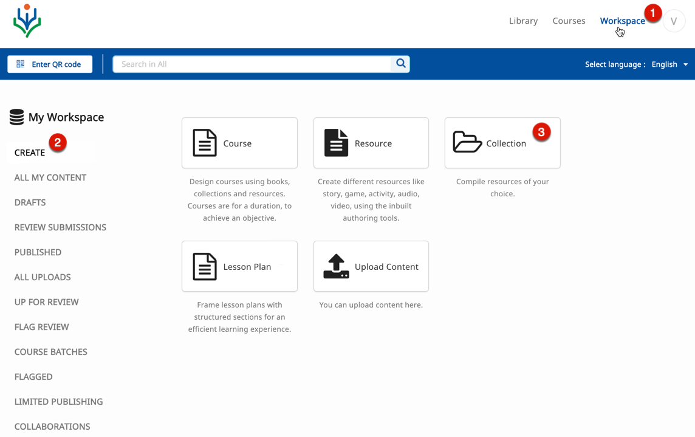
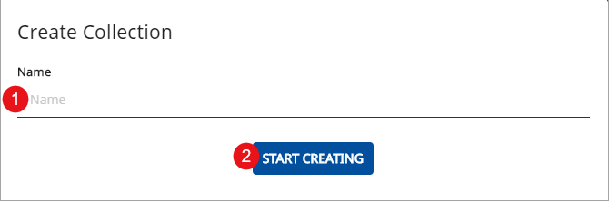
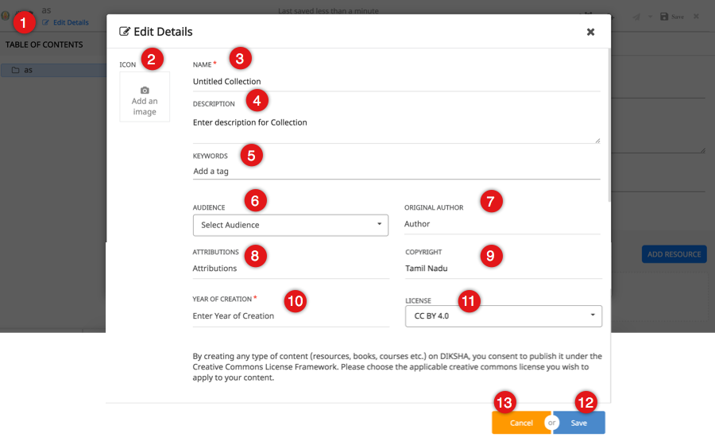
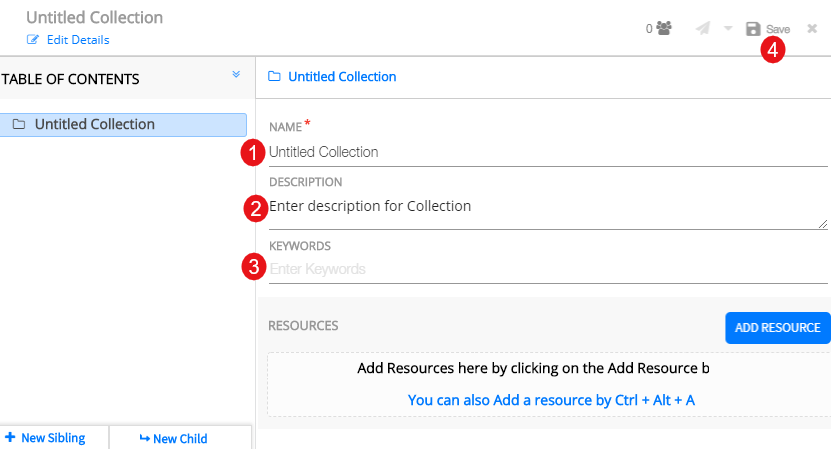

## Overview

Collection is a compilation of content. A collection can be compiled on DIKSHA using the various learning resources available on the portal or by creating content on the in-built content editor and later collating them as a collection. Related or unrelated content can be compiled together. 

## Prerequisites
<table>
  <tr>
    <th style="width:35%;">Step</th>
    <th style="width:65%;">Screen</th>
  </tr>
  <tr>
    <td>You are logged in 
       1. You are currently on <b>Workspace</b> 
       2. You have selected <b>Create</b> 
       3. You have clicked on <b>Collection</b> tile
       </td>
      <td></td>
  </tr>
  </table>

## Creating Collection

<table>
  <tr>
    <th style="width:35%;">Step</th>
    <th style="width:65%;">Screen</th>
  </tr>
   <tr>
    <td>On <b>Create Collection</b> screen
     1. Enter <b>Name</b> 
     2. Click <b>Start Creating</b> 
    </td>
    <td></td>
  </tr>
</table>

### Editing Collection Details

<table>
  <tr>
    <th style="width:35%;">Step</th>
    <th style="width:65%;">Screen</th>
  </tr>
  <tr>
    <td>1. Click <b>Edit Details</b> to enter the collection details 
     2. Click the camera icon to add an image  <b>Note</b>: For details, refer <a href="/help/creator/common/metadata_addingimages.html" target="_blank">Adding Image to Metadata</a> 
       3. Enter <b>Name</b> of the collection 
       4. Enter <b>Description</b> of the collection 
       5. Enter <b>Keywords</b>. Keywords are ideas and topics that define content. Keywords aid in searching for content 
       6. Select <b>Audience</b>
       7. Enter <b>Original Author</b> of the content
       8. Enter <b>Attributions</b>
       9. Enter <b>Copyright</b>
       10. Enter <b>Year of Creation</b>
       11. Enter the <b>License</b> for the content
       12. Click <b>Save</b> on the header to save the details
       13. Click <b>Cancel</b> to go back to the previous screen
    </td> 
    <td></td>
  </tr>	
  </table>

### Adding Content and Resource to Collection

<table>
  <tr>
    <th style="width:35%;">Step</th>
    <th style="width:65%;">Screen</th>
  </tr>
  <tr>
    <td>To add content to a collection, you can do one of the following actions: 
     1. Click <b>Add Resource</b> from the menu associated with the required node in the left navigation pane or right-click on the node name and select <b>Add Resource</b> 
     2. Click <b>Add Resource</b> on the right bottom of the page to add content to the unit or chapter. For details on adding resources, refer <a href="../common/addingresources.html" target="_blank">Adding Resources</a>
     3. Use the keyboard shortcut <b>Ctrl+Alt+A</b>   For more details on keyboard shortcuts, refer <a href="/help/creator/common/keyboardshortcuts.html" target="_blank">Keyboard Shortcuts</a>
    </td>
    <td></td>
  </tr>
</table>

### Adding Details to Collection ToC
<table>
  <tr>
    <th style="width:35%;">Step</th>
    <th style="width:65%;">Screen</th>
  </tr>
  <tr>
    <td>Enter details for the ToC heading: 
     1. Enter <b>Name</b> or title of the content
     2. Enter <b>Description</b> 
     3. Enter <b>Keywords</b>  <b>Note:</b> Keywords are ideas and topics that define content. Keywords aid in searching for content 
     4. Click <b>Save</b> on the header to save the details
    </td>
    <td></td>
  </tr>
  </table>

### Viewing Contributor Details

<table>
  <tr>
    <th style="width:35%;">Step</th>
    <th style="width:65%;">Screen</th>
  </tr>
  <tr>
    <td>1. Click <b>Add Resource</b> to add resource to the collection.  For further details refer <a href="../common/addingresources.html" target="_blank">Adding Resources</a>
     2. The resource is added to the collection
     3. The names of the resource owners appears under <b>Created with Contributions From</b> button
    </td>
    <td>
    </td>
  </tr>
</table>

## Working with Table of Contents 

The Table of Contents tree seen in the left pane is used to navigate content compiled for a collection, textbook, course or lesson plan. You can manipulate the tree using either: 
 &emsp;a) The burger menu associated with a tree node 
 &emsp;b) Right-click options associated with a tree node, **OR** `
 &emsp;c) Keyboard shortcuts 
 For details on manipulating the tree and adding content, refer <a href="/help/creator/common/treestructure_toc.html" target="_blank">Exploring ToC Structure</a>

### Deleting Content 

<table>
  <tr>
    <th style="width:35%;">Step</th>
    <th style="width:65%;">Screen</th>
  </tr>
  <tr>
    <td>1. Click <b>Yes</b> icon beside the burger menu  2. Click <b>Yes,delete</b> to delete the added content   <b>Note:</b> You can alternatively delete content by clicking <b>Yes</b> in the burger menu drop-down</td>
    <td></td>
  </tr>
</table>

### Reordering Content 

<table>
  <tr>
    <th style="width:35%;">Step</th>
    <th style="width:65%;">Screen</th>
  </tr>
  <tr>
    <td>1. Drag and drop the content to the desired position to rearrange the order of the content added to the collection</td>
    <td></td>
  </tr>
  <tr>
    <td>1. Click the upward arrow to collapse the table of contents. Click the same arrow to expand collapsed table of contents  <b>Note</b>: You can edit or update the title of content in the collection from the navigation hierarchy
     </td>
    <td></td>
  </tr>
</table>

## Sending Collection for Review

<table>
  <tr>
    <th style="width:35%;">Step</th>
    <th style="width:65%;">Screen</th>
  </tr>
  <tr>
    <td>A collection must be reviewed before it is published  1. Click <b>Save</b> on the header to save the collection  2. Click <b>Send for review</b> to send the created collection for review  Before sending for review, you can share the content to a limited audience. To know more, refer <a href="/help/creator/common/limitedpublishnshare.html" target="_blank">Limited Publishing and Sharing</a>
    </td>
    <td></td>
  </tr>
  </table>

## Exploring What's New

<table>
  <tr>
    <th style="width:35%;">Step</th>
    <th style="width:65%;">Screen</th>
  </tr>
  <tr>
    <td>The What’s New feature informs you of the product features added or enhanced since the last product release 
       1. Click on the <b>What's New</b> icon to view concise information about new product functionality 
       <b>Note</b>: The What's New icon is red before you view it for the first time. The icon turns grey after you view the information, until the next product version
    </td>
    <td></td>
  </tr>
  </table>
