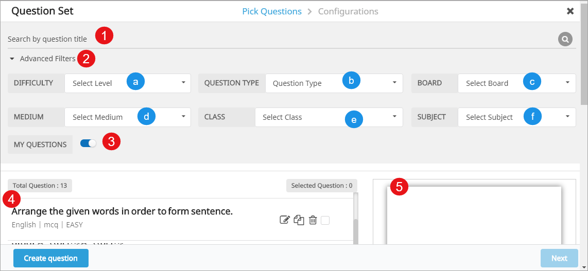
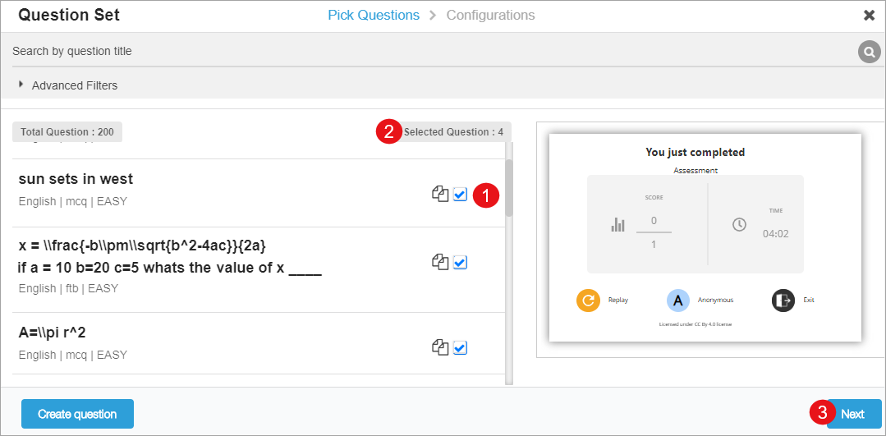

## Overview

To ensure that learning objectives are met, it is important to check and reaffirm the learner’s progress at multiple logical points in the study material provided to learners. Question sets introduced at such logical points are one of the means to assess learner progress. The assessment must gather the following information:

- Marks obtained after completing a course
- Date and time to start the course
- Time to answer a question
- Attempted questions
- Complete and partially correct answers

To create a question set for your course, use the following options:

- Search for questions 
- Apply filters to narrow down the search
- [Create new question](./questionset_create.html)
- Copy an existing question

## Searching and Filtering Questions

<table>
  <tr>
    <th style="width:35%;">Step</th>
    <th style="width:65%;">Screen</th>
  </tr>  
  <tr><td>1. Type the relevant keywords to search questions 
   2. The search result displays on the left pane 
   3. Select the questions from the left pane and add them in question set 
   4. Preview the selected question is on the right pane 
   5. Apply the following filters to refine the search results: 
	 &emsp;a. <b>Difficulty</b> 
 	 &emsp;b. <b>Question Type</b> 
 	 &emsp;c. <b>Board</b> 
 	 &emsp;d. <b>Medium</b> 
	 &emsp;e. <b>Class</b> 
	 &emsp;f. <b>Subject</b> 
   5. Enable <b>My Questions</b> toggle button to sort your questions at the top of the search result 
   6. Click <b>Create question</b> to add a new question. To create a new question refer <a href ="./questionset_create.html">Creating Questions</a>
   7. Click Next</td>
  <td></td>
  </tr>
</table>

## Compiling Question Set

After you search and select the questions from the available list, compile them to form a question set that can be readily used by students. 

<table>
<tr>
   <th style="width:35%;">Steps</th>
   <th style="width:65%;">Screen</th>
</tr>  
<tr>
  <td>On the <b>Pick Question</b> page:
   1. Select the question you want to add in question set 
   2. Displays the count of the selected question 
   3. Click <b>Next</b>. The <b>Configurations</b> page is displayed here</td>
  <td></td>
</tr>
<tr>
  <td>On the <b>Configurations</b> page
   1. Enter the <b>Question Set Title</b> 
   2. Enter <b>Max Score</b> for the question 
   3. Use the <b>Display</b> drop-down to select the number of questions to be displayed in the assessment 
   4. Enable the <b>Show Immediate Feedback</b> toggle button to display instant results after attempting the question 
   5. Select the <b>Shuffle Question</b> icon to change the sequence of questions
   6. Click <b>Close</b> icon to remove a question from the question set
   7. Use <b>Configure Score</b> to display the score that corresponds to the selected questions 
   8. Select <b>Add more question</b> to continue adding more questions in the question set  
   9. Select <b>Add</b> to add the question set 
  </td>
  <td></td>
 </tr>
</table>

## Customizing Questions Set

After adding the question set to the slide on your content editor screen, you can edit and update details related to the question set. You can update the following details on the content editor slide
 
<table>
  <tr>
    <th style="width:35%;">Steps</th>
    <th style="width:65%;">Screen</th>
  </tr>  
  <tr>
    <td>
     1. Click <b>Edit</b> button under <b>Edit Question Set</b>  
     2. Enter <b>Question Set Title</b>  
     3. Enable <b>Shuffle Question</b> toggle button if you want to change the order in which questions appear in the assessment
     4. Enable the <b>Show Immediate Feedback</b> toggle button to display the instant result after attempting the question 
     5. Use <b>Display</b> textbox to enter the number of question to be displayed in the assessment
     6. Enter <b>Total Marks</b></td>
    <td></td>
  </tr>
</table>
