## Overview

The create question option enables you to create questions to check the learner’s progress. You can create the questions
in the following languages:

- English  
- Hindi  
- Oria  
- Telugu  
- Kannada  
- Marathi  
- Assamese  
- Bengali  
- Tamil  
- Urdu  

## Creating Questions

<table>
  <tr>
    <th style="width:35%;">Step</th>
    <th style="width:65%;">Screen</th>
  </tr>
  <tr>
    <td>1. On the <b>Create Question</b> page select the type of question you want to create
       2. Create the following question types:
       &emsp;a. <b>Multiple Choice</b>
       &emsp;b. <b>Match the Following</b>
       &emsp;c. <b>Fill in the Blanks</b>
       &emsp;d. <b>Reordering Words</b>
       &emsp;e. <b>Arrange in Sequence</b>
       3. Click <b>Select</b> to continue creating a question
       4. Click <b>Cancel</b> to go to the previous screen
    </td>
    <td>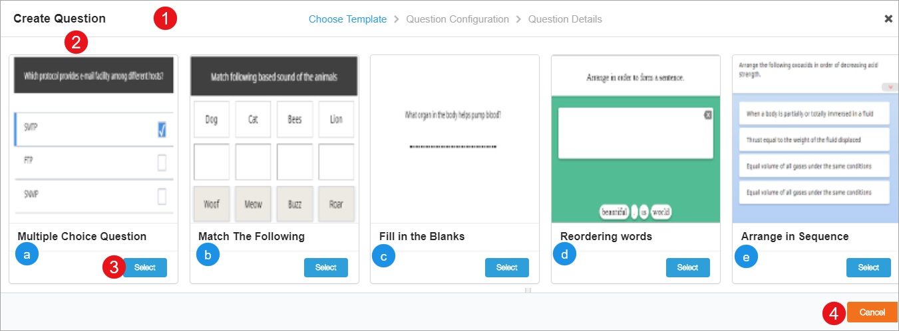</td>
  </tr>
</table>

### Creating Multiple Choice Question

This option allows you to create question that has multiple options to select the right answer. To create or edit a multiple choice question, update the following details:

<table>
  <tr>
    <th style="width:35%;">Step</th>
    <th style="width:65%;">Screen</th>
  </tr>
  <tr>
    <td>1. Enter the question in the text box
       2. Format the text, and also include the questions in your preferred language using rich text editor
       a. Displays the count of the characters used in the question
       4. Click <b>Image</b> icon to add an image. Refer <a href="/help/creator/common/metadata_addingimages.html" target="_blank">Adding Images</a>
       5. Click <b>Audio</b> icon to add an audio
       6. Enter the answer
       7. Mark the correct answer amongst the multiple answers
       8. Click <b>Delete</b> icon to remove an answer
       9. Click <b>Add Answer</b> to insert another choice of answer</td>
    <td>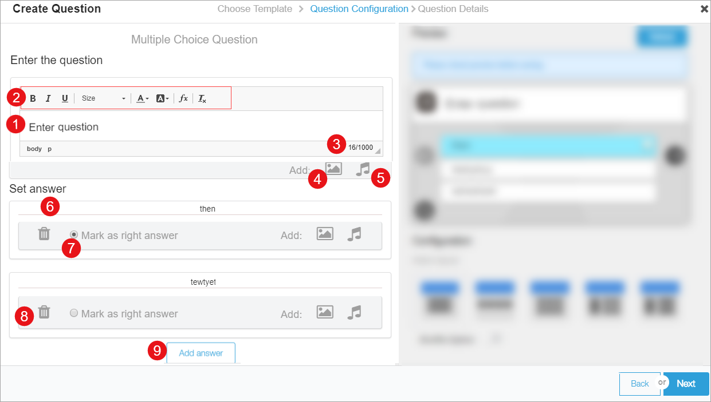</td>
  </tr>
  <tr>
    <td><b>Previewing Question</b>
       1. Select <b>Refresh</b> icon to preview your question
       2. Select the layout
       3. Enable <b>Shuffle</b> option to change the sequence of answers
       4. Click <b>Next</b> to enter the <a href="#adding-questions-details">Question Details</a>
       5. Select <b>Back</b> to go to the previous page
    </td>
    <td>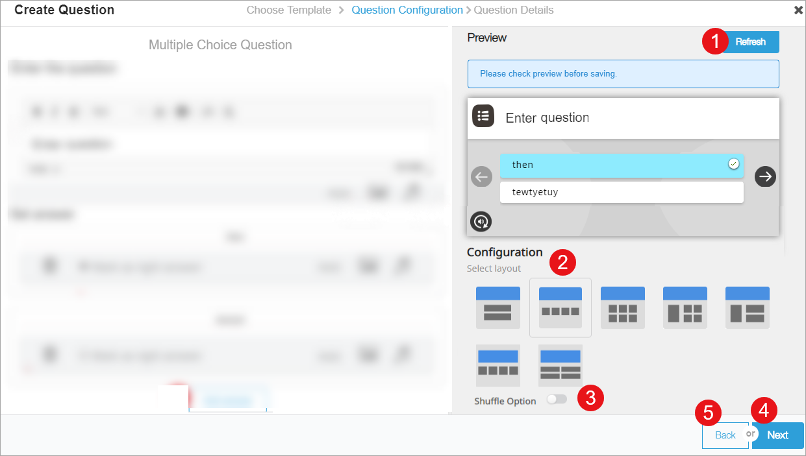</td>
  </tr>
</table>

### Creating Match the Following Question

This options allows you to create match the following questions. It has multiple question-answer pairs in left and right columns. Users need to drag and drop the option from the right column and associate it to its pair in the left column.
To create or edit a Match the Following question, update the following details:

<table>
  <tr>
    <th style="width:35%;">Step</th>
    <th style="width:65%;">Screen</th>
  </tr>
  <tr>
    <td>1. Enter the question in the text box
       2. Format the text, and also include the questions in your preffered language using rich text editor
       a. Displays the count of the characters in the question
       3. Enter the answers
       <b>Note</b>: Add up to 25 characters in your preffered language
       4. Select the layout of the answers using <b>Choose Layout</b> drop-down menu. The answers can be a
      combination of text and images
       5. Click <b>Image</b> icon to add an image. Refer <a href="/help/creator/common/metadata_addingimages.html"
        target="_blank">Adding Images</a>
       6. Click <b>Audio</b> icon to add an audio
       7. Select <b>Delete Pair</b> icon to remove answer set
       8. Select <b>Add another question answer pair</b> to add another question and answer</td>
    <td>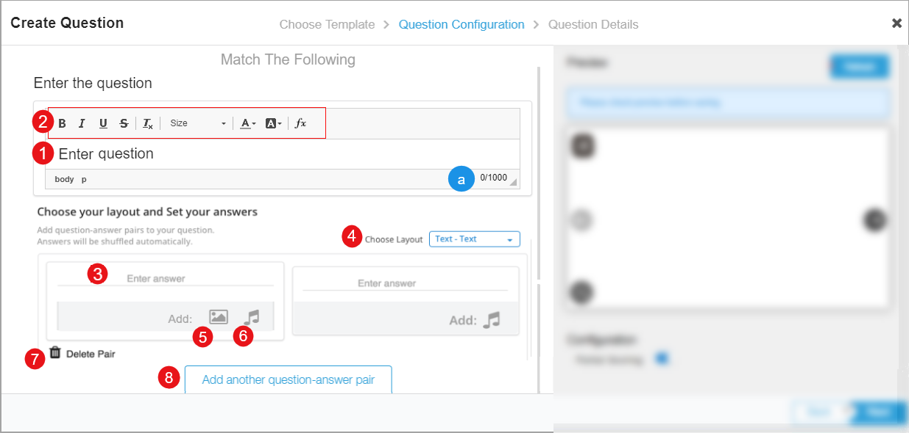</td>
  </tr>
  <tr>
    <td><b>Previewing Question</b>
       1. Select <b>Refresh</b> button to preview your question
       2. Select <b>Partial Scoring</b> to enable scoring for each correct answer pair
       3. Click <b>Next</b> to enter the <a href="#adding-questions-details">Question Details</a>
       4. Select <b>Back</b> to go to the previous page</td>
    <td>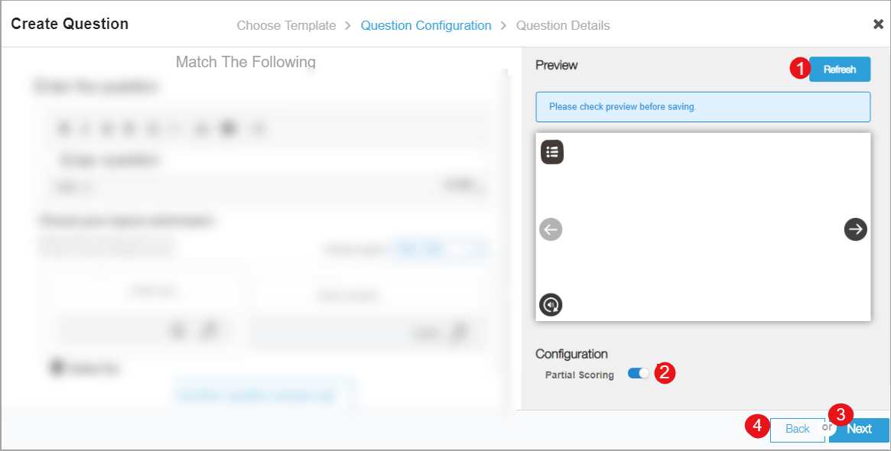</td>
  </tr>
</table>

### Creating Fill in the Blanks Question

This options allows you to create Fill in the Blanks questions. These questions may have single or multiple blanks in
the question. To create or edit a fill in the blanks question, update the following details:

<table>
  <tr>
    <th style="width:35%;">Step</th>
    <th style="width:65%;">Screen</th>
  </tr>
  <tr>
    <td>1. Enter the question in the text box
       2. Format the text, and also include the questions in your preffered language using rich text editor
       a. Displays the count of the characters used in the question. Enter the answers within a pair of square
      brackets [[Answer]]
       3. Use <b>Select Keyboard</b> option select the text input method as Device, English and Custom
       <b>Note</b>: Add up to 26 characters in your preffered language to appear on the custom keyboard </td>
    <td>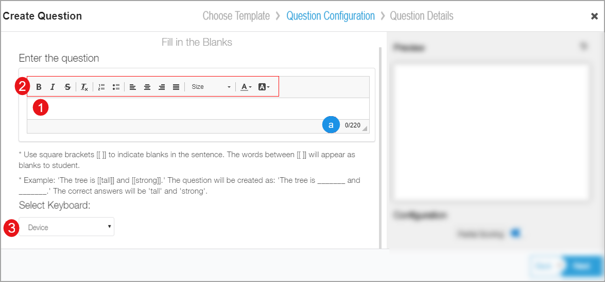</td>
  </tr>
  <tr>
    <td><b>Previewing Question</b>
       1. Select <b>Refresh</b> button to preview your question
       2. Select <b>Partial Scoring</b> to enable scoring for each correct answer
       3. Select <b>Unordered Evaluation</b>. In case of multiple blanks, enabling this option allows the user to
      enter the answers in any sequence
       4. Click <b>Next</b> to enter the <a href="#adding-questions-details">Question Details</a>
       5. Select <b>Back</b> to go to the previous page</td>
    <td>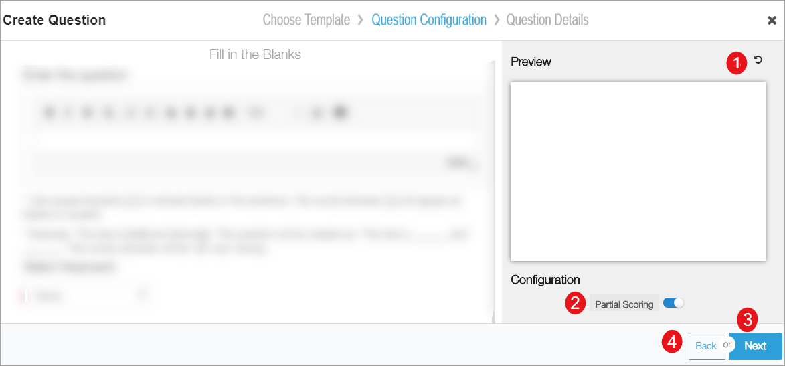</td>
  </tr>
</table>

### Creating Reordering Words Question

This option allows you to create Reordering Words question. Users who take up the assessment, need to drag and drop
multiple words in order to form the correct sentence. To create or edit a reordering words question, update the
following details:

<table>
  <tr>
    <th style="width:35%;">Step</th>
    <th style="width:65%;">Screen</th>
  </tr>
  <tr>
    <td>1. Enter the question in the text box
       2. Format the text, and also include the questions in your preffered language using rich text editor
       a. Displays the count of the characters used in the question
       3. Enter the sentence. The words in this sentence will be shuffled to form question
       4. The shuffled words are displayed here</td>
    <td>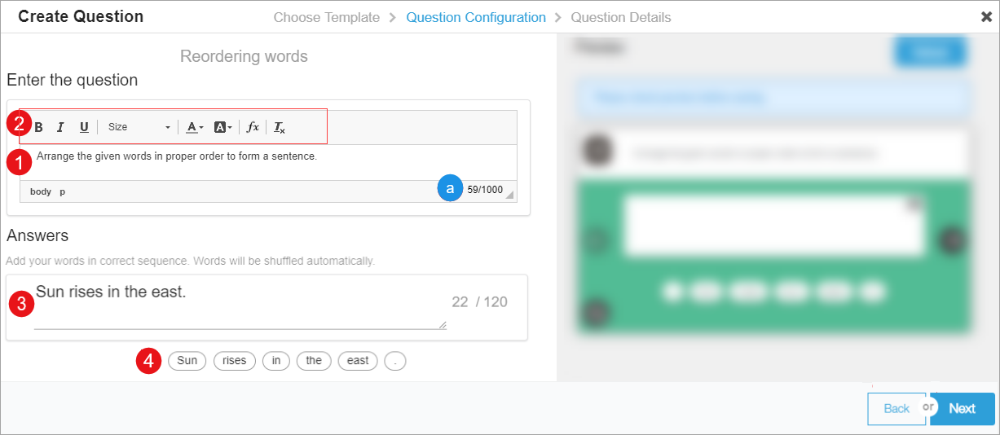</td>
  </tr>
  <tr>
    <td><b>Previewing Question</b>
       1. Select <b>Refresh</b> button to preview your question
       2. Drag and drop the word buttons in the preview pane in reordered format
       3. Click <b>Next</b> to enter the <a href="#adding-questions-details">Question Details</a>
       4. Select <b>Back</b> to go to the previous page</td>
    <td>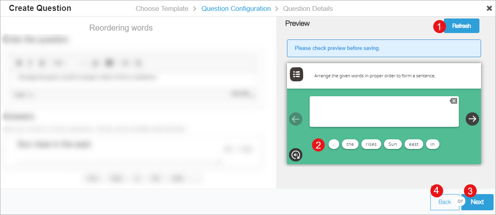</td>
  </tr>
</table>

### Creating Arrange in Sequence Question

This options allows you to create Arrange in Sequence type questions. Users who take up the assessment, need to drag and
drop multiple sentences in the correct sequence in accordance with the question. To create or edit an arrange in
sequence question type, update the following details:

<table>
  <tr>
    <th style="width:35%;">Step</th>
    <th style="width:65%;">Screen</th>
  </tr>
  <tr>
    <td>1. Enter the question in the text box
       2. Format the text, and also include the questions in your preffered language using rich text editor
       a. Displays the count of the characters used in the question
       3. Click <b>Image</b> icon to add an image. Refer <a href="/help/creator/common/metadata_addingimages.html"
        target="_blank">Adding Images</a>
       4. Click <b>Audio</b> icon to add an audio
       5. Enter the answers
       6. Select <b>Add Sequence</b> to add another answer</td>
    <td>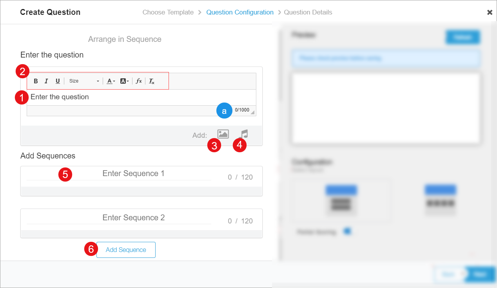</td>
  </tr>
  <tr>
    <td><b>Previewing Question</b>
       1. Select <b>Refresh</b> button to preview your question
       2. Select the layout for displaying question and answer pairs from the available formats
       3. Select <b>Partial Scoring</b> to enable scoring for each correct answer pair
       4. Click <b>Next</b> to enter the <a href="#adding-questions-details">Question Details</a>
       5. Select <b>Back</b> to go to the previous page</td>
    <td>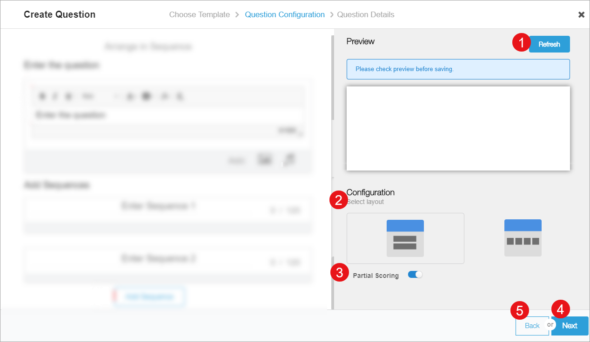</td>
  </tr>
</table>

## Adding Questions Details

You can update the details for the questions that you have created. These details help to search for question. The
preview pane of the question has following options:

<table>
  <tr>
    <th style="width:35%;">Step</th>
    <th style="width:65%;">Screen</th>
  </tr>
  <tr>
    <td>1. Enter the question set <b>Title</b>
       2. Enter <b>Description</b> for the question
       3. Select the following from the drop-down menu
       &emsp;a. Select <b>Board</b>
       &emsp;b. Select <b>Medium</b>
       &emsp;c. Select <b>Grade Level</b>
       &emsp;d. Select <b>Subject</b>
       &emsp;e. Select <b>Level</b>
       &emsp;f. Select <b>Learning Outcome</b>
       4. Select <b>Topic</b>
       <b>Note</b>: To know more refer <a href = "/help/creator/common/selecting_topics.html" target="_blank">Selecting Topics</a>
       5. Enter the <b>Max Score</b> of the question</td>
    <td>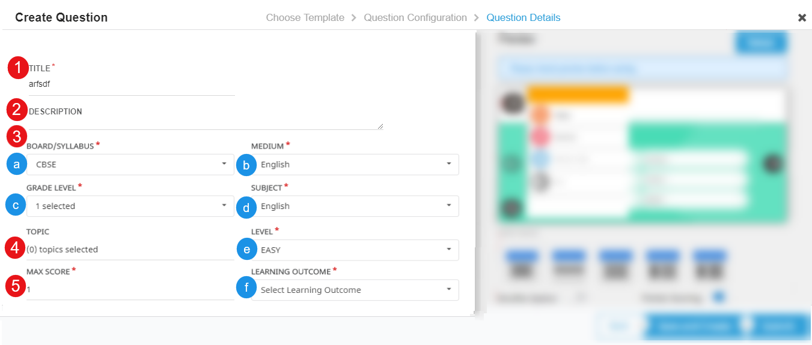</td>
  </tr>
  <tr>
    <td><b>Managing Preview</b>
       1. Select <b>Refresh</b> icon to preview your question
       2. Choose <b>Select Layout</b>
       3. Select <b>Shuffle Option</b>
       4. Enable <b>Partial Scoring</b> slider to track score for each correct answer in a question
       5. Click <b>Submit</b> to configure the question details
       6. Click <b>Save and Create</b> to save the existing question and add another question
       7. Click <b>Back</b> to go to back to the previous page</td>
    <td>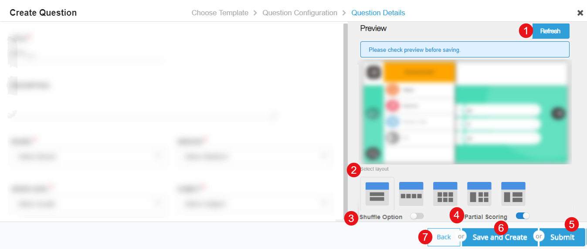</td>
  </tr>
  <tr>
    <td><b>Preview Pane</b>
       1. Select the menu to choose the following option:
       a. <b>Replay</b> the question
       b. Enable <b>Sound</b>
       c. Take <b>Teachers Notes</b>
       d. <b>Exit</b> from the menu
       2. Select to go to previous question
       3. Select to go to next question
       4. Select to replay </td>
    <td>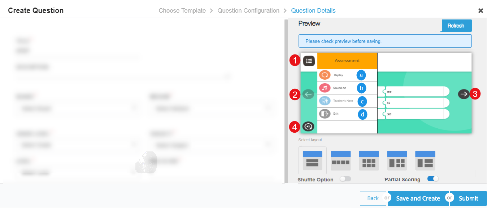</td>
  </tr>
</table>

## Managing Questions

The questions that you create or copy can be edited, copied, and deleted. To know more refer [Managing Questions](./questionset_manage.html)