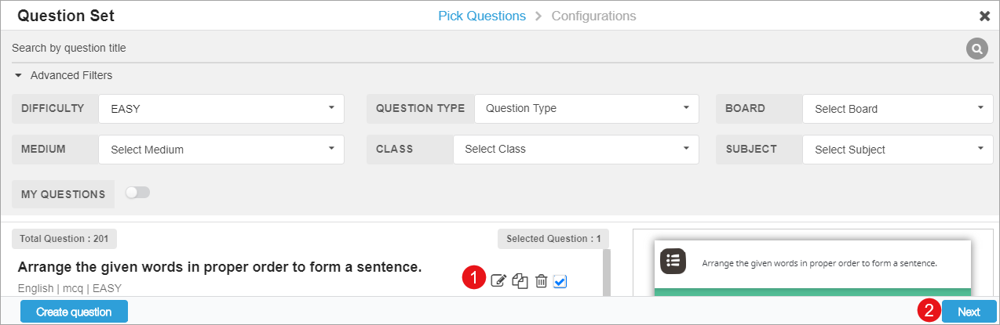
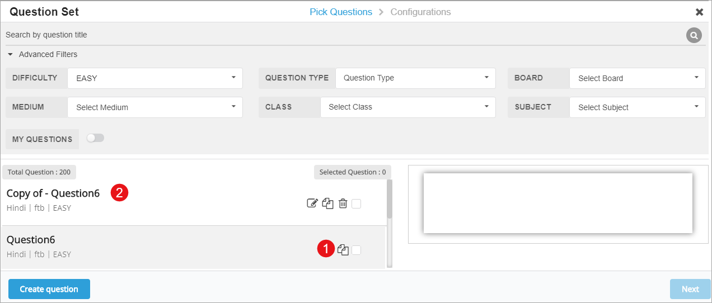

## Overview

The questions that you copy or create are editable. You can further create a copy or delete them.  Add these questions in the question set to observe the changes.

### Editing Questions 

<table>
<tr>
   <th style="width:35%;">Step</th>
   <th style="width:65%;">Screen</th>
</tr>
<tr>
  <td>On the <b>Pick Question</b> page 
 1. Click <b>Edit</b> icon. The editable question is displayed here 
 2. Click <b>Next</b> to update the details of the question</td>
<td></td>
 </tr>
</table>

### Copying a Question

You can copy an existing question from the list of available questions. 

<table>
 <tr>
  <th style="width:35%;">Step</th>
    <th style="width:65%;">Screen</th>
  </tr>
  <tr>
  <td>1. Click the <b>Copy</b> icon to create an editable replica of the question 
   <b>Note</b>: Edit and update the questions as described in the Create Question section 
   2. The name is preceded by "<b>Copy of</b>" the question name in the list 
   <b>Note</b>: Enable the <b>My Questions</b> toggle button to display the copied question on top of the search result list</td>
  <td> </td>
  </tr> 
</table>

### Deleting a Question

You can delete only those questions that you have copied or created.

<table>
  <tr>
  <th style="width:35%;">Step</th>
    <th style="width:65%;">Screen</th>
  </tr>
  <tr>
  <td>1. Click <b>Delete</b> icon to remove the question
   2. The delete confirmation message is displayed here 
   &emsp;a. Click <b>Delete</b> to confirm deletion
   &emsp;b. Click <b>Cancel</b> to retain the question</td>
  <td></td>
  </tr>
</table>
