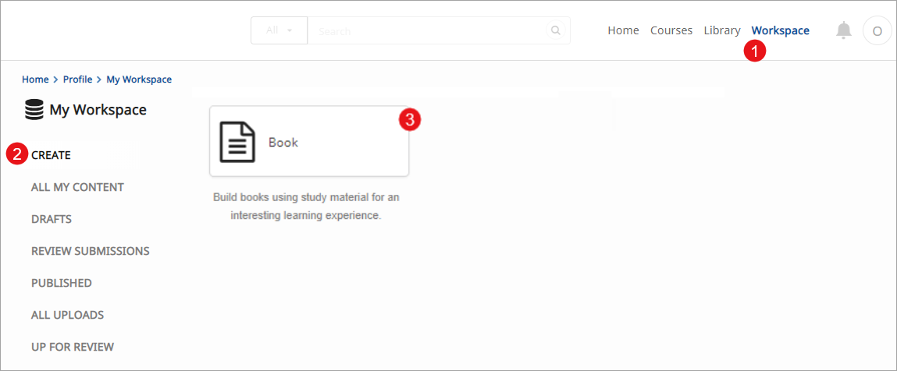
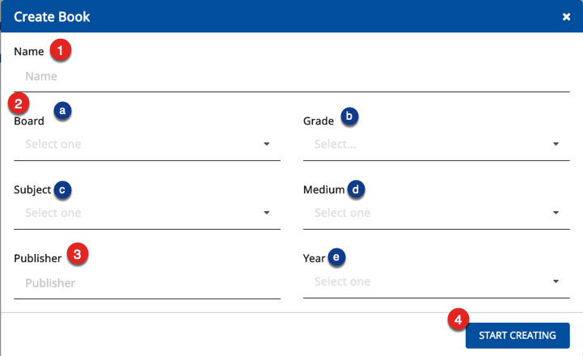
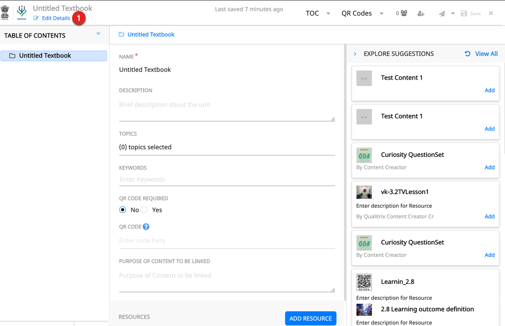
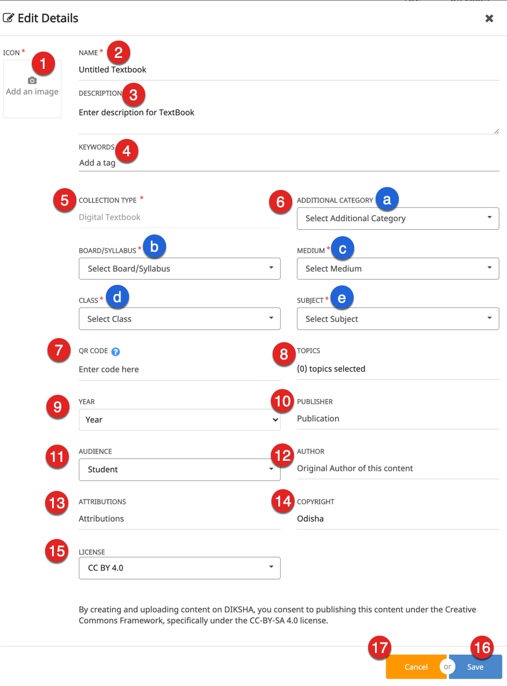
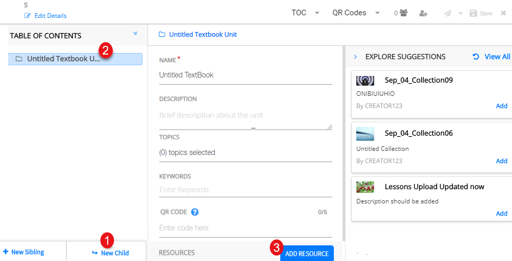
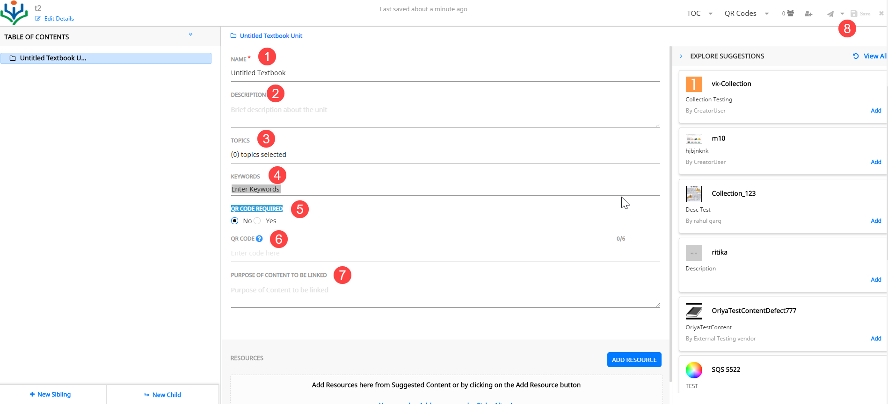

## Overview

On DIKSHA, a Book is a collection of content units. Books can be compiled or curated from school textbooks or any book that conforms to syllabi of state or central boards. They can also be compiled or curated from books of any recognized institution or publication. Any book must be in the said medium of instruction and language. To create a book you must have a book creation rights assigned to you. 

## Prerequisites

<table>
  <tr>
    <th style="width:35%;">Step</th>
    <th style="width:65%;">Screen</th>
  </tr>
  <tr>
    <td>Log in as a book creator 
     1. Click <b>Workspace</b> 
     2. Select <b>Create</b>
     3. Click the <b>Book</b> tile
    </td>
    <td></td>
  </tr>
  </table>

## Creating Book

<table>
  <tr>
    <th style="width:35%;">Step</th>
    <th style="width:65%;">Screen</th>
  </tr>
  <tr>
  <td>On <b>Create Book</b> screen  1. Enter a <b>Name</b> for the book  2. Select the following from their respective drop-down menus:  &emsp;a. Board  &emsp;b. Grade  &emsp;c. Subject  &emsp;d. Medium  &emsp;e. Year  3. Enter <b>Publisher</b> details  4. Click <b>Start Creating</b>
 <b>Note</b>: It is mandatory to fill in all these details. Ensure the name provided here is same as the name given in the .csv file
  </td>
  <td></td>
  </tr>
</table>

### Adding or Editing Book Details 

<table>
  <tr>
    <th style="width:35%;">Step</th>
    <th style="width:65%;">Screen</th>
  </tr>
  <tr> <td>1. Click <b>Edit Details</b> to enter the book details</td>
    <td></td>
  </tr>
  <tr>
  <td>
     1. Click the camera icon to add an image  <b>Note</b>: For details, refer <a href="../common/metadata_addingimages.html" target="_blank">Adding Image to Book Details</a>
       2. Enter <b>Name</b> of the book
       3. Enter <b>Description</b> of the book
       4. Enter <b>Keywords</b>. Keywords are ideas and topics that define content. Keywords aid in searching for content
       5. The <b>Collection Type</b> is auto-filled based on the content type that is being created
       6. Select the following from their respective drop-down lists:
       &nbsp;a. <b>Additional Category</b>
       &emsp;b. <b>Syllabus</b> 
       &emsp;c. <b>Medium</b> 
       &emsp;d. <b>Class</b> 
       &emsp;e. <b>Subject</b> 
       You can select multiple value for subject, board, and medium
       7. Enter <b>QR Code</b> for the textbook
       8. Select <b>Topics</b>
       <b>Note</b>: For details, refer <a href="./topic-tree.html" target="_blank">Adding Topics</a>
       9. Select <b>Year</b>
       10. Enter <b>Publisher</b> 
       11. Enter <b>Audience</b>
       12. Enter <b>Author</b>
       13. Enter details of people you want to acknowledge in the <b>Attributions</b> field  
       14. Enter <b>Copyright</b> details
       15. Enter <b>Year of Creation</b>
       16. Select the <b>License</b> for your content
       17. Click <b>Save</b> on the header to save the details
       18. Click <b>Cancel</b> to go back to the previous screen
        <b>Note</b>: Metadata refers to the data that provides information about other data. It includes elements such as board, medium keywords associated with the book, publisher details, creators of the book and so on. 
        i. When metadata is updated while creating content, the displayed content suggestions on <b>Adding Resource</b> screen are also updated accordingly.
       ii. Only the following special characters are allowed in the metadata field
        : / - _ , . ( ) 
    </td>
    <td></td>
  </tr>
</table>  

### Adding Content to Book

You can add various elements in the book like units or chapters, heading details, QR codes, resources and courses.  
<table>
  <tr>
    <th style="width:35%;">Step</th>
    <th style="width:65%;">Screen</th>
  </tr>
  <tr>
  <td>1. Click <b>New Child</b>, on the left navigation pane to add chapter or unit
   2. A unit is added to the left pane and the corresponding heading details are displayed on the action pane. For details on child textbook unit, sibling textbook unit, refer <a href="../common/treestructure_toc.html" target="_blank">Exploring ToC Structure</a>
   3. Click <b>ADD RESOURCE</b> to add content to the headings. For details on adding resources, refer <a href="/help/creator/common/addingresources.html" target="_blank"> Adding Resources</a>
  </td>
  <td> </td>
  </tr>
 </table>

### Adding Details to Book ToC or Book Metadata

<table>
 <tr>
   <th style="width:35%;">Step</th>
   <th style="width:65%;">Screen</th>
 </tr>
 <tr>
   <td>To start adding heading details in a unit or chapter
      1. Enter <b>Name</b>. This is the topic/chapter/unit name as in the physical textbook
      2. Enter <b>Description</b> 
      3. Enter <b>Topic</b>
      <b>Note</b>: To know more refer <a href = "/help/creator/common/selecting_topics.html" target="_blank">Selecting Topics</a>
      4. Enter <b>Keywords</b>
      3. Select <b>QR Code Required</b> if QR code is required for this topic
      <b>Note</b>: If this value is set to <b>No</b> and  QR code value is provided during upload, the upload fails
      6. Enter the <b>QR code</b>
      <b>Note:</b> QR code is used to link digital contents to the book. The QR codes are uniquely associated and mapped with the book or topics. For successful upload of the text book and its topics, enter correct QR code reserved for the topic.
      7. Enter the <b>Purpose of Content to be Linked</b>
       Purpose of content describes the intent and overview of the content being linked
     8. Click <b>Save</b> to save the details
   </td>
   <td> </td>
 </tr>
</table>
