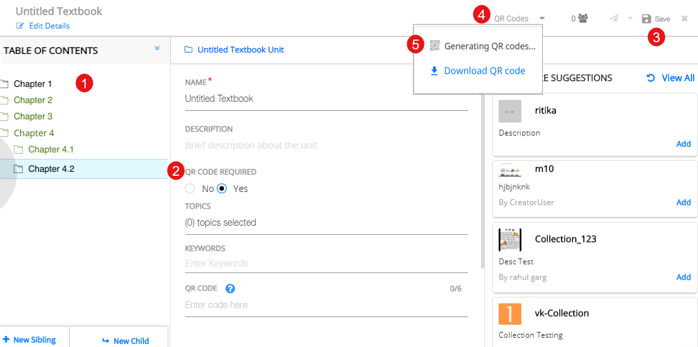
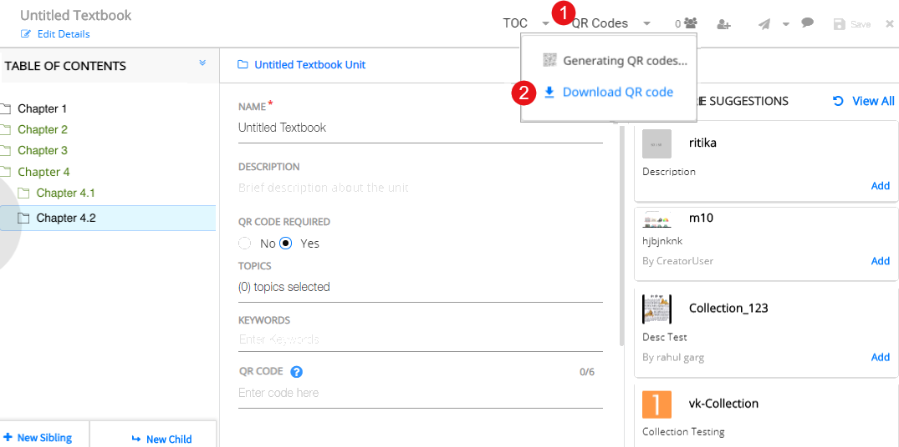

## Overview 
A QR code is an image with patterns of black and white squares that can be read by electronic devices with a scanner. QR codes need to be positioned appropriately in order to make it easy for you (teacher and student) to access the relevant content. A Textbook with printed QR codes, is called an Energised Text Book(ETB). Users can use the DIKSHA app to scan the QR codes. On successful scan, the content resources linked to the QR code are downloaded on to the mobile device.

## Generating QR Codes

<table>
  <tr>
    <th style="width:35%;">Step</th>
    <th style="width:65%;">Screen</th>
  </tr>
  <tr>
    <td>To generate QR codes for the book, ensure that all the topics/headings units, that require a QR code, are created within the TOC of the book and the field <b>QR Code Required</b> is set to <b>Yes</b> for these topics.
     you need to fill Board, Subject,Medium,Grade before generating the QR code
     1. Click <b>QR Codes</b> on the header
     2. Click <b>Generate QR Codes</b>
    <b>Note</b>: You can generate a maximum 250 QR codes at a time
    </td>
    <td></td>
  </tr>
  </table>

## Downloading QR Codes

  <table>
  <tr>
    <th style="width:35%;">Step</th>
    <th style="width:65%;">Screen</th>
  </tr>
  <tr>
    <td>
     Once the QR code is generated, download it to use in the physical book. To download the generated QR codes 
     1. Click <b>QR Codes</b>
     2. Click <b>Download QR Code</b></td>
    <td></td>
  </tr>
</table>
