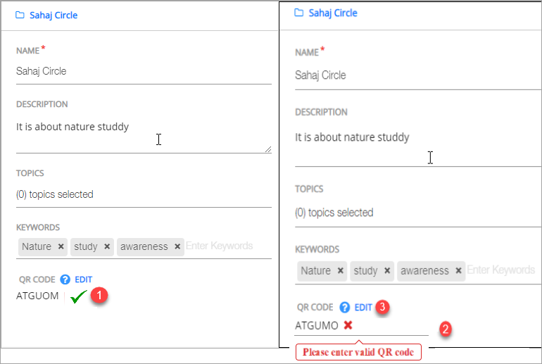
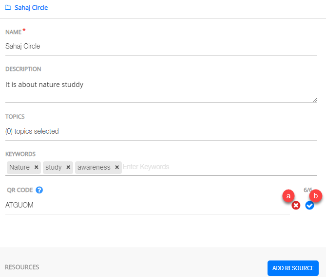

You can link a QR code with a content resource, and unlink the QR code from the content resource whenever required.

## Linking or Unlinking QR Code

<table>
  <tr>
    <th style="width:35%;">Step</th>
    <th style="width:25%;">Screen</th>
  </tr>
  <tr>
    <td>Enter the code from the list of QR codes associated with he book being created
       1. For every right code entered, the ✔️ icon is displayed beside the code
       2. For every incorrect code, the ❌ icon is displayed beside the code
    </td>
    <td></td>
  </tr>
  <tr>
   <td>3. Click <b>Edit</b> 
     &emsp;a. Click to Unlink the QR code from the book
     &emsp;b. Link the QR code to the book
   </td>
   <td></td>
  </tr>
</table>
