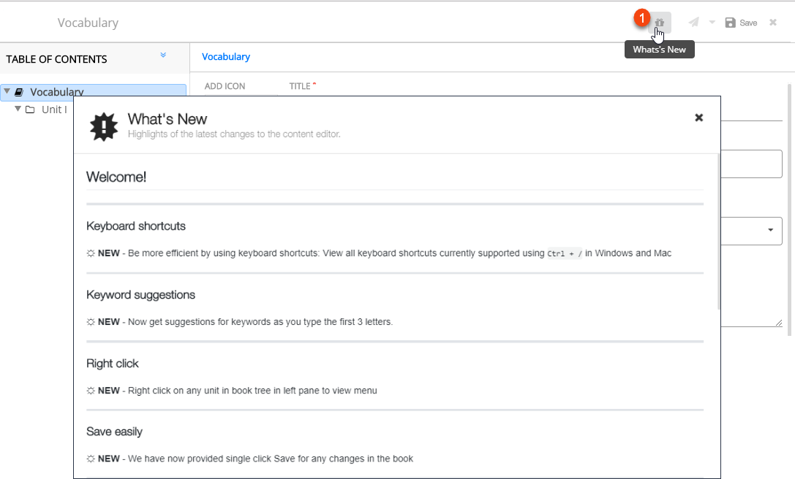
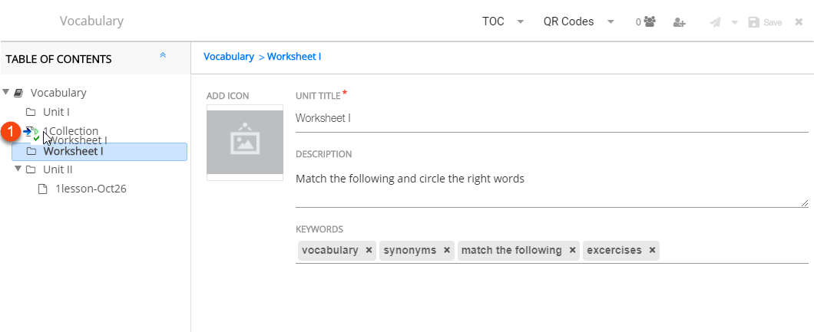
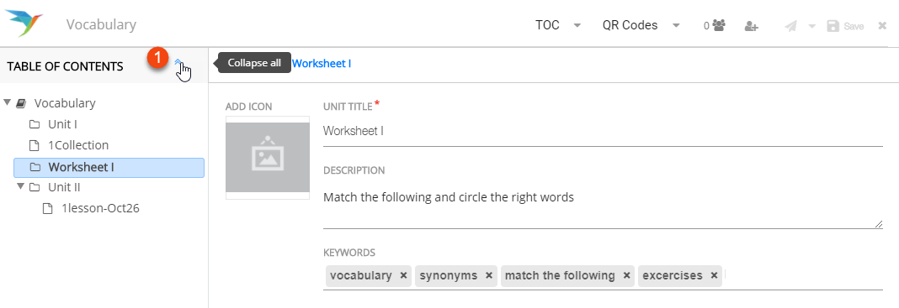
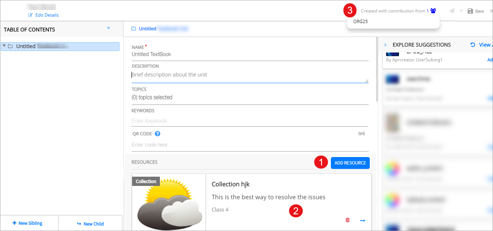
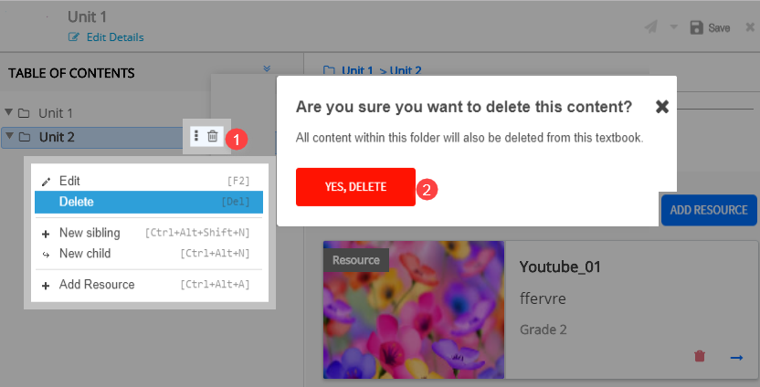
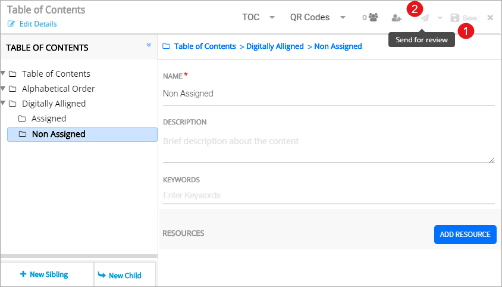

## Managing Book Content and Table of Content
You can perform several action to mananage table of content and content

### Exploring What's New

<table>
  <tr>
    <th style="width:35%;">Step</th>
    <th style="width:65%;">Screen</th>
  </tr>
  <tr>
    <td>The What’s New feature informs you of the product features added or enhanced since the last product release.
       1. Click on the <b>What's New</b> icon to view concise information about new product functionality
       <b>Note</b>: The What's New icon is red before you view it for the first time. The icon turns grey after you view the information, until the next product version
    </td>
    <td></td>
  </tr>
</table>

### Working with Table of Contents

You can see <b>Table of Content</b> tree in the left pane to navigate content compiled for a collection, textbook, course or lesson plan. You can manipulate the tree using either:
   &emsp;a. The burger menu associated with a textbook unit of the tree
   &emsp;b. Right-click options associated with a textbook unit of the tree, OR
   &emsp;c. <a href="../common/keyboardshortcuts.html" target="_blank">Keyboard shortcuts</a>  For details on manipulating the tree and adding content, refer <a href="../common/treestructure_toc.html" target="_blank">Exploring ToC Structure</a>

### Reordering Content

<table>
  <tr>
    <th style="width:35%;">Step</th>
    <th style="width:65%;">Screen</th>
  </tr>
  <tr>
    <td>1. Drag and drop the content to the desired position to rearrange the order of the content added to the textbook
      </td>
    <td></td>
  </tr>
  <tr>
    <td>1. Click the upward arrow to collapse the table of contents. Click the same arrow to expand the collapsed table of contents
     </td>
    <td></td>
  </tr>
</table>

### Viewing Contributor Details

<table>
  <tr>
    <th style="width:35%;">Step</th>
    <th style="width:65%;">Screen</th>
  </tr>
  <tr>
    <td>1. Click <b>Add Resource</b> to add resource to the book, refer <a href="/help/creator/common/addingresources.html" target="_blank">Adding Resources</a>
     2. The resource is added to the book
     3. The names of the resource owners appears under <b>Created with Contributions From</b> button
    </td>
    <td></td>
  </tr>
</table>

### Copying a Book 

Once a book is reviewed and published it is available in the Library. A book creator can copy the published book using [Copy a book](../../getting-started/library/index.html#copying-content){:target="_blank"} feature  

### Deleting Content

<table>
  <tr>
    <th style="width:35%;">Step</th>
    <th style="width:65%;">Screen</th>
  </tr>
  <tr>
    <td>1. Click <b>Delete</b> icon beside the burger menu  2. Click <b>Yes</b> to delete the added content
       <b>Note:</b> You can alternatively delete content by clicking <b>Delete</b> in the burger menu drop-down
      </td>
    <td></td>
  </tr>
</table>

### Sending Book for Review

<table>
  <tr>
    <th style="width:35%;">Step</th>
    <th style="width:65%;">Screen</th>
  </tr>
  <tr>
    <td>A book must be reviewed before it is published
       1. Click <b>Save</b> on the header to save the book
       2. Click <b>Send for review</b> to send the created book for review. Before sending for review, you can share the content to a limited audience. To know more about Limited Sharing, refer <a href="/help/creator/common/limitedpublishnshare.html" target="_blank">Limited Publishing and Sharing</a>
    </td>
    <td></td>
  </tr>
</table>
