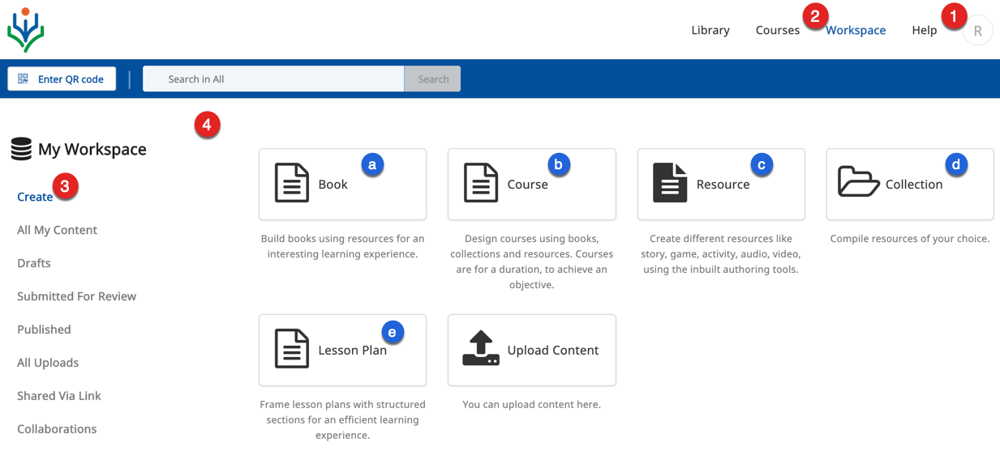
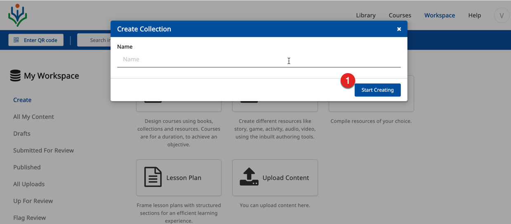
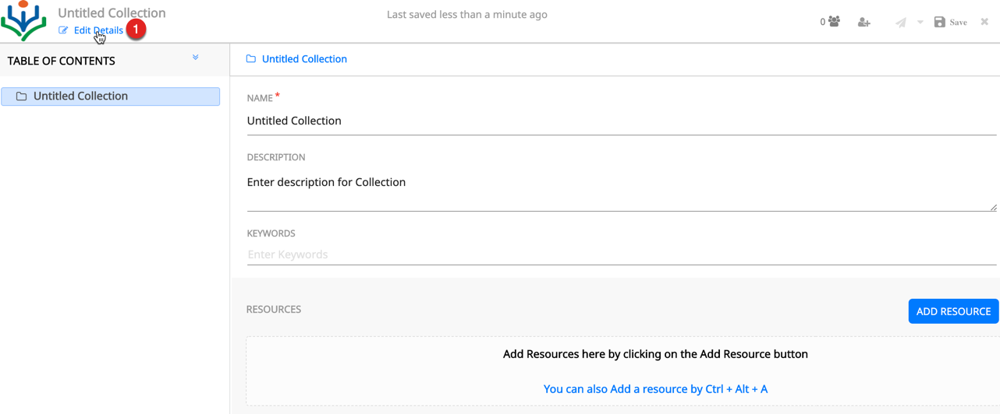
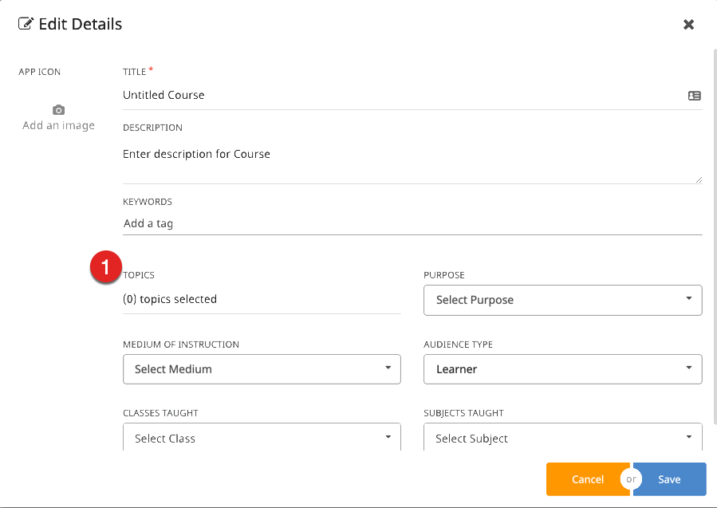
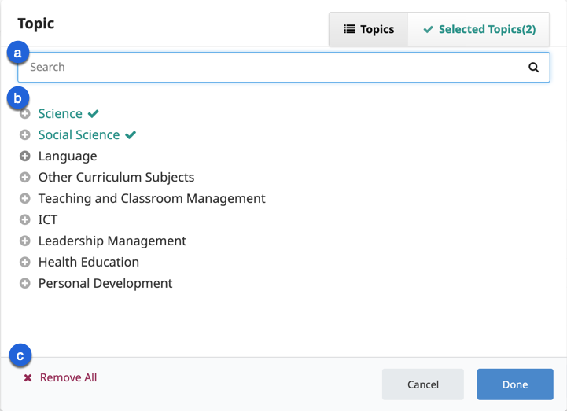

## Overview

DIKSHA hosts a wide variety of content. Content published on DIKSHA are generally centred around one or more concepts. These concepts are called **Topics** on DIKSHA. To ensure that any content created or published on DIKSHA is easily discovered by users, as a best practice, all content creators are instructed to associate any content they create with a topic. The topic selector feature in DIKSHA provides an exhaustive list of topics for the content creators to choose from. This section provides detailed instructions on how to select topics from this topic selector while creating content.

## Prerequisites

<table>
  <tr>
    <th style="width:35%;">Step</th>
    <th style="width:65%;">Screen</th>
  </tr>
  <tr>
    <td>1. Log in as creator
     2. You are currently on <b>My Workspace</b>
     3. Select<b>Create</b> 
     4. You have clicked any one of the following content tiles: 
     &emsp;a. Book 
     &emsp;b. Course
     &emsp;c. Resource
     &emsp;d. Collection
     &emsp;e. Lesson Plan
    </td>
    <td></td>
  </tr>
  <tr>
    <td>1. Click <b>Start Creating</b> </td>
    <td></td>
  </tr>
</table>

## Selecting Topics

All content on DIKSHA has various details associated with it that provide information about the content. For example; the details include information about the Subject, Board, Medium, and Contributor. Each organization on DIKSHA decides and configures which information about the content is mandatory when creating or updating content. To elaborate, some organization may mandate having only the name of the content to be recorded during creation. Another organization may mandate that all information details about the content such as the classes for which the content is appropriate, the topics covered by the content, content creator details, etc. are captured.  

This section provides detailed instructions on how to associate content with topics

<table>
  <tr>
    <th style="width:35%;">Step</th>
    <th style="width:65%;">Screen</th>
  </tr> 
  <tr>
    <td>1. Click <b>Edit Details</b> on the content creation page</td>
    <td></td>
  </tr> 
  <tr>
    <td>1. Click <b>Topics </b>.  2. The Topics pop-up window appears </td> 
    <td></td>
  </tr>
  <tr>
    <td> On this window, you can:
     a. Search for topics 
     b. Select one or more topics
     c. Delete selected topics   For more details refer <a href="/help/creator/common/selecting_topics.html" target="_blank"> Selecting Topics</a></td>
    <td></td>
  </tr>
</table>

