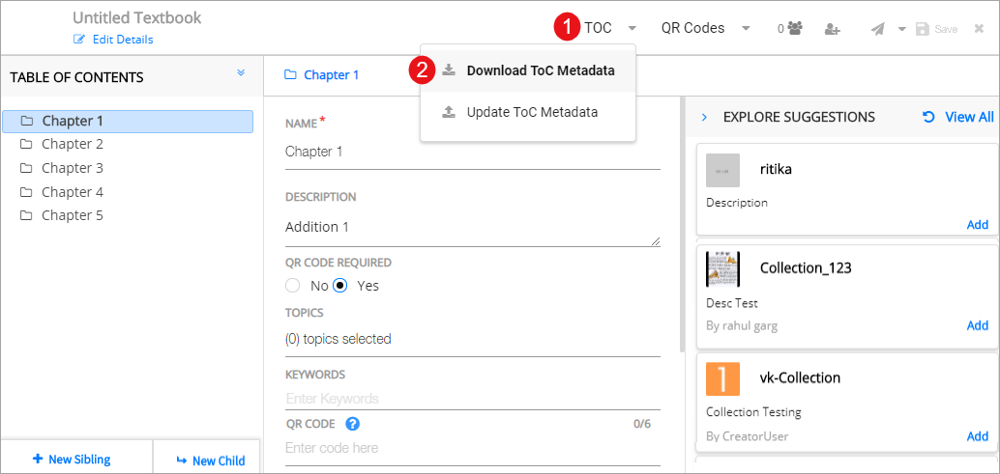
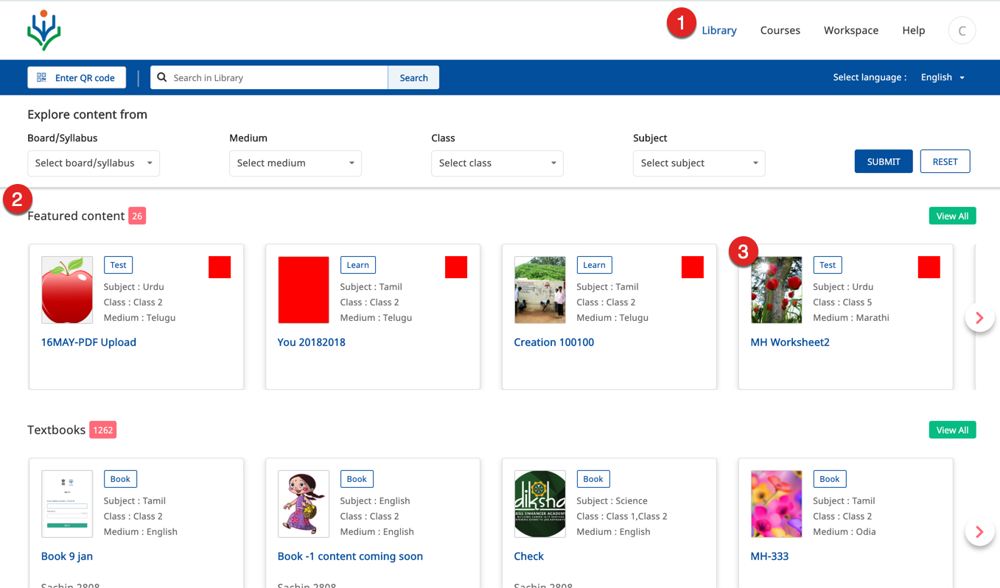
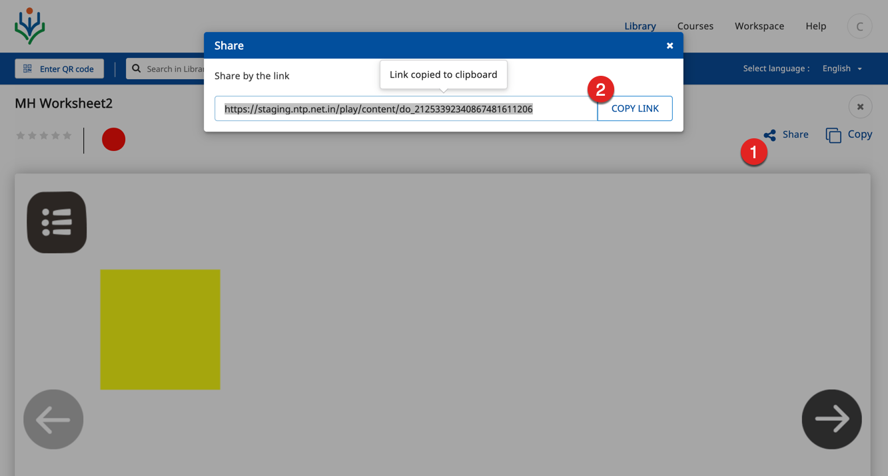
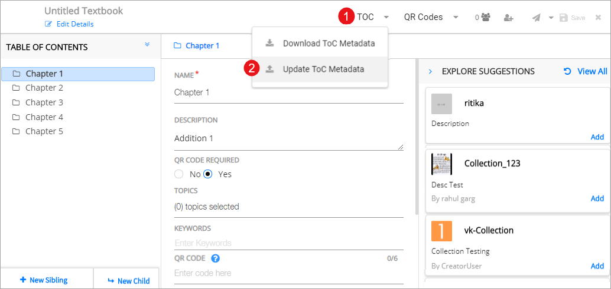

## Updating ToC Details
  <table>
  <tr>
      <th style="width:35%;">Step</th>
      <th style="width:65%;">Screen</th>
  </tr>
  <tr>
     <td>
     The file containing the ToC metadata is downloaded in your local folder. The format of the <a href="download_updatetoccsv_v1.csv">downloaded .csv</a> must be same as that of updating the ToC Metadata. 
     <b>Note</b>: &emsp;a) Do not change the system generated <b>ID</b> column in the downloaded .csv  &emsp;b) A text book in Indian language will contain the text in the Indian language script. Therefore, the .csv will also be comprised of the same script. To see Indian language script properly, the .csv must be opened as described in following steps: 
     &emsp;a. Right-click on the file name
     &emsp;b. Choose <b>Open With</b> 
     &emsp;c. Select <b>Notepad</b>
     &emsp;d. Click <b>Save</b>
    </td>
    <td></td>
  </tr>
  <tr>
  <td><b>Adding Content URL in .csv file</b>
      Book creators can add links of resources published on DIKSHA in the .csv file in the column titled, <b>Linked Content</b>. For any given topic, upto three resources can be added. To add a resource URL:
     1. Click <b>Library</b> tab
     2. Browse and select the resource you want to link
     3. Click the content card </td>
     <td></td>
  </tr>
  <tr>
    <td>On the content card  1. Click <b>Share</b> icon
     2. Copy the link that is displayed, paste it in the .csv file, and save the .csv file
    </td>
    <td></td>
  </tr>
  <tr>
    <td>To upload the updated .csv file
     1. Click <b>ToC</b>
     2. Click <b>Update ToC Metadata</b>
    </td>
    <td></td>
  </tr>
</table>