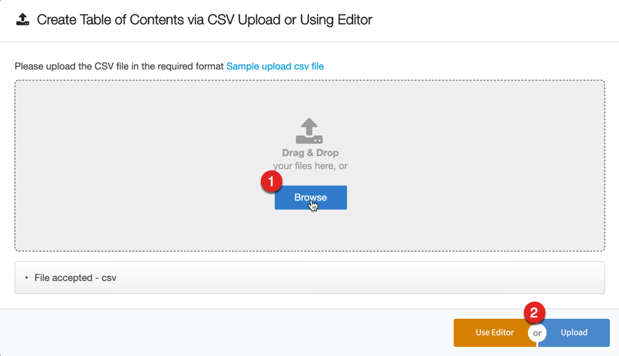
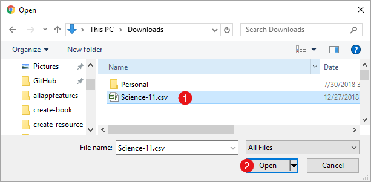
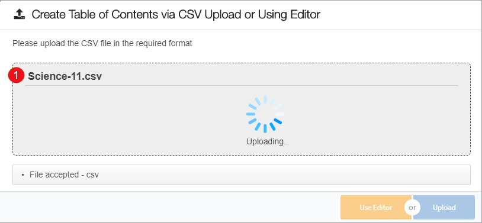
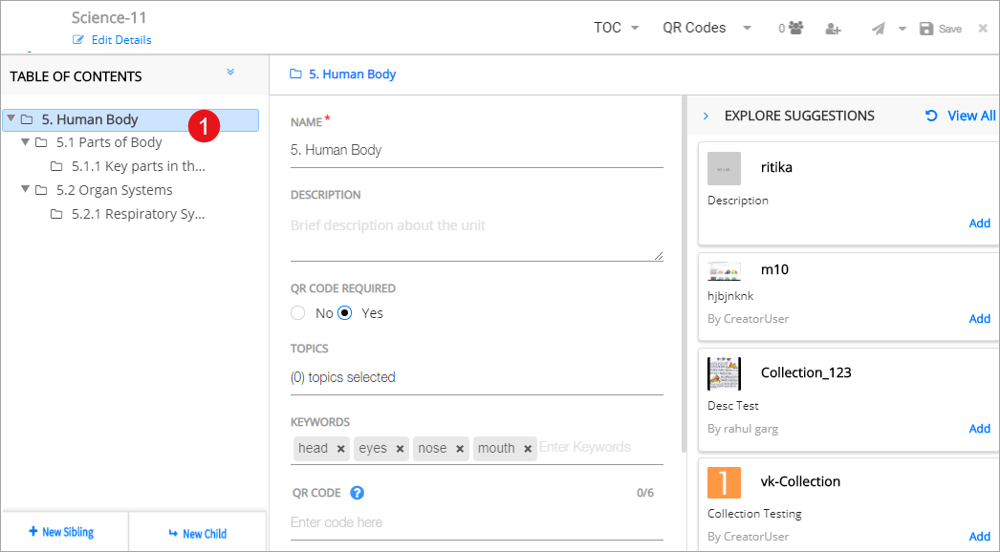

## Overview

To ease the process of book creation, DIKSHA provides the feature of uploading the Table of Contents (ToC) on a .csv file. This option enables book creators to update details of the book along with its QR codes in a .csv file and upload it on the portal. The .csv file can be updated offline and uploaded on the portal when there is internet connectivity. 

<table>
  <tr>
    <th style="width:35%;">Step</th>
    <th style="width:65%;">Screen</th>
  </tr>
  <tr>
  <td>On clicking <b>Start Creating</b> a pop-up screen is displayed. You can browse and upload the ToC file from this screen or use the ibuilt editor and create the ToC
     1. Click <b>Browse</b> to search for the csv file  2. Click <b>Upload</b> to upload the select file. You can alternatively click <b>Use Editor</b> to create the ToC manually
  </td>
  <td></td>
  </tr>
<tr>
  <td>1. Browse and select the .csv file that is to be uploaded
   <b>Note</b>: To ensure that the .csv file is successfully uploaded: 
     &emsp;a. One .csv must have ToC of only one textbook
     &emsp;b. The .csv file must be saved in the predefined format, as a .csv file. For details, download and refer to <a href="/help/creator/create-book/create-toc-csv_v2.csv" target="_blank"> .csv File Format</a>
     &emsp;c. <b>Textbook Name</b> column in the csv file must be same as the name of the current textbook opened in the editor 
     &emsp;d. .csv must have <b>Level 1 Textbook Unit</b> column. Maximum 4 levels (Level 4 Textbook Unit) are supported
     &emsp;e. Mandatory columns - Medium, Grade, Subject, Textbook Name, Level 1 Textbook Unit. Other columns are optional
   2. Click <b>Open</b>
  </td>
  <td></td>
</tr>
<tr>
  <td>1. The selected file is uploaded
  </td>
  <td></td>
</tr>
<tr>
  <td>1. On successful upload, the uploaded ToC is displayed in the new book
  </td>
  <td></td>
</tr>
</table>
