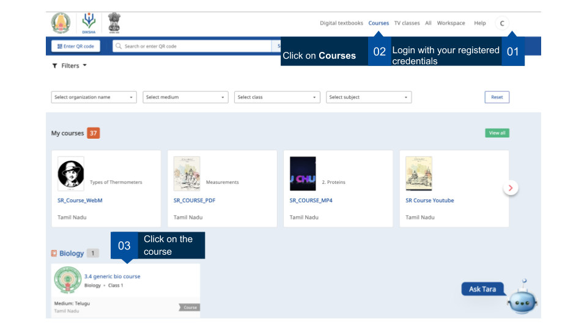
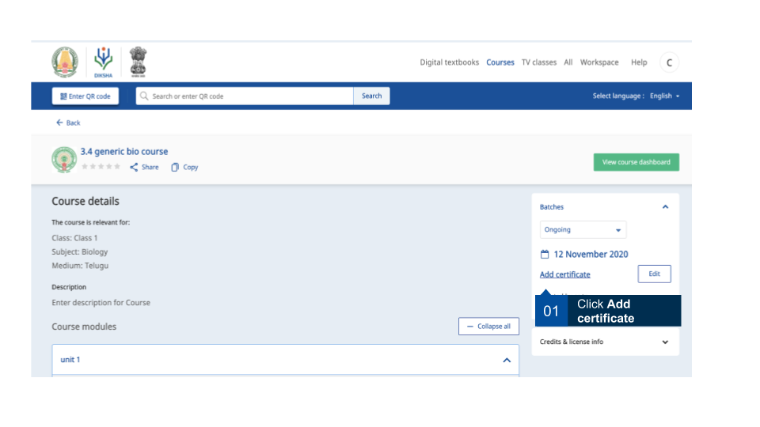
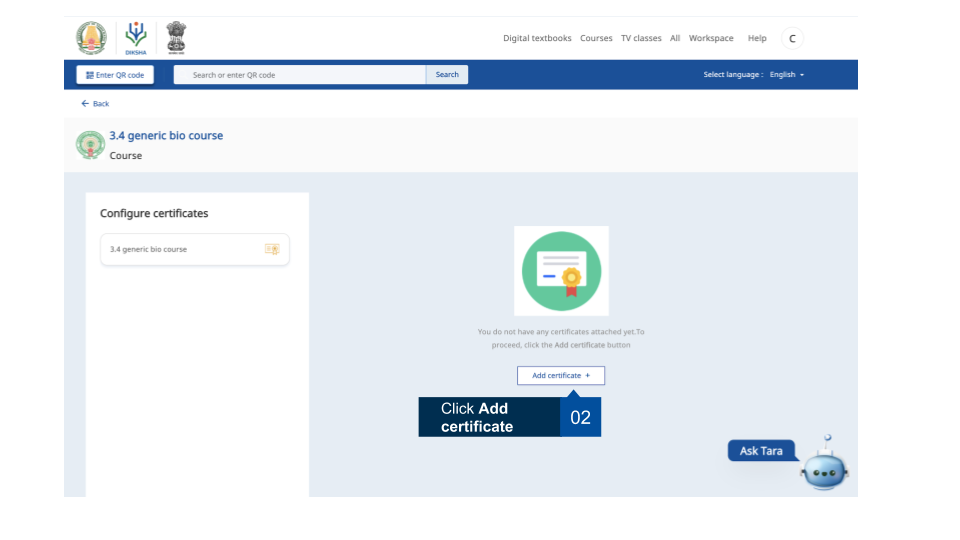
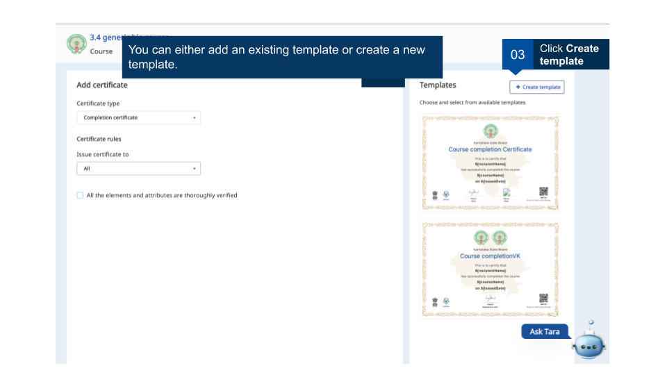
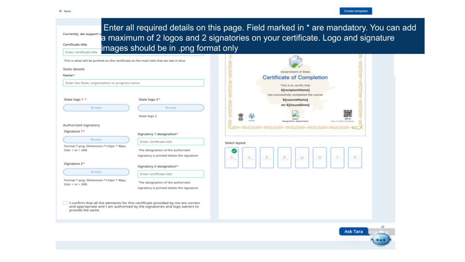
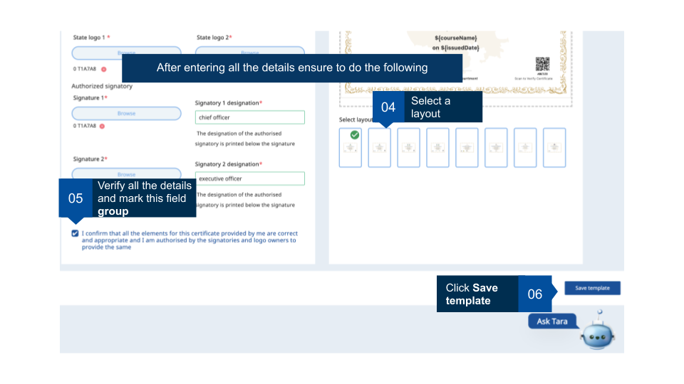
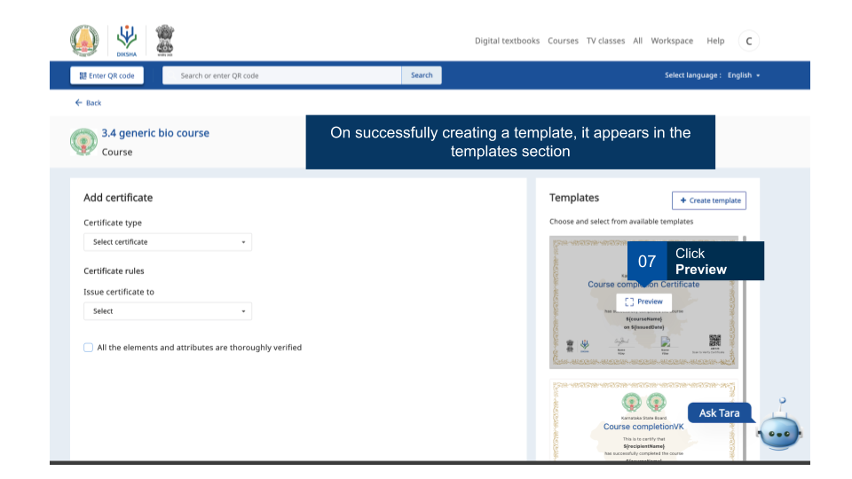
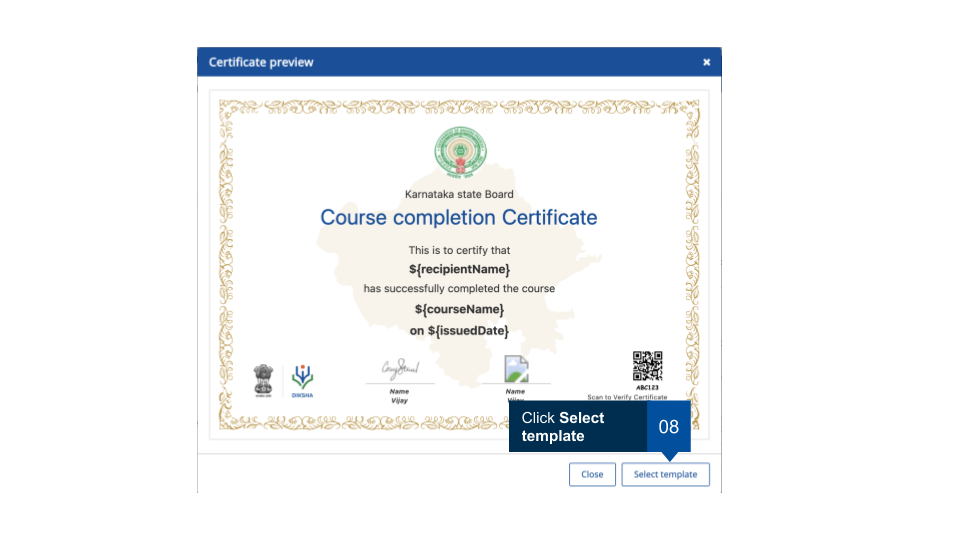
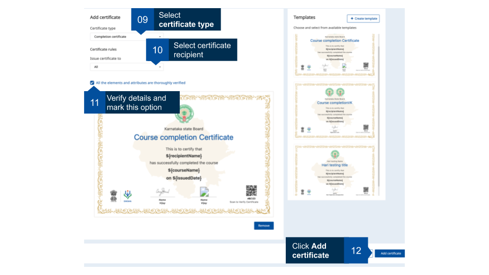
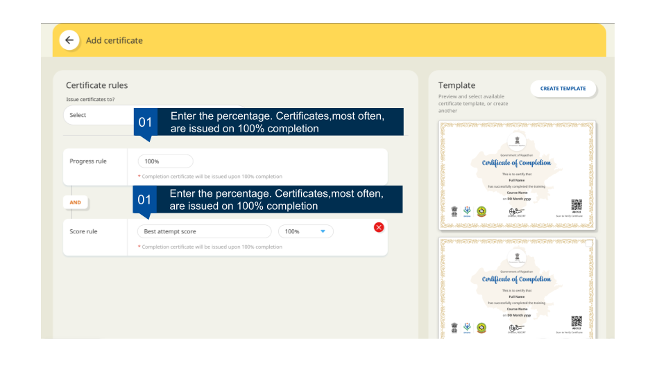

## Overview

On DIKSHA, course creators have the option of creating new certificate templates. Course creators can create and edit templates for only courses that they have created. 

### Prerequisites

<table>
  <tr><th style="width:35%;">Image with instructions</th></tr>
  <tr><td></td></tr>
</table>

### Creating templates

The course creator can use the existing templates offered by DIKSHA or create their own customized templates.

<table>
  <tr><th style="width:35%;">Image with instructions</th></tr>
  <tr><td></td></tr>
  <tr><td></td></tr>
  <tr><td></td></tr>
  <tr><td></td></tr>
  <tr><td></td></tr> 
  <tr><td></td></tr> 
  <tr><td></td></tr>
  <tr><td></td></tr>
  </table>
<b>Note</b>: For assistance on adding images while uploading State logos and signatures refer <a href="../common/metadata_addingimages.html" target="_blank">Adding Images</a>

### Defining scores to issue certificates

The course creators can define score percentage while creating certificate templates. Certificates will be issued to the users based on this criteria defined by the creator.

<table>
  <tr><th style="width:35%;">Image with instructions</th></tr>
  <tr><td></td></tr>
</table>

