## Overview

Courses help learners focus their interests and enhance their abilities. On DIKSHA, course creators and course mentors can create assessments to evaluate the user's understanding of the course. 

The following types of assessments can be created:

- Multiple choice questions
- Match the following
- Fill in the blanks
- Reordering words
- Arranging in sequence

## Prerequisites

You must be registered and logged into DIKSHA with creator credentials.

## Creating Course Assessment

<table>
<tr>
  <th>Image with instructions</th></tr>
<tr><td>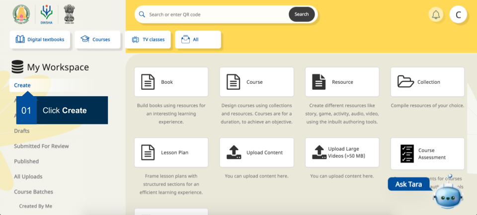</td></tr>
<tr><td>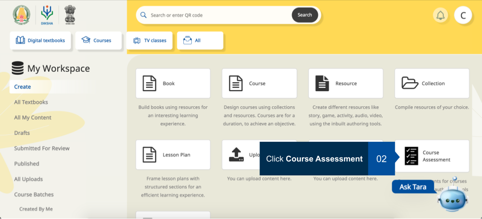</td></tr>
<tr><td>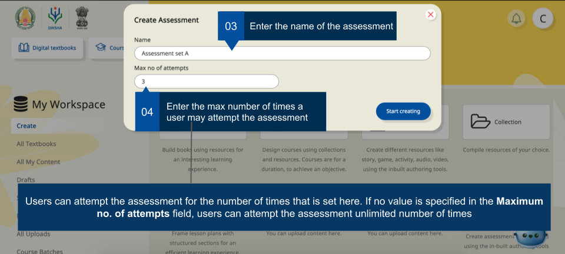</td></tr>
<tr><td>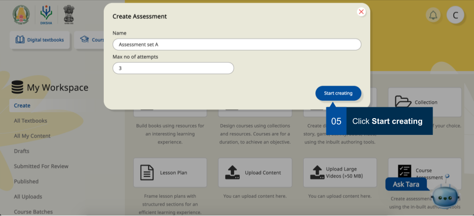</td></tr>
<tr><td>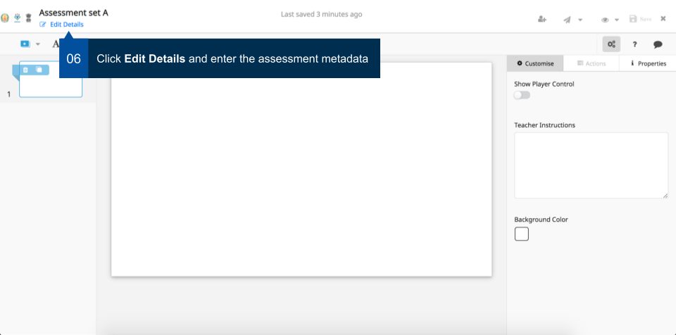</td></tr>
<tr><td>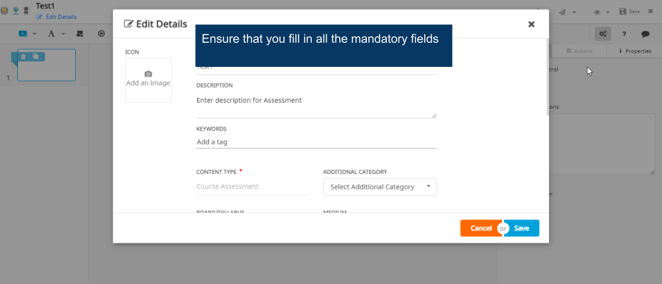</td></tr>
<tr><td>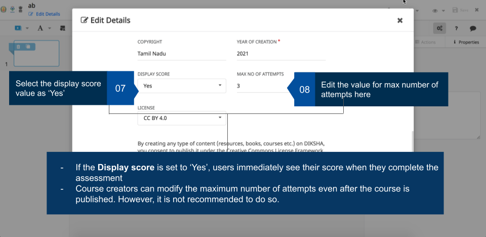</td></tr>
<tr><td>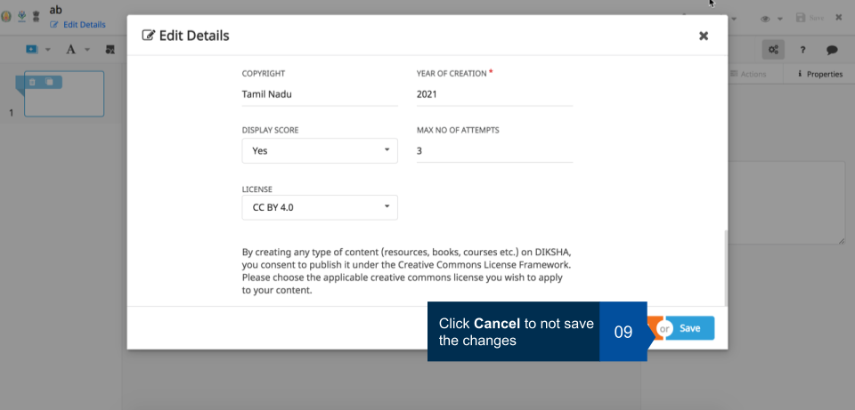</td></tr>
<tr><td>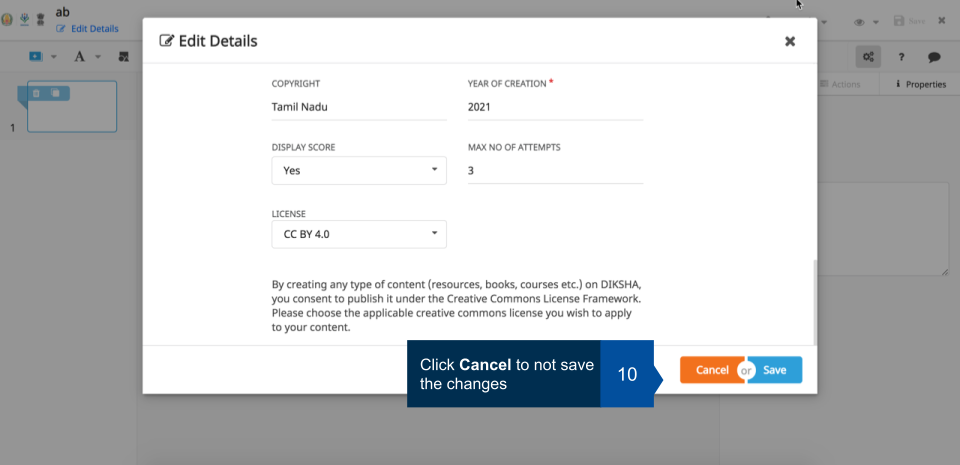</td></tr>
<tr><td>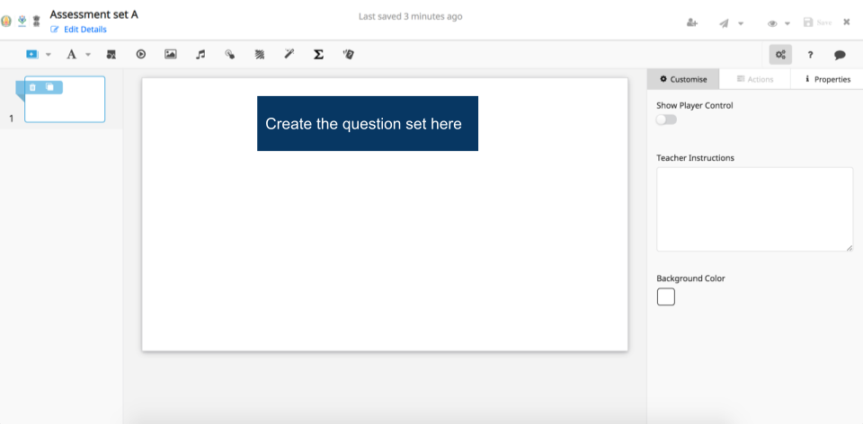</td></tr>
<tr><td>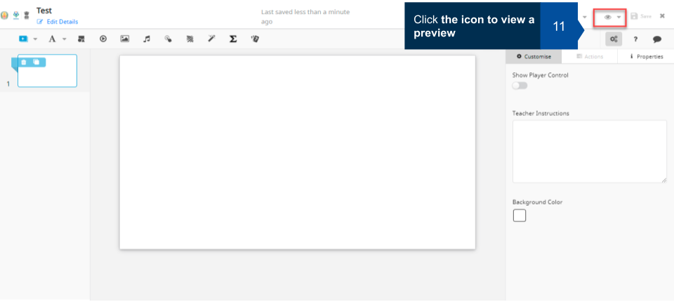</td></tr>
<tr><td>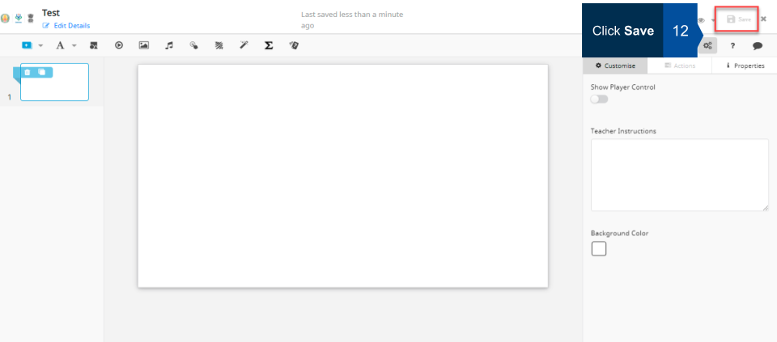</td></tr>
<tr><td>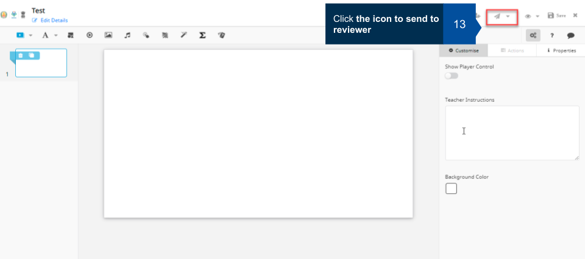</td></tr>
</table>

### Using the Content Editor

Click **Start Creating** to display the inbuilt content editor. For details on how to use the content editor refer <a href = "/help/creator/understand-content-editor-tool/index.html" target="_blank">Understanding the Content Editor</a>

<b>Note</b>: While creating question sets in the assessments, creators can also add the following:

- Instructions: adding instructions would help users to understand details such as how to take the assessments, how many attempts are allowed and so on.

- Timer: creators can set a timer within which the assessment must be completed once the user starts the assessment.

