## Overview 

Courses help learners focus their interests and enhance their abilities. On DIKSHA, course creators and course mentors add relevant content to compile a course. A course creator creates multiple units of the course and compiles them as a course. Whereas a course mentor compiles a course using existing content from the portal.

## Prerequisites 

You must be registered and logged into DIKSHA with creator credentials.

## Course creation

The below steps should be followed to create a course:

<table>
<tr>
  <th>Image with instructions</th></tr>
<tr><td>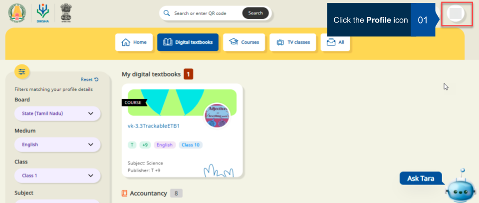</td></tr>
<tr><td>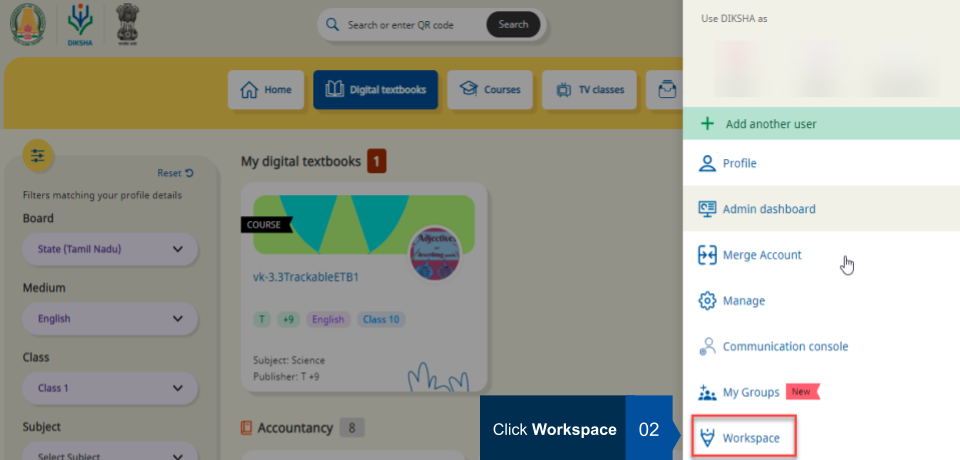</td></tr>
<tr><td></td></tr>
<tr><td></td></tr>
<tr><td>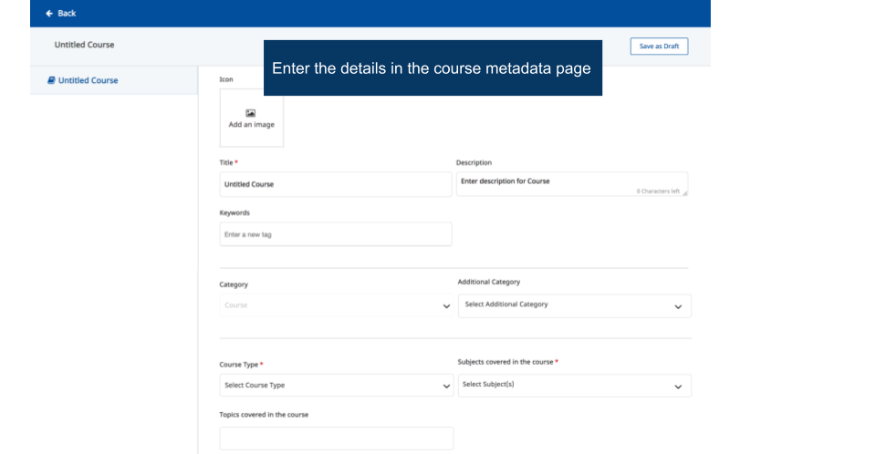</td></tr>
<tr><td>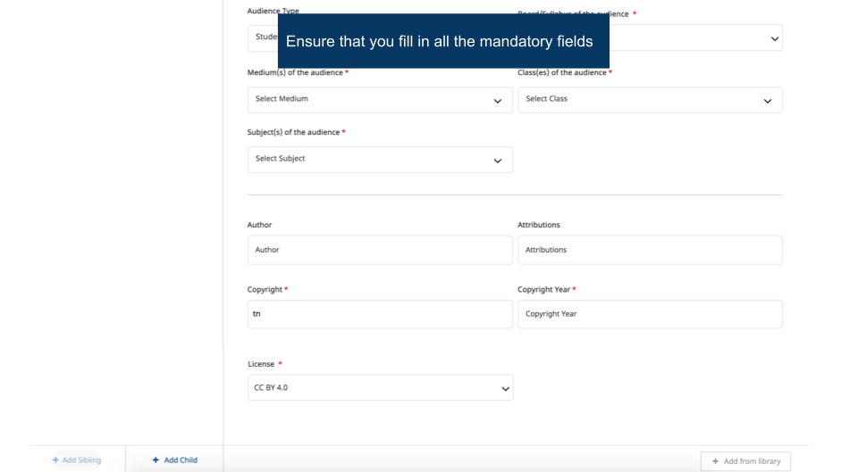</td></tr>
<tr><td>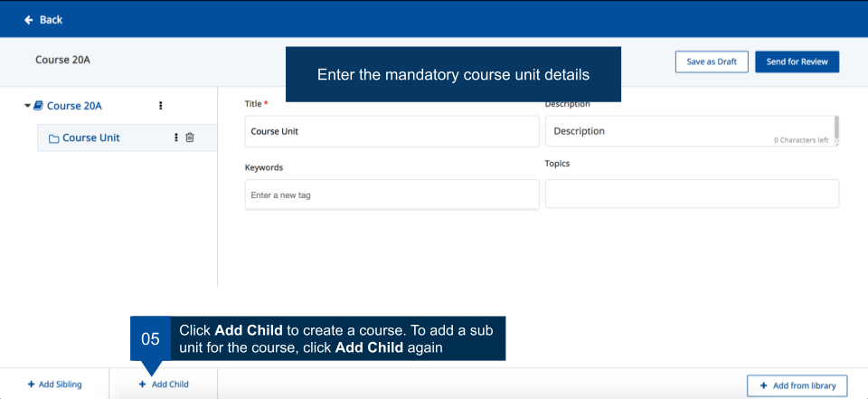</td></tr>
<tr><td>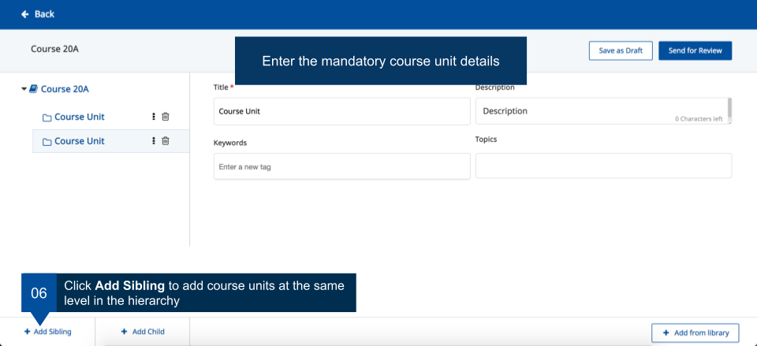</td></tr>
<tr><td>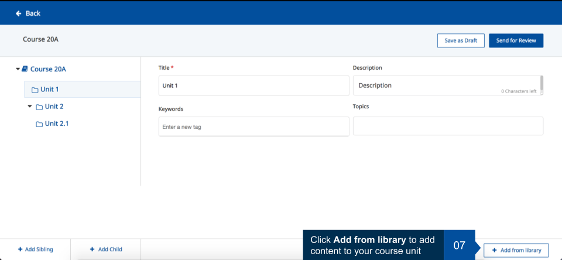</td></tr>
<tr><td>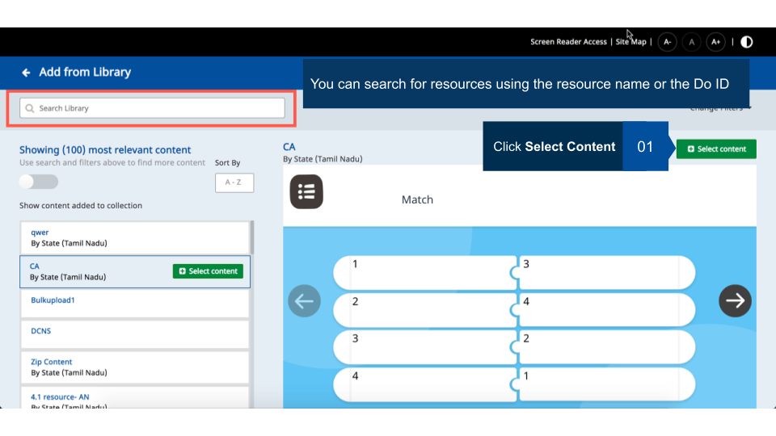</td></tr>
<tr><td>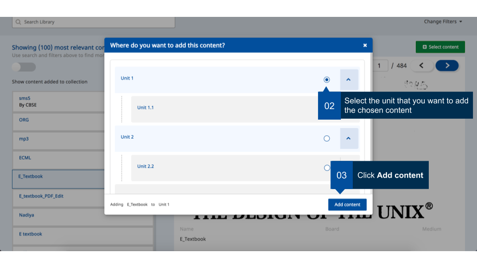</td></tr>
<tr><td>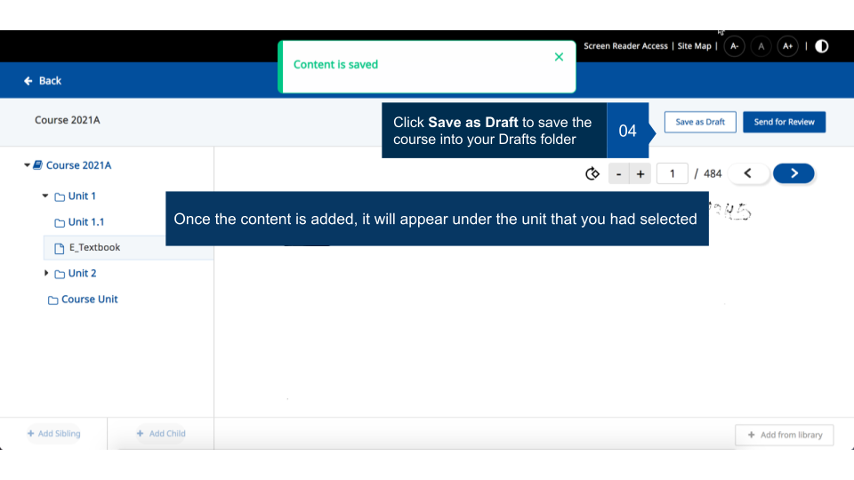</td></tr>
<tr><td>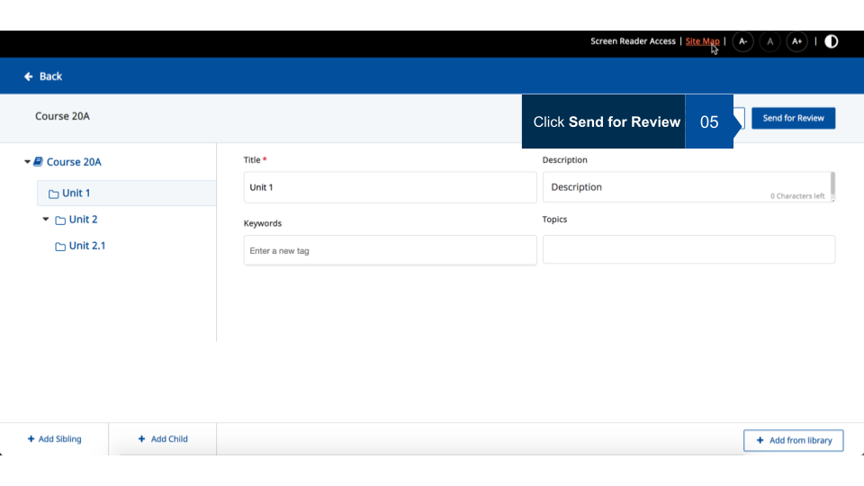</td></tr>
<tr><td>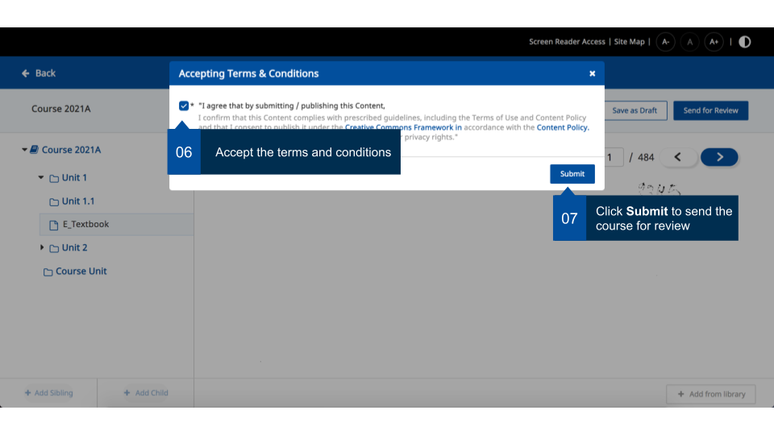</td></tr>
</table>