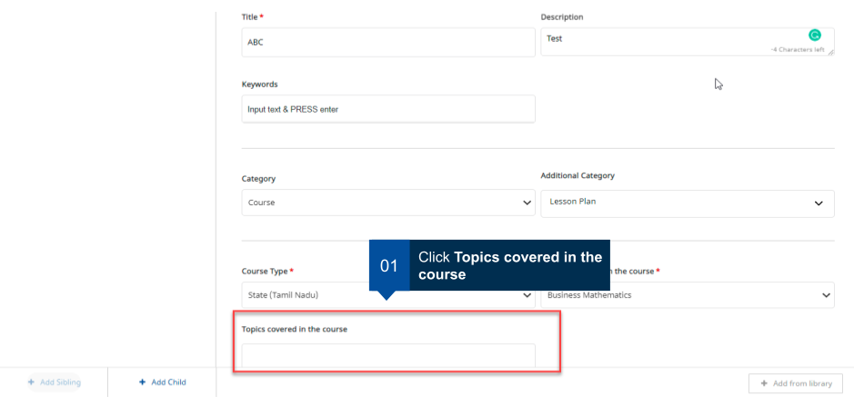
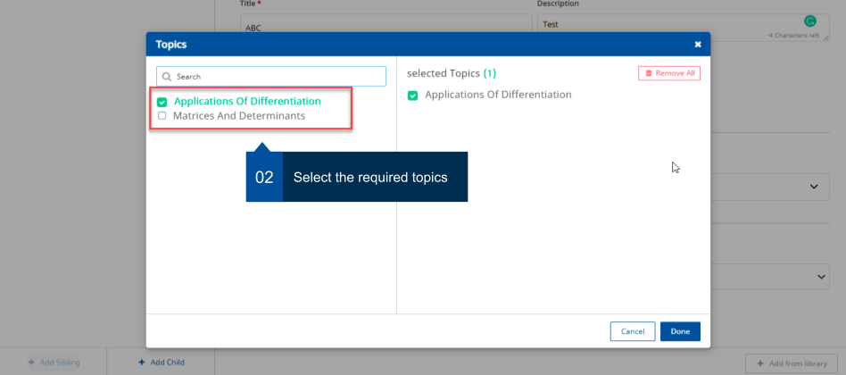
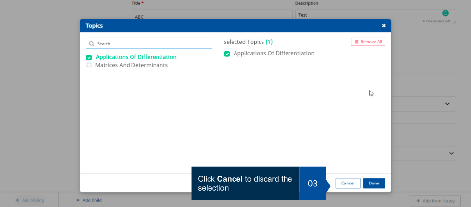
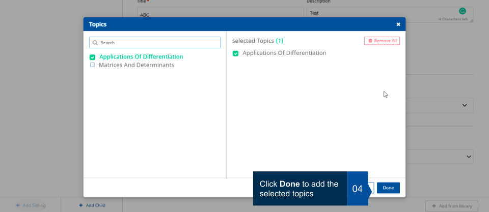

## Overview

DIKSHA hosts a wide variety of content. Content published on DIKSHA are generally centred around one or more concepts.
These concepts are called **Topics** on DIKSHA. To ensure that any content created or published on DIKSHA is easily
discovered by users, as a best practice, all content creators are instructed to associate any content they create with a
topic. The topic selector feature in DIKSHA provides an exhaustive list of topics for the content creators to choose
from. This section provides detailed instructions on how to select topics from this topic selector while creating
content.

## Prerequisites

You must be registered, logged into DIKSHA with creator credentials and you must be inside the Course tile.

## Selecting Topics

All content on DIKSHA has various details associated with it that provide information about the content. For example;
the details include information about the Subject, Board, Medium, and Contributor. Each organization on DIKSHA decides
and configures which information about the content is mandatory when creating or updating content. To elaborate, some
organization may mandate having only the name of the content to be recorded during creation. Another organization may
mandate that all information details about the content such as the classes for which the content is appropriate, the
topics covered by the content, content creator details, etc. are captured.

This section provides detailed instructions on how to associate content with topics

<table>
<tr>
  <th>Image with instructions</th></tr>
<tr><td></td></tr>
<tr><td></td></tr>
<tr><td></td></tr>
<tr><td></td></tr>
</table>