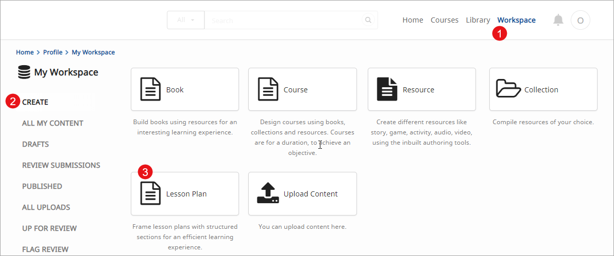
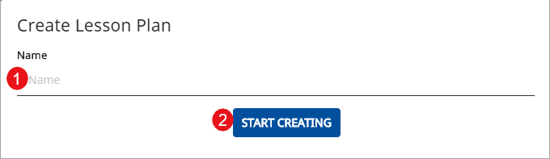
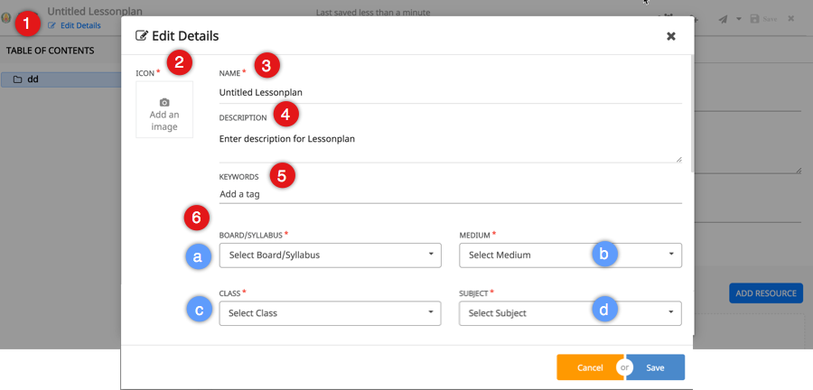
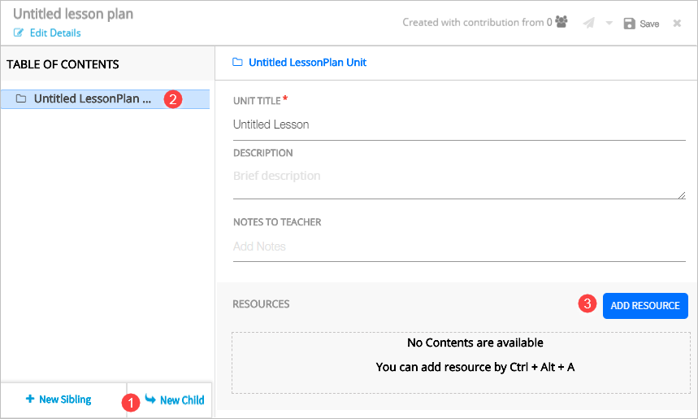
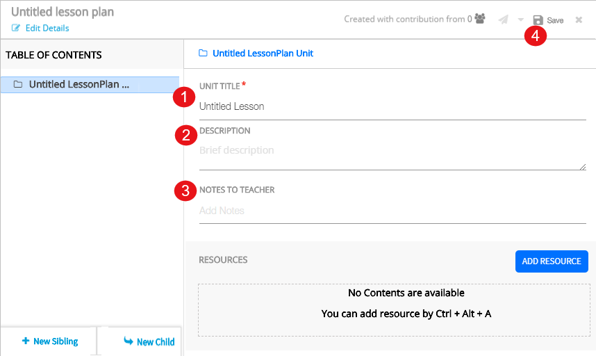
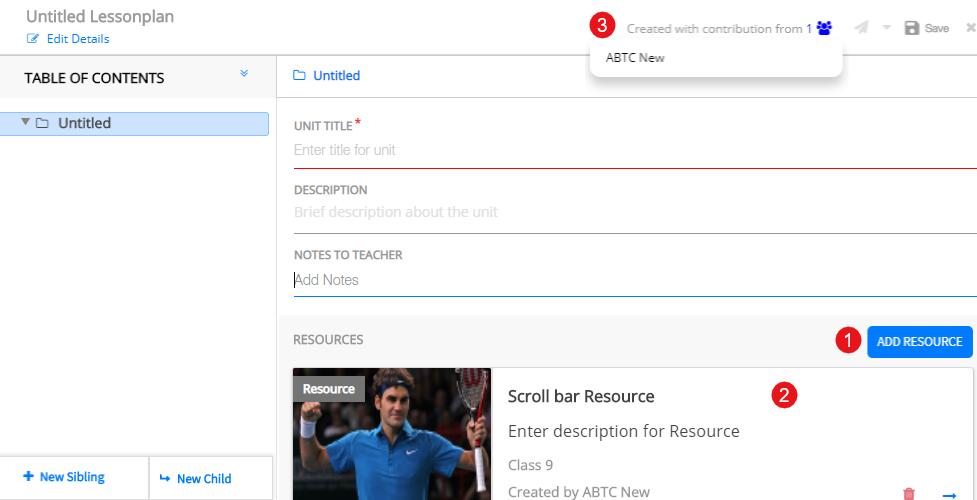

## Overview

Lesson plan is a structured outline of a given topic, unit, chapter to be taught on any given day. Lesson plan aids to streamline teaching and create an engaging learning experience.

## Prerequisites

<table>
  <tr>
    <th style="width:35%;">Step</th>
    <th style="width:65%;">Screen</th>
  </tr>
  <tr>
    <td>You are logged in
      1. You are currently on <b>Workspace</b>
      2. You have selected <b>Create</b>
      3. You have clicked the <b>Lesson Plan</b> tile
    </td>
    <td></td>
   </tr>
 </table>

## Creating Lesson Plan

<table>
  <tr>
    <th style="width:35%;">Step</th>
    <th style="width:65%;">Screen</th>
  </tr>
  <tr>
    <td>On <b>Create Lesson Plan</b> screen 
     1. Enter <b>Name</b> of the course 
     2. Click <b>Start Creating</b> 
    </td>
    <td></td>
  </tr>
 </table>

### Adding Details

<table>
  <tr>
    <th style="width:35%;">Step</th>
    <th style="width:65%;">Screen</th>
  </tr>
  <tr>
    <td>1. Click the <b>Edit Details</b> link on the top left corner of the page
       2. Click the camera icon to add an image 
       <b>Note</b>: For details, refer <a href="/help/creator/common/metadata_addingimages.html" target="_blank">Adding Image to Metadata</a>
       3. Enter <b>Name</b>
       4. Enter <b>Description</b> for the lesson plan
       5. Enter <b>Keywords</b>
       6. Select the values from the following drop-down lists:
       &emsp;a) <b>Board/Syllabus</b>
       &emsp;b) <b>Medium</b>
       &emsp;c) <b>Class</b>
       &emsp;d) <b>Subject</b>
    </td>
    <td></td>
  </tr>
  <tr>
  <td>
      7. Enter <b>Notes to Teacher</b>
       8. Enter <b>Learning Objective</b> 
       9. Enter <b>Duration</b>
       10. Select <b>Topics</b>
       <b>Note</b>: To know more refer <a href = "/help/creator/common/selecting_topics.html" target="_blank">Selecting Topics</a>
       11. Select <b>Year</b>
       12. Enter <b>Original Author</b>
       13. Enter <b>Attributions</b>
       14. Enter <b>Copyright</b>
       15. Enter <b>Year of Creation</b>
       16. Select the <b>License</b> for your content
       17. Click <b>Save</b> to collectively save all updates
       18. Click <b>Cancel</b> to exit the page 
      </td>
    <td></td>
 </tr>
 </table>

### Adding Content to Lesson

<table>
  <tr>
    <th style="width:35%;">Step</th>
    <th style="width:65%;">Screen</th>
  </tr>
  <tr>
    <td>1. Click <b>New Child</b> on the left pane to add lesson unit or chapter
       2. On clicking child node, a heading is added to the Table of Contents pane. For details on child node, sibling node, refer <a href="../common/treestructure_toc.html" target="_blank">Exploring ToC Structure</a>
       3. Click <b>Add Resource</b> to add content to the headings. For details on adding resources, refer <a href="/help/creator/common/addingresources.html" target="_blank">Adding Resources</a>
    </td>
    <td></td>
  </tr>
  </table>

### Adding Details to Lesson ToC

<table>
  <tr>
    <th style="width:35%;">Step</th>
    <th style="width:65%;">Screen</th>
  </tr>
  <tr>
    <td>To start adding heading details in a unit 
       1. Enter <b>Name</b>. This is the unique name of the lesson
       2. Enter <b>Description</b>
       3. Enter <b>Notes to Teacher</b>
       4. Click <b>Save</b> to save the details
    </td>
    <td> </td>
  </tr>
</table>

### Viewing Contributor Details

<table>
  <tr>
    <th style="width:35%;">Step</th>
    <th style="width:65%;">Screen</th>
  </tr>
  <tr><td>1. Click <b>Add Resource</b> to add resource to the Lesson Plan, refer <a href="/help/creator/common/addingresources.html" target="_blank">Adding Resources</a>
   2. The resource is added to the Lesson Plan
   3. The names of the resource owners appears under <b>Created with Contributions From</b> button
  </td>
  <td>
  </td>
  </tr>
</table> 

## Working with Table of Contents

You can see <b>Table of Content</b> tree in the left pane to navigate content compiled for a collection, textbook, course or lesson plan. You can manipulate the tree using either:
  - The burger menu associated with a tree node
  - Right-click options associated with a tree node, OR
  - Keyboard shortcuts 

 For details on manipulating the tree and adding content, refer <a href="/help/creator/common/treestructure_toc.html" target="_blank">Exploring ToC Structure</a>

### Deleting Content

<table>
  <tr>
    <th style="width:35%;">Step</th>
    <th style="width:65%;">Screen</th>
  </tr>
  <tr>
    <td>1. Click <b>Delete</b> icon beside the burger menu  2. Click <b>Yes</b> to delete the added content
     <b>Note</b>: You can alternatively delete content by clicking <b>Delete</b> in the burger menu drop-down</td>
    <td></td>
  </tr>
</table>

### Reordering Content

<table>
  <tr>
    <th style="width:35%;">Step</th>
    <th style="width:65%;">Screen</th>
  </tr>
  <tr>
    <td>1. Drag and drop the content to the desired position to rearrange the order of the content added to the lesson plan
      </td>
    <td></td>
  </tr>
  <tr>
    <td>1. Click the upward arrow to collapse the table of contents. Click the same arrow to expand collapsed table of contents.
     </td>
    <td></td>
  </tr>
</table>

## Sending Lesson Plan for Review

Before the Lesson Plan is published, it must be reviewed. You can send it for reviewing and publishing.

<table>
  <tr>
    <th>Step</th>
    <th>Screen</th>
  </tr>
  <tr>
    <td>1. Click <b>Save</b> on the header to save the lesson  2. Click <b>Limited sharing</b> to publish the lesson to the limited audiences  <b>Note</b>: Refer <a href="/help/creator/common/limitedpublishnshare.html" target="_blank">Limited Publishing and Sharing</a> to view and share all the contents created and ready for sharing.  3. Click <b>Send for review</b> to send the created lesson for review
    </td>
    <td></td>
  </tr>
  </table>

## Exploring What's New

<table>
  <tr>
    <th style="width:35%;">Step</th>
    <th style="width:65%;">Screen</th>
  </tr>
  <tr>
    <td>The What’s New feature informs you of the product features added or enhanced since the last product release
       1. Click on the <b>What's New</b> icon to view concise information about new product functionality
       <b>Note</b>: The What's New icon is red before you view it for the first time. The icon turns grey after you view the information, until the next product version
    </td>
    <td></td>
  </tr>
  </table>
