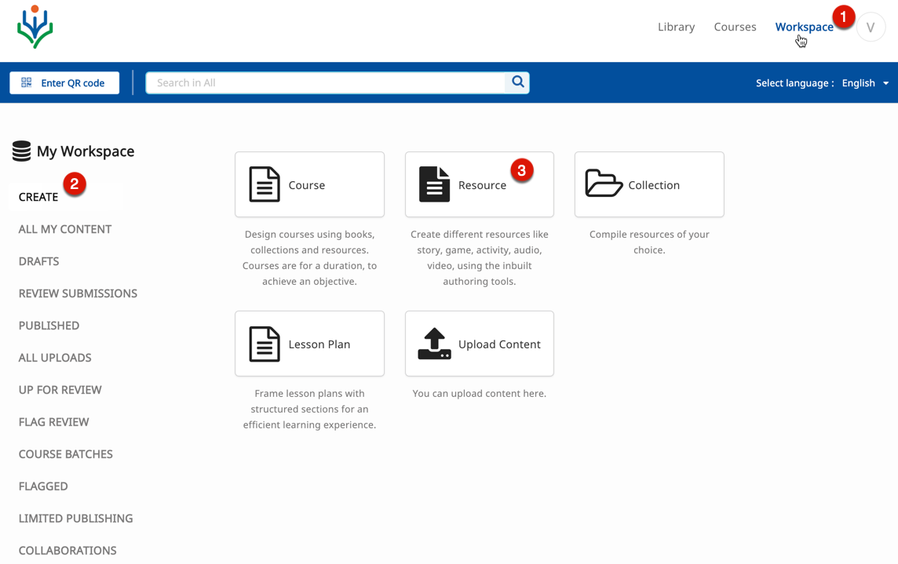
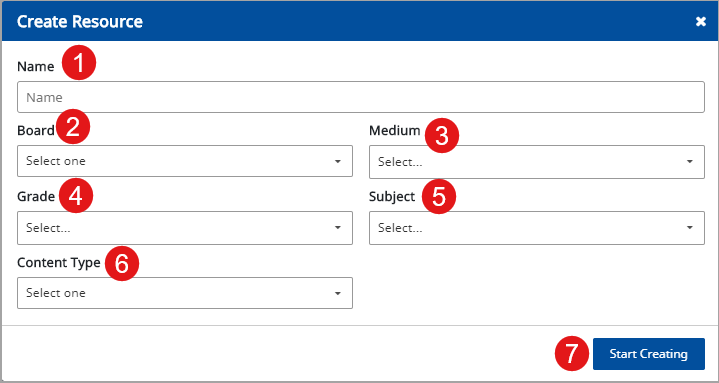
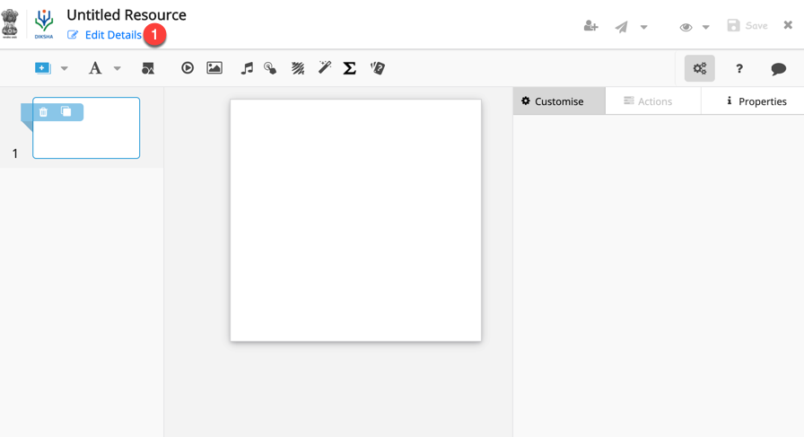
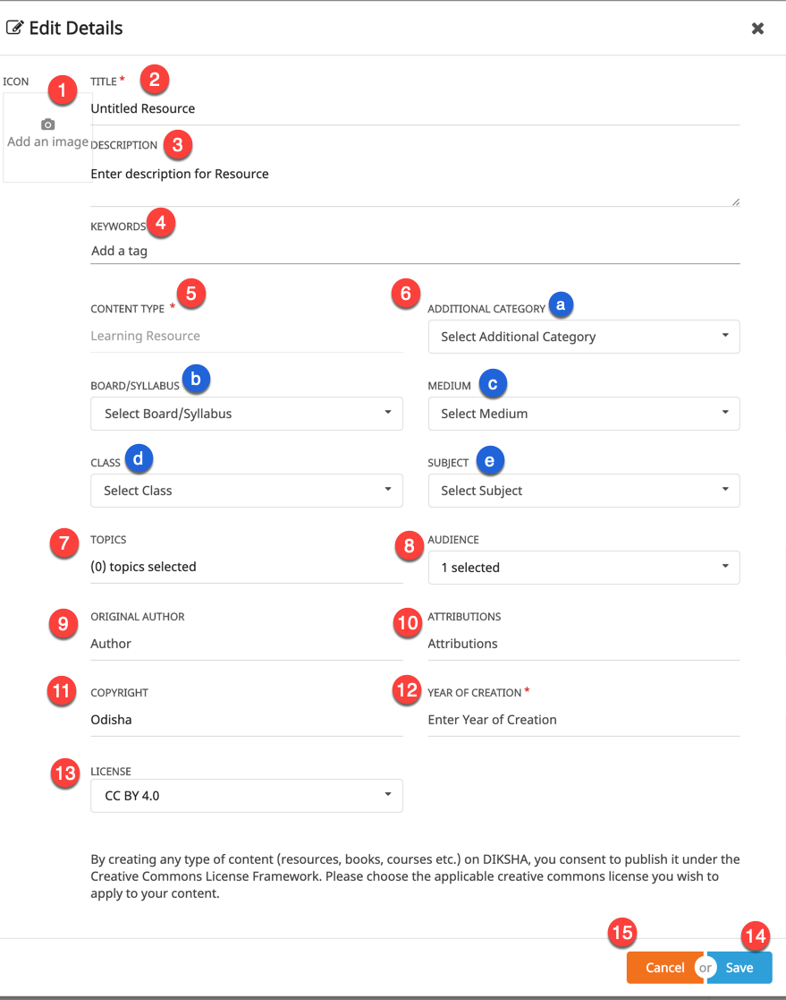

## Overview

DIKSHA houses a wide variety of content. Users can directly create content on DIKSHA using the inbuilt content editor. Content available offline for example, a pdf file available in your local system can be uploaded on DIKSHA. For more details on uploading content, created offline, refer <a href="/help/creator/upload-content/content-upload.html" target="_blank">Uploading Content</a>

Resources  are the simplest/smallest unit of content that can be created by any user on DIKSHA using the inbuilt content editor. The various categories of resources that can be created on DIKSHA include:

- Experiment
- Learn
- Play
- Practice
- Read
- Teach
- Test

Each of these categories corresponds to the learning process/methodology that is deployed to teach a particular piece of content. For example, a tutor creates an activity and the intent is to educate the learner about a concept through a game. The resource category in this case is, Play. Similarly, a tutor creates a story to enhance the reading skills of the learner, the story falls under the category of Read.

This page details the procedure of creating resources on DIKSHA

## Prerequisites
<table>
  <tr>
    <th style="width:35%;">Step</th>
    <th style="width:65%;">Screen</th>
  </tr>
  <tr>
    <td>1. You are logged in 
     2. You have clicked on <b>Workspace</b> tab 
     3. You have clicked on <b>Resource</b> tile 
      </td>
      <td></td>
  </tr>
  </table>

## Creating Resources
<table>
  <tr>
    <th style="width:35%;">Step</th>
    <th style="width:65%;">Screen</th>
  </tr>
  <tr>
    <td>On <b>Create Resource</b> screen 
     1. Enter <b>Name</b> of the course 
     Select the values in the following drop-down lists:
     2. Click <b>Start Creating</b> 
     3. Select <b>Board</b>
     4. Select <b>Medium</b>
     5. Select <b>Grade</b>
     6. Select <b>Subject</b>
     7. Select <b>Content Type</b></td>
    <td></td>
  </tr>
  </table>

## Editing Resource Details

Once the resource is created, using the content editor, all details pertaining to the resource must be updated before sending the resource for review.

<table>
  <tr>
    <th style="width:35%;">Step</th>
    <th style="width:65%;">Screen</th>
  </tr>
  <tr>
    <td>1. Click the <b>Edit Details</b> link on the top left corner of the page
       </td>
    <td></td>
  </tr>
  <tr>
  <td>
       1. Click the camera icon to add an image 
       <b>Note</b>: For details, refer <a href="/help/creator/common/metadata_addingimages.html" target="_blank">Adding Image to Metadata</a>
       2. Enter <b>Title</b>
       3. Enter <b>Description</b> for the resource
       4. Enter <b>Keywords</b>
       5.  5. The <b>Collection Type</b> is auto-filled based on the content type that is being created
       6. Select the following from their respective drop-down lists:
       &nbsp;a. <b>Additional Category</b>
       &emsp;b) <b>Board</b>
       &emsp;c) <b>Medium</b>
       &emsp;d) <b>Class</b>
       &emsp;e) <b>Subject</b>
      7. Enter <b>Topic</b>
       <b>Note</b>: To know more refer <a href = "/help/creator/common/selecting_topics.html" target="_blank">Selecting Topics</a>
       8. Enter <b>Audience</b>
       9 Enter <b>Original Author</b>
       10. Enter <b>Attributions</b>
       11. Enter <b>Copyright</b>
       12. Enter the <b>Year of Creation</b>
       13. Select the <b>License</b> for the content from the drop-down list
       14. Click <b>Save</b> to collectively save all updates
       15. Click <b>Cancel</b> to exit the page
       <b>Note</b>: These details can also be added later when updating the resource details before sending it for review
    </td>
    <td></td>
  </tr>
</table>

#### Content Types 

DIKSHA supports the following additional Content Types for all   

  - Lesson Plan  
  - Explanation Resource  
  - Practice Resource  
  - Learning Outcome Definition    

## Content Editor

DIKSHA provides an inbuilt content editor to create engaging and innovative content. For details on how to create resource using the content editor, refer <a href="/help/creator/understand-content-editor-tool/index.html" target="_blank">Content Editor</a>

### Sending Resource for Review

<table>
  <tr>
    <th style="width:35%;">Step</th>
    <th style="width:65%;">Screen</th>
  </tr>
  <tr>
    <td>1. Click <b>Save</b> on the header to save the created resource
     2. Click <b>Send for review</b>. Before sending for review, you can share the content to a limited audience. To know more about Limited Sharing, refer <a href="/help/creator/common/limitedpublishnshare.html" target="_blank">Limited Publishing and Sharing</a>
    </td>
    <td></td>
  </tr>
</table>
