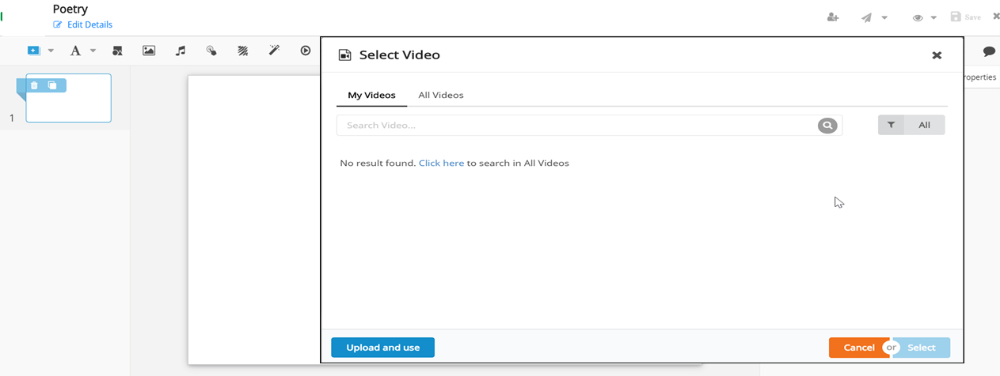
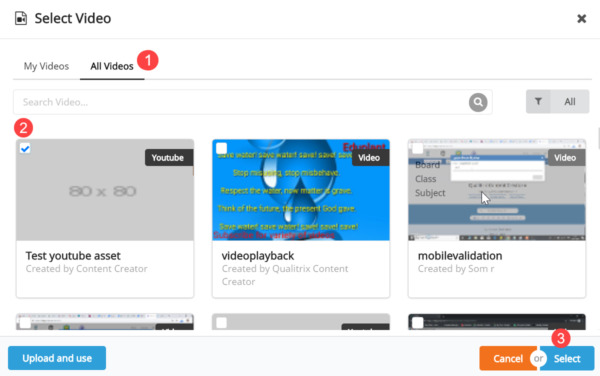
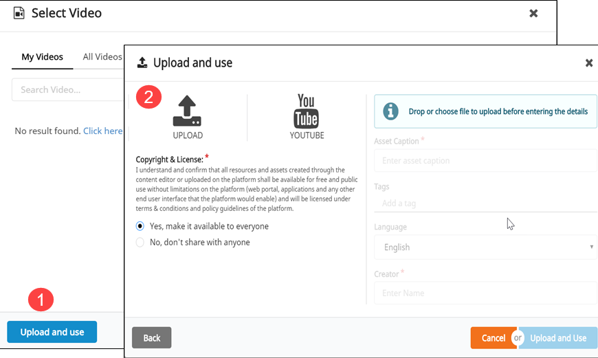
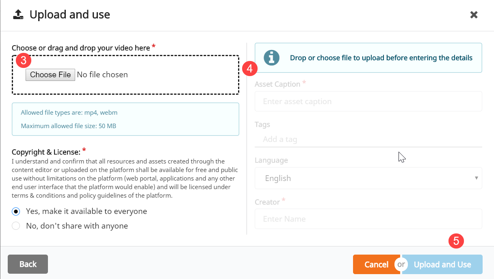
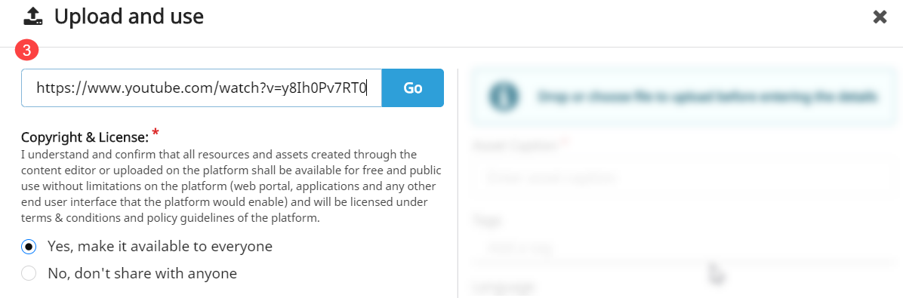
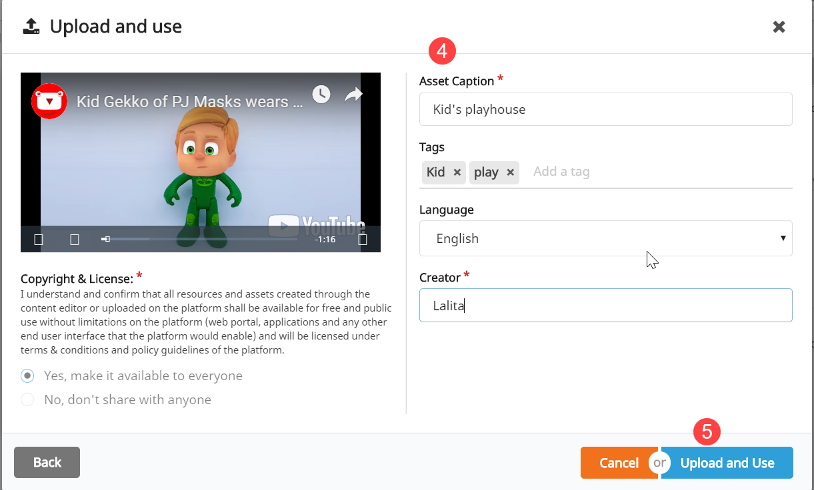

## Overview

You can add/upload a video to a content editor slide on DIKSHA portal. Videos can be uploaded from:
- Your local system
- Library (published videos on DIKSHA)
- YouTube (providing the video link)

## Prerequisite

<table>
  <tr>
    <th style="width:35%;">Step</th>
    <th style="width:65%;">Screen</th>
  </tr>
  <tr>
    <td>
      To add a video on a content editor slide:
       1. Click <b>Add Video</b> icon. The <b>Select Video</b> window is displayed
        You can select and upload a video from this window</td>
    <td></td>
  </tr>
</table>

## Adding Video from Library

Videos published on DIKSHA are available in the Library tab. To select and add a video from the existing videos on
DIKSHA:

<table>
  <tr>
    <th style="width:35%;">Step</th>
    <th style="width:65%;">Screen</th>
  </tr>
  <tr>
    <td>1. Click <b>All Video</b> from the <b>Select Video</b> window 
     2. Select a video from the listed videos
       3. Click <b>Select</b> 
      The video gets added to the content editor slide</td>
    <td></td>
  </tr>
</table>

## Adding Video from your Local System

<table>
  <tr>
    <th style="width:35%;">Step</th>
    <th style="width:65%;">Screen</th>
  </tr>
  <tr>
    <td>1. Click <b>Upload and use</b> from the <b>Select Video</b> window An <b>Upload and use</b> window is displayed
       2. Click the <b>Upload</b> icon. A <b>Choose File</b> option is displayed on the window</td>
    <td></td>
  </tr>
  <tr>
    <td>3. Click the <b>Choose File</b> option to browse video files from your local. You can alternatively drag and
      drop the video file  <b>Note</b>: You can only upload mp4 and webm file type, and the size of the file must not
      exceed 50 MB  4. Add the following details for the selected video:
       &emsp;a. Asset caption: Title of the video
       &emsp;b. Tags: Keywords to enhance the searchability
       &emsp;c. Language: Medium of instruction of the video
       &emsp;d. Creator: Name of the video creator
       5. Click <b>Upload and use</b> to upload the video on the content editor slide
        You can make the video available for all by selecting the option <b>Yes, make it available to everyone</b>.
      If you don't want to share the video with everyone, select the option <b>No, don't share with anyone</b></td>
    <td></td>
  </tr>
</table>

## Adding Online Videos

<table>
  <tr>
    <th style="width:35%;">Step</th>
    <th style="width:65%;">Screen</th>
  </tr>
  <tr>
    <td>1. Click <b>Upload and use</b> from the <b>Select Video</b> window. A <b>Upload and use</b> window appears 2.
      Click the <b>YouTube</b> icon. A blank field is displayed
    </td>
    <td></td>
  </tr>
  <tr><td> Copy the link of the YouTube video 
    3. Paste the copied video URL in the field, and click <b>Go</b></td>
    <td></td>   
  </tr>
  <tr>
    <td>4. Add the following details for the video:
       &emsp;a. Asset caption: Title of the video
       &emsp;b. Tags: Keywords to enhance the searchability
       &emsp;c. Language: Medium of instruction for the video
       &emsp;d. Creator: Name of the creator
       5. Click <b>Upload and use</b> to upload the YouTube video on the content editor slide
        You can make the video available for all by selecting the option <b>Yes, make it available to everyone</b>.
      If you don't want to share the video with everyone, select the option <b>No, don't share with anyone</b>
        DIKSHA supports only CC-BY licensed YouTube video. For more information, refer <a
        href="https://www.smartcopying.edu.au/open-education/creative-commons/creative-commons-information-pack-for-teachers-and-students/how-to-find-creative-commons-material-using-youtube" target="_blank">Link</a></td>
    <td></td>
  </tr>
</table>
