## Overview

DIKSHA houses a wide variety of content. Users can create content on DIKSHA or upload content created offline.

>**Note**: For details on uploading content that is created offline, refer [Uploading Content](/help/creator/upload-content/content-upload.html){:target="_blank"}

A user with content creation rights can use DIKSHA's inbuilt content editor to create a **Resource** that is DIKSHA's simplest or smallest unit of content.

You can create the following categories of resources on DIKSHA:

- Experiment
- Learn
- Play
- Practice
- Read
- Teach
- Test

Each of these categories corresponds to a stage or intent of the learning process or methodology that is used by tutors to impart knowledge of the subject. For example, a tutor intends to educate learners of a concept through a game. When the tutor creates the game, the category of the resource (the game) is, **Play**. Similarly, if a tutor creates a story to enhance the reading skills of learners, the category of the resource (the story) is, **Read**.

This page details how to create resources using the inbuilt content editor.

### Prerequisites

<table>
  <tr>
    <th style="width:35%;">Step</th>
    <th style="width:65%;">Screen</th>
  </tr>
  <tr>
    <td>Log in to DIKSHA 
       1. Click <b>My Workspace</b>. For more details on workspace refer <a href="/help/getting-started/workspace/index.html" target="_blank">Workspace</a>
       2. Click <b>Create</b> 
       3. Click the <b>Resource</b> tile to create content
    </td>
    <td></td>
  </tr>
  <tr>
    <td>1. Enter a <b>Name</b> for the content resource 
     2. Enter <b>Board</b>
     3. Enter <b>Grade</b>
     4. Enter <b>Medium</b>
     5. Enter <b>Subject</b>
     6. Enter <b>Resource Type</b>
     7. Click <b>Start Creating</b>
    </td>
    <td></td>
  </tr>
  </table>

## Content Editor Parts

  The broad areas of the content editor are:

  <table>
  <tr>
    <th style="width:35%;">Step</th>
    <th style="width:65%;">Screen</th>
  </tr>
  <tr>
    <td>1. <b>Tool Bar</b>: A collection of several tools available to create content resources   2. <b>Preview</b>: A viewer that allows you to see how content will display when published   3. <b>Right Pane</b>: A collection of tabs that allow you to customize defaults for tools from the tool bar, add animation or interactive controls and view information about the slide   4. <b>Working Area</b>: The slide that is currently being worked upon  5. <b>Slide Sorter</b>: Use this area to order your slides
    </td>
    <td>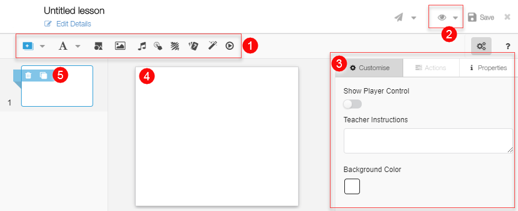</td>
  </tr>
  </table>

### Right pane

  **Customize Tab and Default Options**

  <table>
 <tr>
    <th style="width:35%;">Step</th>
    <th style="width:65%;">Screen</th>
  </tr>
  <tr>
    <td> 1. <b>Show Player Control</b>: A slider button that allows you to view or hide grid lines and the position of player control buttons. This button is not enabled by default. Enabling this option helps you effectively visualize your slide composition   2. <b>Teacher Instructions</b>: A pane to enter notes or instructions to teachers, about the slide content  3. <b>Background Color</b>: Select the background color of the slide from color bar. The default background color is white.
    </td>
    <td>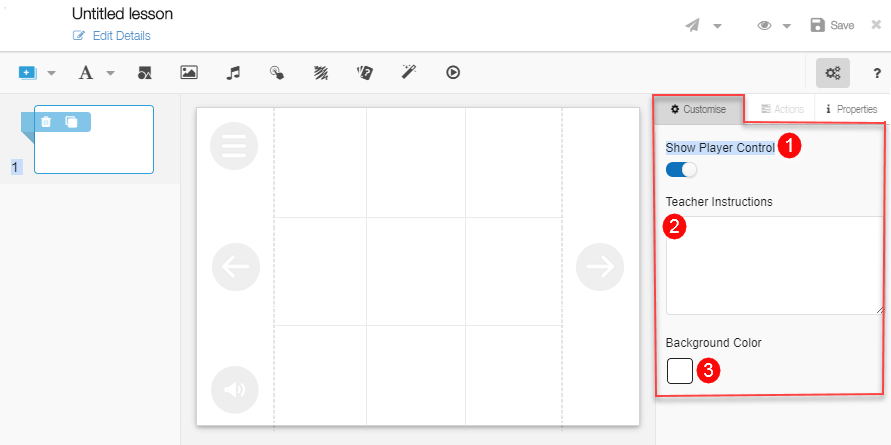</td>
  </tr>
  </table>

  **Actions Tab**

   <table>
 <tr>
    <th style="width:35%;">Step</th>
    <th style="width:65%;">Screen</th>
  </tr>
  <tr>
    <td>1. <b>Actions</b> enables you to add, modify or delete actions to animate objects on the slide. Ensure that you select a target object before you attach an action to it</td>
    <td>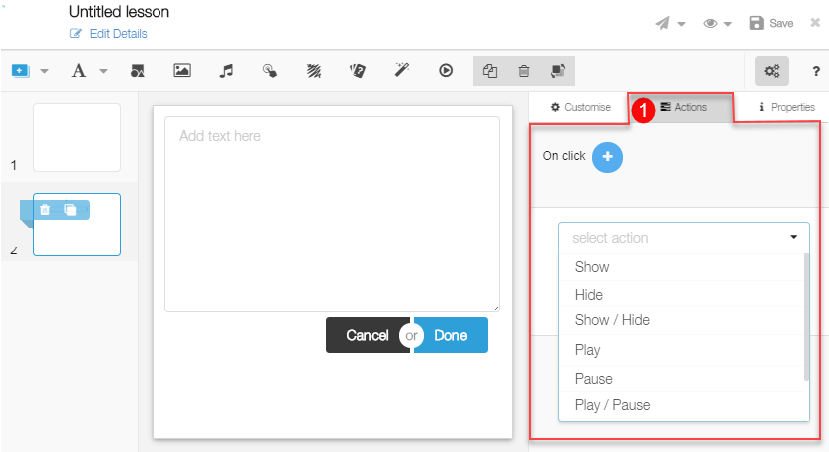</td>
  </tr>
  </table>

  **Properties Tab**

  <table>
 <tr>
    <th style="width:35%;">Step</th>
    <th style="width:65%;">Screen</th>
  </tr>
  <tr>
    <td>1. <b>Properties</b> enables you to view information that the editor automatically adds about the slide and the objects on the slide</td>
    <td>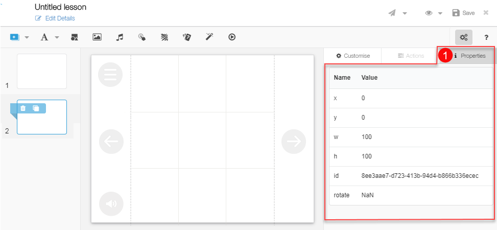</td>
  </tr>
  </table>

## Tool Bar

While creating content, you can add shape, slide, rich text, image, audio files, video files, hotspot, scribblepad, question sets and activities using the tool bar.
An alignment bar is displayed around any items that are added using the tool bar. You can drag, adjust, align and reshape the items using the bar.

### Adding Slide

  <table>
  <tr>
    <th style="width:35%;">Step</th>
    <th style="width:65%;">Screen</th>
  </tr>
  <tr>
    <td>1. To add slides, click the <b>Add Slide</b> icon  2. Click to add a slide either in the:   a) <b>Beginning</b>: as the first slide   b) <b>End</b>: as the last slide  c) <b>After Current</b>: after the current slide   d) <b>Before Current</b>: before the current slide  <b>Note</b>: Drag and drop slides in the left
page to reorder them
    </td>
    <td>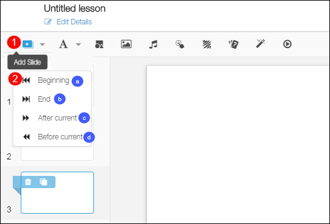</td>
  </tr>
  </table>

### Adding Text

   <table>
  <tr>
    <th style="width:35%;">Step</th>
    <th style="width:65%;">Screen</th>
  </tr>
  <tr>
    <td>1. Click the <b>Add Text</b> icon 
     2. Type text into the text box that is added to the slide 
     You can use different text formatting such as bold, italic, underline, strikethrough, subscript, superscript.
     3. Click <b>Done</b> to add the text box or <b>Cancel</b> to remove the text box 
      After clicking <b>Done</b>, you can format and reposition the text box
    </td>
    <td>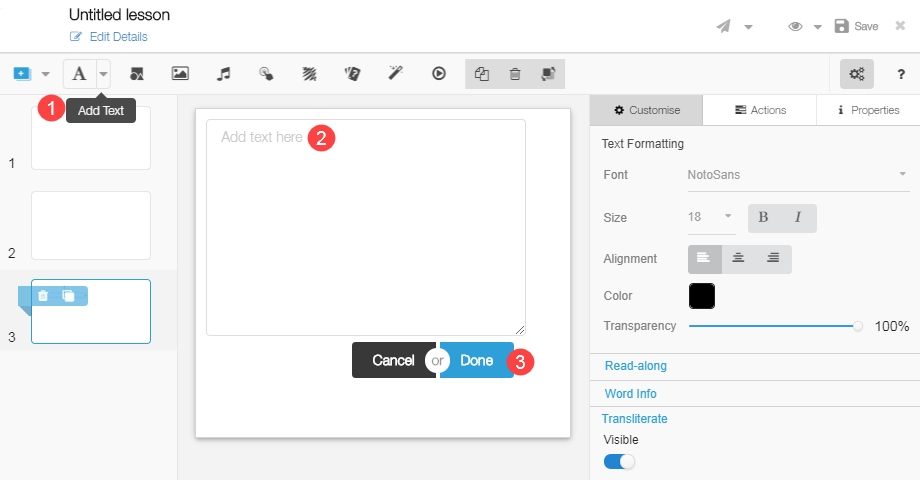</td>
  </tr>
  </table>

**Formatting Text - Customize tab**

  <table>
  <tr>
    <th style="width:35%;">Step</th>
    <th style="width:65%;">Screen</th>
  </tr>
  <tr>
    <td>On clicking Add text, the customize tab displays options to add features to the text. The Text Formatting feature allows you to modify: 1. <b>Font</b>: Pick a new font for your text  2. <b>Size</b>: Change font size  3. <b>Alignment</b>: Align text to the left, right or center of the text box  4. <b>Color</b>: Change color of your text  5. <b>Transparency</b>: Change the transparency of your text in relation to the background of the text box  6. The <b>Read along</b> feature on the customize tab allows you to add audio to the text on the slide. This is a useful feature to learn pronunciation, enhance vocabulary, etc.
    </td>
    <td>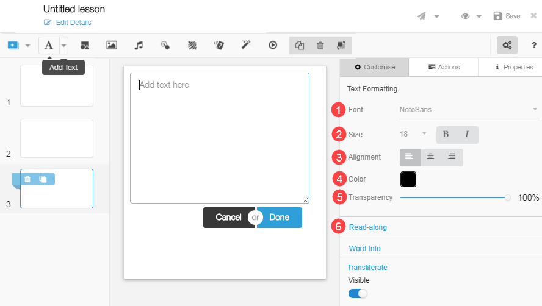</td>
  </tr>
  </table>

**Selecting Text for Read Along Audio**

<table>
  <tr>
    <th style="width:35%;">Step</th>
    <th style="width:65%;">Screen</th>
  </tr>
  <tr>
    <td>1. Text that you have typed will appear in the text box or you can type text in the text box  2. Click <b>Select Audio</b>
    </td>
    <td></td>
  </tr>
</table>

**Selecting Audio for Read Along Text**

<table>
  <tr>
    <th style="width:35%;">Step</th>
    <th style="width:65%;">Screen</th>
  </tr>
  <tr>
    <td>You can add audio to read along text either by selecting an audio file from a list or recording audio immediately  1. Click <b>My audio</b> to view a list of all audio files that you have previously uploaded or recorded  2. Click <b>All audio</b> to view a list of audio files from the repository
       <b>Note:</b> The repository contains all audio files added and uploaded by any users
       3. Select an appropriate audio file from any list and click <b>Select</b> 
       4. Click <b>Upload/Record</b> to record and upload audio immediately
       5. Click <b>Cancel</b> to go back to previous page
    </td>
    <td>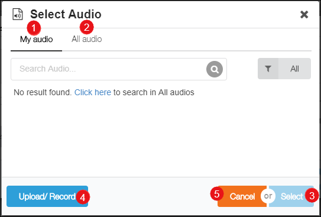</td>
  </tr>
</table>

**Selecting Audio for Reading Along**

<table>
  <tr>
    <th style="width:35%;">Step</th>
    <th style="width:65%;">Screen</th>
  </tr>
  <tr>
    <td>1. Click <b>Next</b>
     2. Click <b>Cancel</b> to go back to previous page</td>
    <td>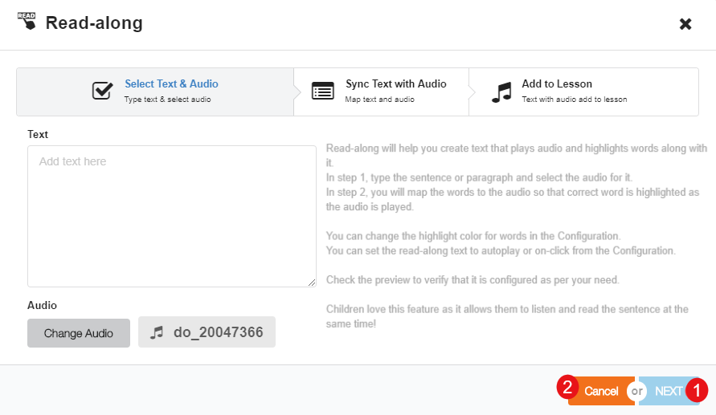</td>
  </tr>
  </table>

**Sync Audio Text with Audio to Read Along**

<table>
  <tr>
    <th style="width:35%;">Step</th>
    <th style="width:65%;">Screen</th>
  </tr>
  <tr>
    <td>1. To set the speed of text enunciation, set the playback rate to <b>Normal, Slow or Slower</b>  2. Press the <b>Spacebar</b> button on your keyboard to space pauses and synchronize words of the sentence with the audio  3. Click <b>Add to Lesson</b> to add the audio file to the text displayed on screen
    </td>
    <td></td>
  </tr>
</table>

**Read Along - Highlighter**

<table>
  <tr>
    <th style="width:35%;">Step</th>
    <th style="width:65%;">Screen</th>
  </tr>
  <tr>
    <td>After adding the audio file, you can highlight the text associated with the audio  1. Click the drop-down arrow in the right pane to change the highlight color  <b>Note:</b> Highlight color refers to the color that is used to highlight the text to sync with the audio  2. Slide the <b>Autoplay</b> button, to enable or disable automatic play of the audio file
    </td>
    <td>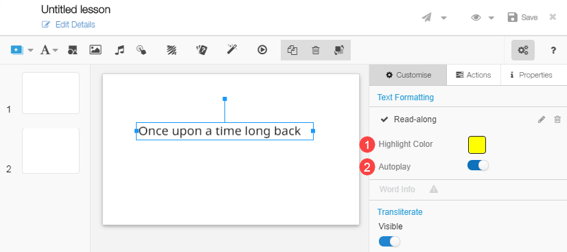</td>
  </tr>
</table>

**Word Info**

<table>
  <tr>
    <th style="width:35%;">Step</th>
    <th style="width:65%;">Screen</th>
  </tr>
  <tr>
  <td>On clicking <b>Add text</b>, the <b>Word Info</b> feature on the customize tab provides all related information about any word added using the content editor  <b>Note:</b> Word Info is available only for those
words that already exist in the repository  1. To use this feature, select the word or paragraph in the text box  2. Click <b>Done</b> button  3. Click <b>Word Info</b>
    </td>
    <td>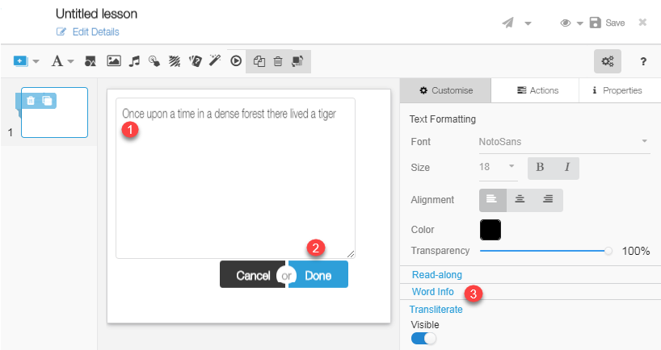</td>
  </tr>
  <tr>
    <td>1. <b>Word Info Popup</b> page appears  2. Click <b>Add to Lesson</b> button to add words with the meaning  3. Click <b>Cancel</b> button to exit the page</td>
    <td></td>
  </tr>
</table>

**Transliteration**

<table>
  <tr>
    <th style="width:35%;">Step</th>
    <th style="width:65%;">Screen</th>
  </tr>
  <tr>
  <td>The process of changing the written script from one language to another is known as transliteration. On clicking Add text, the Transliterate feature on the customize tab allows you to transliterate in ten Indian languages  1. To transliterate, select the word or sentence and click <b>Transliterate</b></td>
    <td>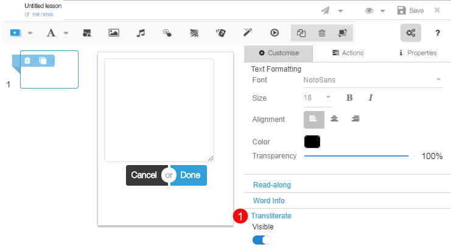</td>
  </tr>
  <tr>
    <td><b>Language Transliteration Tool</b>  
      1. Select the language from the drop down list  2. Click <b>Transliterate</b>  3. The original text is displayed in the textbox on the left and the transliterated text is displayed in the textbox on the right  4. Click <b>Add to Stage</b> to add the transliterated text to the slide
       5. Click <b>Cancel</b> to go back to previous page</td>
    <td>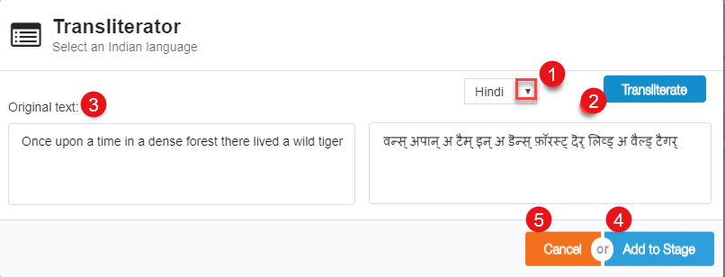</td>
  </tr>
</table>

### Adding Richtext

<table>
  <tr>
    <th style="width:35%;">Step</th>
    <th style="width:65%;">Screen</th>
  </tr>
  <tr>
    <td>1. To add Rich text, click the dropdown arrow  2. Click <b>Add Richtext</b>, to open <b>Richtext Editor</b>
    </td>
    <td>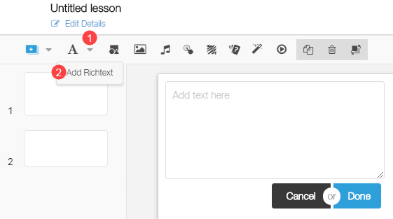</td>
  </tr>
  <tr>
    <td>1. Type text into the text box and use the Rich text editor for customizing and styling the text. The richtext formatting feature allows you to modify: 
       <li> Pick <b>Font Formatting</b>: Bold, Italic, Strikethrough and Remove Format</li>
        <li><b>Paragraph Formatting</b>: Numbered list, Bulleted list</li>
      <li><b>Alignment</b>: Align text to the left, right, center or justify</li>
      <li><b>Paragraph Styling</b>: Normal, Heading 1,2...</li>
      <li><b>Font Size</b>: Pick the different size for the font</li>
      <li><b>Color</b>: Change the color of your text and background</li>  2. Click <b>Add To Lesson</b> to add richtext styles  3. Click <b>Cancel</b> button, to cancel the text formatting  4. Click <b>Close</b> icon, to exit the page
    </td>
    <td></td>
  </tr>
  <tr>
  <td><b>Copy-Pasting content from word document</b>  1. Select and copy content from the word document. Right-click on <b>Richtext Editor</b> 
   2. Click <b>Paste</b> to paste the content that you have copied. Alternatively, you can use the shortcut command <b>Ctrl+V</b> to paste the content 
  </td>
  <td>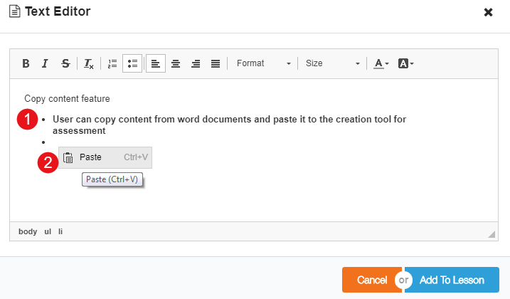</td>
  </tr>
</table>

### Adding Shapes

<table>
  <tr>
    <th style="width:35%;">Step</th>
    <th style="width:65%;">Screen</th>
  </tr>
  <tr>
    <td>1. To add shapes, click the <b>Add Shapes</b> icon on the toolbar  2. The customize tab displays options to add features to the shapes. You can:  a) Click <b>Fill</b> Color to add or modify the color of the shape  b) Use the <b>Transparency</b> slider to modify the transparency level of the shape  c) Use the <b>Visible</b> slider to make the selected shape visible or invisible  d) Click <b>Border Color</b> to modify the color of the shape outline</td>
    <td>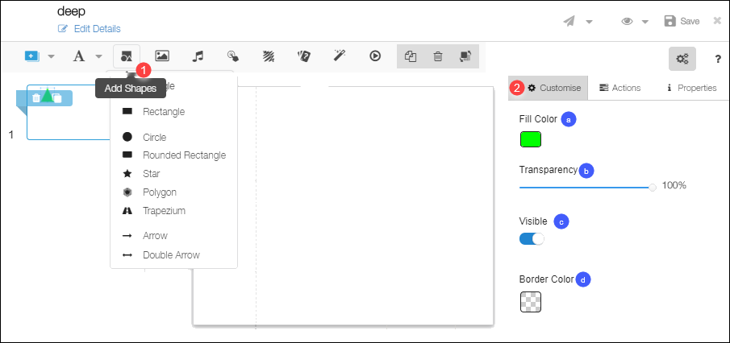</td>
  </tr>
</table>

### Adding Images

<table>
  <tr>
    <th style="width:35%;">Step</th>
    <th style="width:65%;">Screen</th>
  </tr>
  <tr>
    <td>1. To add images, click the <b>Add Images</b> icon on the toolbar</td>
    <td>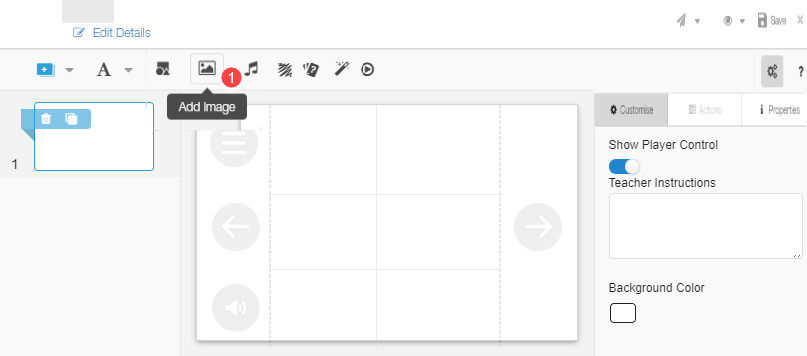</td>
  </tr>
</table>

**Selecting Images**

<table>
  <tr>
    <th style="width:35%;">Step</th>
    <th style="width:65%;">Screen</th>
  </tr>
  <tr>
     <td>You can add images either by selecting an image from a list or uploading images from your local machine to use immediately  1. Click <b>My images</b> to view a list of all image files that you have previously uploaded  2. Click <b>All image</b> to view a list of image files from the repository  <b>Note:</b> The repository contains all image files added and uploaded by any users  3. Choose an appropriate image file from any list and click <b>Select</b>  4. Click <b>Upload and use</b> to upload and use images from your gallery
     </td>
     <td></td>
  </tr>
</table>

**Uploading and Using Images**

<table>
  <tr>
    <th style="width:35%;">Step</th>
    <th style="width:65%;">Screen</th>
  </tr>
  <tr>
    <td>1. Click <b>Choose File</b> and select a file from your local drive or drag and drop the required file on the screen. 
     <b>Note:</b> Supported file formats are: .jpeg, .jpg, .png
     2. Under <b>Copyright & License</b>, select if you want to:
     a) Make it available to everyone
     b) Not share with anyone 
     3. Add image details in the <b>Asset Caption</b> area 
     4. Click <b>Upload and Use</b> to upload the image
     5. Click <b>Cancel</b> to cancel uploading
     6. Click <b>Back</b> to go to previous screen
    </td>
    <td>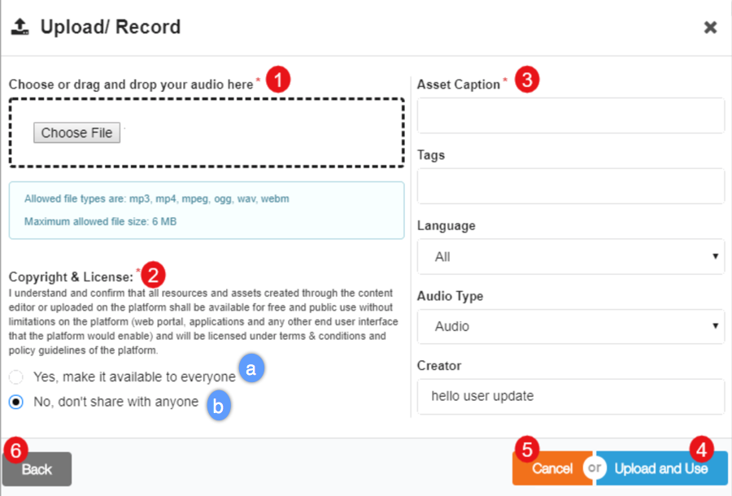</td>
  </tr>
</table>

**Formatting Images**

<table>
  <tr>
    <th style="width:35%;">Step</th>
    <th style="width:65%;">Screen</th>
  </tr>
  <tr>
    <td>After selecting and adding an image to the slide, the customize tab displays options to add features to the shapes. You can:  1. Click <b>Image Browser</b> to browse for images and select another image  2. Use the <b>Visible</b> slider to make the selected image visible or invisible  3. Click <b>Border Color</b> to modify the color of the shape outline
    </td>
    <td>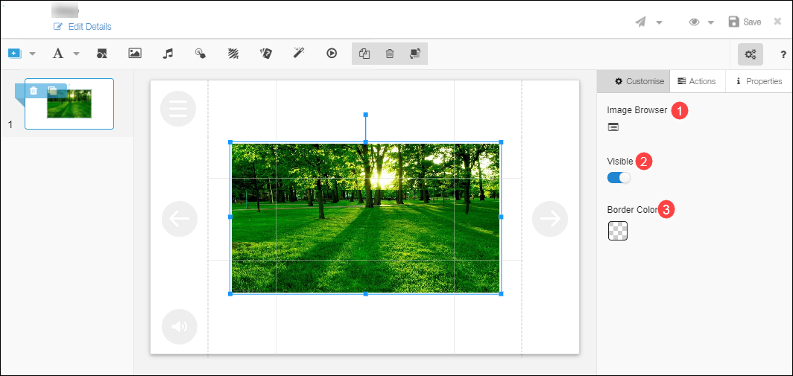</td>
  </tr>
</table>

### Adding Audio

<table>
  <tr>
    <th style="width:35%;">Step</th>
    <th style="width:65%;">Screen</th>
  </tr>
  <tr><td>1. To add audio, click the <b>Add Audio</b> icon on the toolbar. The <b>Upload/Record</b> page appears
     <b>Note</b>: For detailed instructions to add audio, refer to section Select Audio for Read Along Text
     2. Click <b>Upload</b> to upload an audio
     3. Click <b>Record</b> to record audio
    </td>
    <td>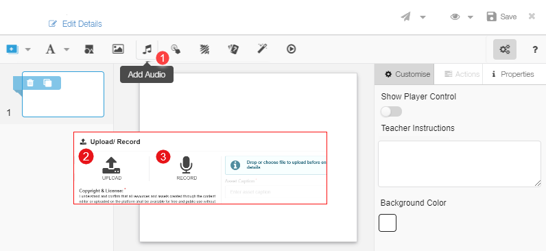</td>
  </tr>
</table>

**Uploading Audio**

<table>
  <tr>
    <th style="width:35%;">Step</th>
    <th style="width:65%;">Screen</th>
  </tr>
  <tr>
    <td>1. Choose File to browse and select a file from your local drive or open the explorer in a separate window and drag and drop the required file on the screen. 
     <b>Note:</b> Supported file formats are: .mp3, .mp4 
     2. Under <b>Copyright & License</b>, select if you want to: 
     &emsp;a) Make it available to everyone 
     &emsp;b) Not share with anyone 
     3. Add audio file details in the <b>Asset Caption</b> area 
     4. Click <b>Upload and Use</b> to upload the audio file
     5. Click <b>Cancel</b> to abort uploading audio
     6. Click <b>Back</b> to go to the previous screen
    </td>
    <td></td>
  </tr>
</table>

### Adding Hotspot

<table>
  <tr>
    <th style="width:35%;">Step</th>
    <th style="width:65%;">Screen</th>
  </tr>
  <tr>
    <td>A Hotspot is an invisible button. Attach hotspot to any text, shape, or object to denote any action  1. Click the <b>Add Hotspot</b> icon on the toolbar</td>
    <td>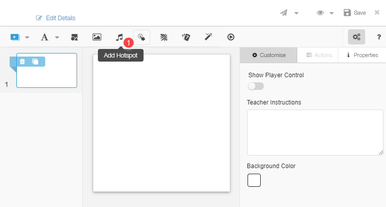</td>
  </tr>
</table>

**Adding Action to the Hotspot**

<table>
  <tr>
    <th style="width:35%;">Step</th>
    <th style="width:65%;">Screen</th>
  </tr>
  <tr>
    <td>1. Click the <b>Action</b> tab on the right pane  2. Select an interaction from the drop-down menu  3. Select the target object to attach the action from the drop-down menu
    </td>
    <td>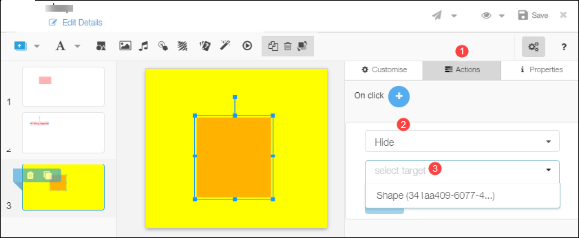</td>
  </tr>
</table>

### Adding Scribblepad

<table>
  <tr>
    <th style="width:35%;">Step</th>
    <th style="width:65%;">Screen</th>
  </tr>
  <tr>
    <td>The Scribblepad helps users take notes, if required, while viewing content  1. Click the <b>Add Scribblepad</b> icon on the toolbar  2. You can make modifications using the default options of the customize tab
    </td>
    <td>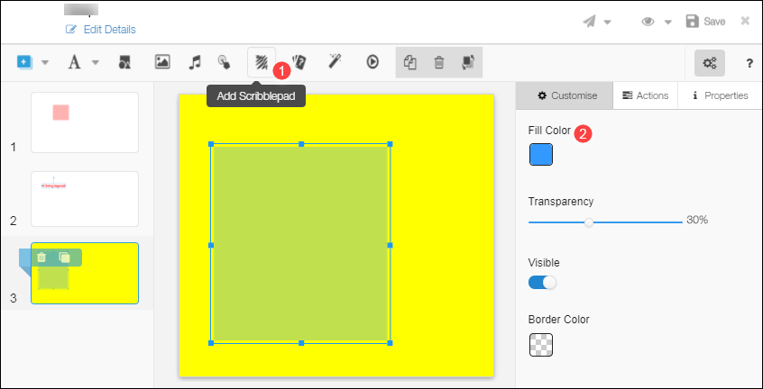</td>
  </tr>
</table>

### Adding Question Set

<table>
  <tr>
    <th style="width:35%;">Step</th>
    <th style="width:65%;">Screen</th>
  </tr>
  <tr>
    <td>To add question set, click the <b>Add Question Set</b> icon on the toolbar. The question set browser page is displayed.
     To ensure that the content achieves the learning objective it is important to check and reaffirm the learner’s progress at different points in the study material. Adding questions and question sets is one method 
     1. Click the <b>Add Question Set</b> icon on the toolbar. Refer <a href="/help/creator/create-assessment/questionset_create.html" target="_blank">Adding Question Set</a>
    </td>
    <td>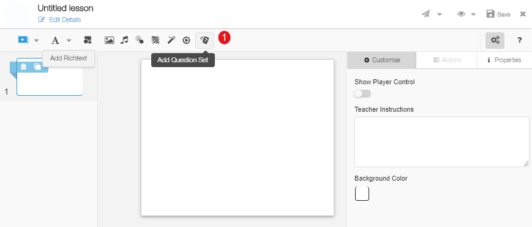</td>
  </tr>
  </table>

### Adding Activity

<table>
 <tr>
    <th style="width:35%;">Step</th>
    <th style="width:65%;">Screen</th>
 </tr>
 <tr>
    <td>1. To add activity, click the <b>Add Activity</b> icon on the toolbar</td>
    <td>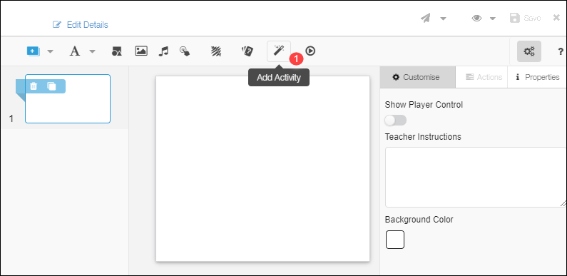</td>
 </tr>
 </table>

**Activity Browser**

<table>
 <tr>
    <th style="width:35%;">Step</th>
    <th style="width:65%;">Screen</th>
 </tr>
 <tr>
    <td>You can add activities by selecting activities from the list displayed in the activity browser 
     1. Filter the displayed list by selecting the: 
     a) Category  b) Concepts 
     <b>Note:</b> You can choose to filter the list using more than one category and concept 
     2. Alternatively, you can search for activities by entering key words  3. Select the activity and click <b>ADD</b></td>
    <td></td>
 </tr>
</table>

**Adding Details**

<table>
 <tr>
    <th style="width:35%;">Step</th>
    <th style="width:65%;">Screen</th>
 </tr>
 <tr>
    <td>1. All details of the selected activity are displayed on the right  2. Click <b>Add</b> to add the activity</td>  
    <td></td>
 </tr>
 </table>

**Configuring Activity Details**

 <table>
 <tr>
    <th style="width:35%;">Step</th>
    <th style="width:65%;">Screen</th>
 </tr>
 <tr>
    <td>1. If the selected activity has details added at the time of creation, the appropriate activity category icon is displayed. Click the icon to view or modify activity details  2. If no details have been added, you can enter the activity details in the <b>Configuring Activity</b> details screen</td>
    <td>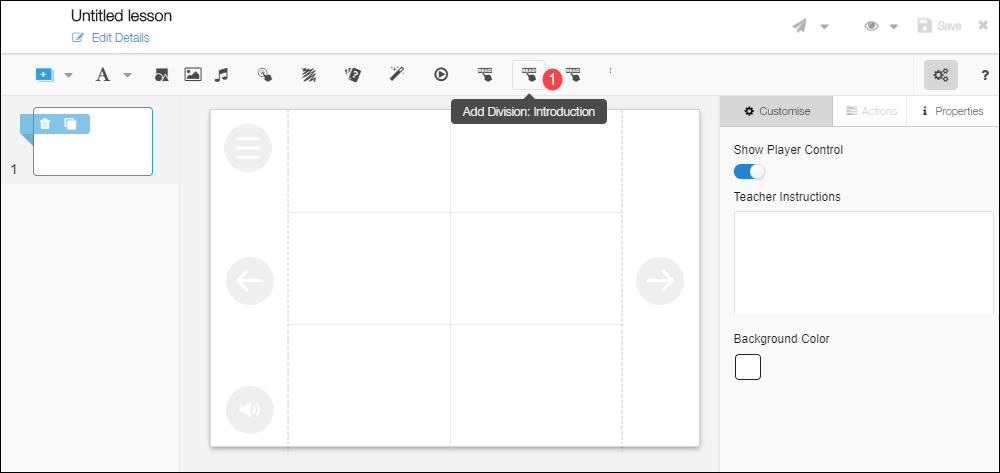</td>
 </tr>
 <tr>
    <td>1. Select the following from their respective drop-down menus:  &emsp;a. Content  &emsp;b. Numerals  &emsp;c. Grade  &emsp;d. Level  &emsp;e. Sub Level  2. Determine the No. of Questions  3. Click <b>Add</b>
     4. Click <b>Cancel</b> to go back to previous page
    </td>
    <td>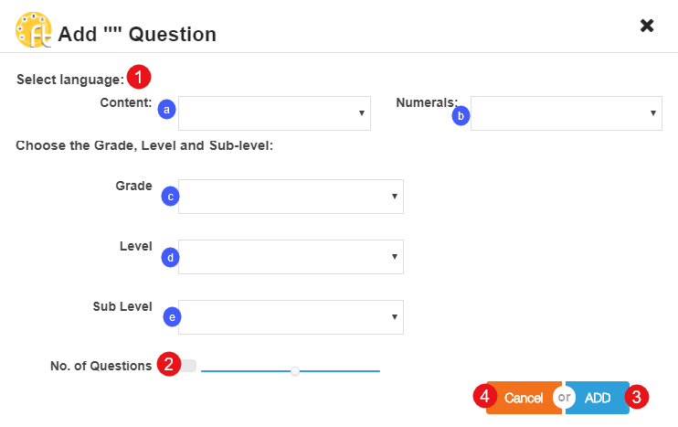</td>
 </tr>
 </table>

### Adding Video

<table>
  <tr>
    <th style="width:35%;">Step</th>
    <th style="width:65%;">Screen</th>
  </tr>  
  <tr>
    <td>1. To add video, click the <b>Add Video</b> icon on the toolbar. The Video editor page is displayed
     The content editor supports uploading:
     &emsp;- publicly shared videos 
     &emsp;- Youtube URLs
     &emsp;- mp4 or webm video from your local folder
     For more details, refer <a href="/help/creator/create-resource/video_add.html" target="_blank">Adding Video</a></td>
    <td>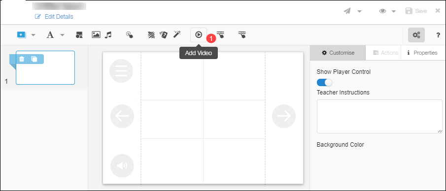</td>
  </tr>
</table>

## Reviewing and Publishing Content

<table>
 <tr>
    <th style="width:35%;">Step</th>
    <th style="width:65%;">Screen</th>
  </tr>
  <tr>
    <td>All created study material must be reviewed and approved by designated reviewers before it can be published. To send content for review:  1. Click Save to save the content  2. Click <b>Send for review</b> to send the created content for review  3. Before sending for review, you can share the content to a limited audience. To know more this, refer <a href="/help/creator/common/limitedpublishnshare.html" target="_blank">Limited Publishing and Sharing</a>
    </td>
    <td>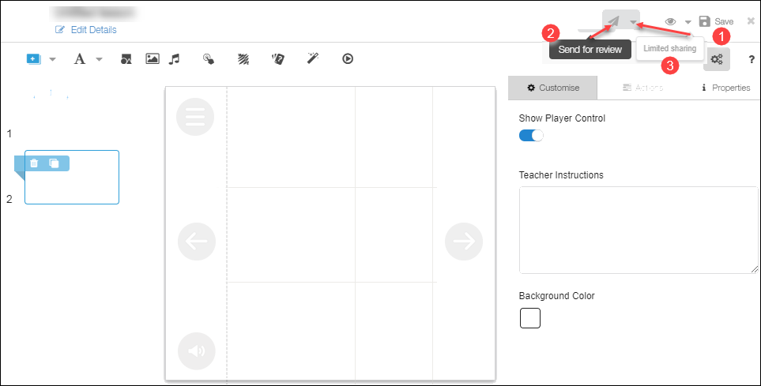</td>
  </tr>
  </table>

## Limitations

  - The WYSIWYG editor works best only with [NotoSans fonts](https://fonts.google.com/specimen/Noto+Sans){:target="_blank"}
  - In Rich Text, the bullet point size remains the same even if the font size of text is changed
