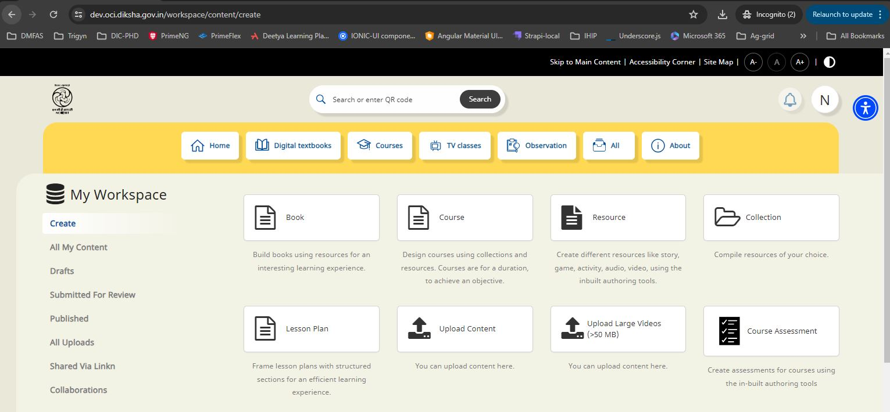
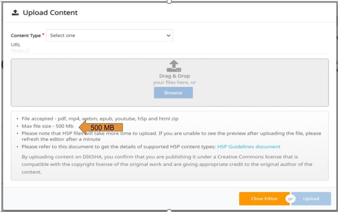
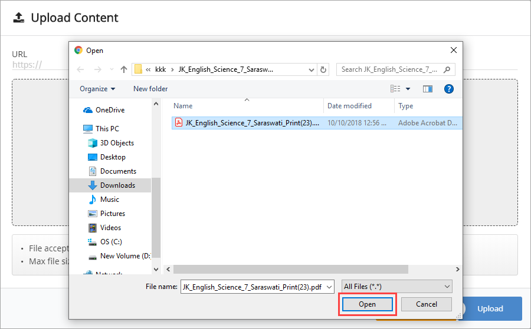
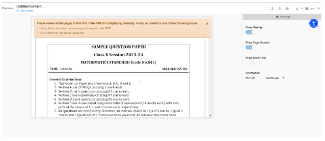
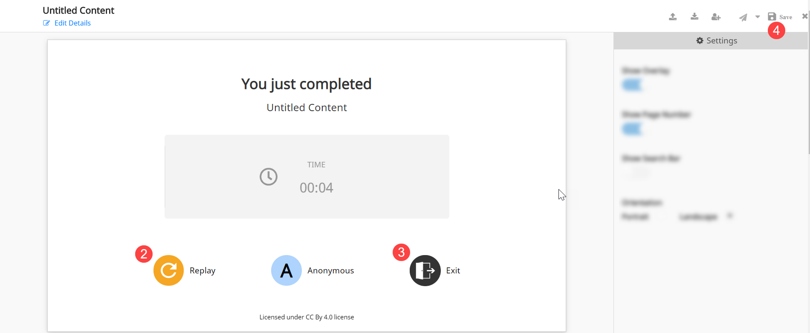
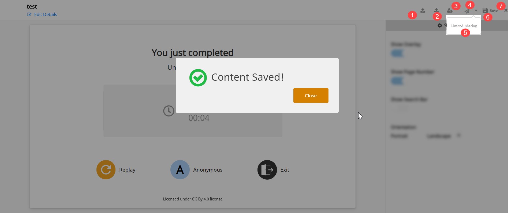
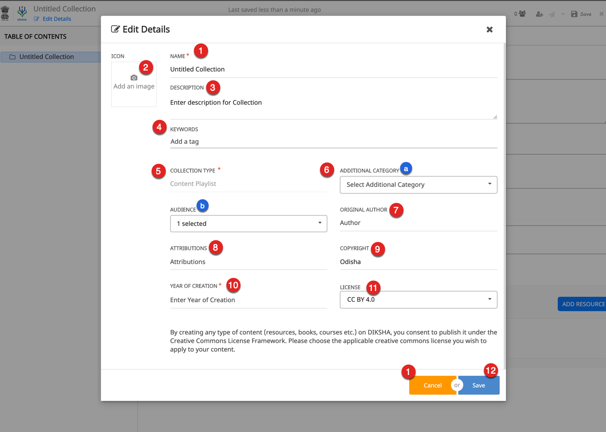
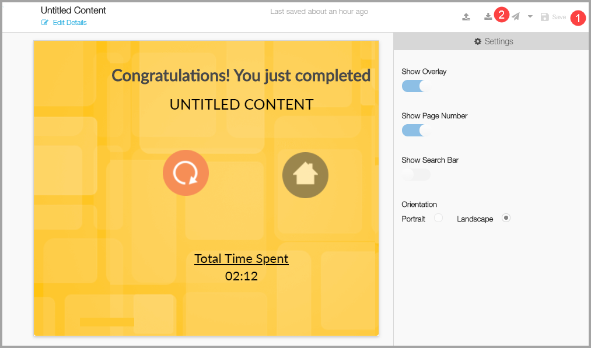

## Overview

A content creator may create content without using DIKSHA Content creation platform. They can create and save those content on their system (laptop, desktop, etc). They can upload the content which are saved on their local using <b>Upload Content</b> feature of the DIKSHA portal. DIKSHA supports the following content formats:
- Video (.mp4, .webm)
- HTML zip
- ECML (created using the inbuilt content editor)
- EPUB
- H5P
- Document format (.pdf)
- URLs for YouTube videos and other files

It supports maximum of 50 MB file size

**Note:** DIKSHA validates the standard YouTube credits and licenses before it allows the upload. Users have the permission of using, copying or distributing YouTube contents with the regulations, in accordance with its license policy.

## Prerequisites
<table>
  <tr>
    <th style="width:35%;">Step</th>
    <th style="width:65%;">Screen</th>
 </tr>
 <tr>
    <td>1. Log in to DIKSHA portal using your content creator credential  2. Click <b>Create</b> 3. Click <b>Upload Content</b>
       </td>
      <td></td>
  </tr>
  </table>

## Uploading Content
  <table>
  <tr>
    <th style="width:35%;">Step</th>
    <th style="width:65%;">Screen</th>
  </tr>
  <tr>
    <td>1. Enter the <b>URL</b> of the Youtube video or the external website URL or path of the pdf file which you want to upload 
     <b>Note</b>: The PDF supports only noto-sans fonts of different languages while rendering on the mobile application. Refer <a href="https://fonts.google.com/specimen/Noto+Sans" target="_blank">Supported Font Types</a> 
     2. Click <b>Browse</b> to select the desired file for upload from your local system (laptop, desktop, etc). You can alternatively <b>Drag & Drop</b> files from your local
     3. Click <b>Upload</b> to upload the selected content</td>
    <td></td>
  </tr>
  </table>

### Browsing Content
<table>
  <tr>
    <th style="width:35%;">Step</th>
    <th style="width:65%;">Screen</th>
 </tr>
 <tr>
    <td>Navigate through files from your local system (laptop, desktop, etc), select a file, and click <b>Open</b>. The file is uploaded to the content editor slide
       </td>
      <td></td>
  </tr>
  </table>

## Previewing and Playing the Content

  On successful upload, the preview of the uploaded file appears on the content editor slide
  <table>
  <tr>
    <th style="width:35%;">Step</th>
    <th style="width:65%;">Screen</th>
 </tr>
 <tr>
    <td>1. Click the <b>Arrow</b> icon to navigate to the consecutive pages of the content
       </td>
      <td></td>
      </tr>
      <tr>
      <td>After you finish playing the content, a message <b>You just completed</b> is displayed  2. Click <b>Replay</b> to replay the content  3. Click <b>Exit</b> to exit from the preview screen 4. Click <b>Save</b> to save the uploaded content</td>
      <td></td>
  </tr>
  </table>

## Managing Content

 <table>
  <tr>
    <th style="width:35%;">Step</th>
    <th style="width:65%;">Screen</th>
 </tr>
 <tr>
 <td>1. Click <b>Upload</b> icon to upload some other additional content to the same editor if required 2. Click <b>Download</b> icon to download the content  3. Click <b>Add Collaborator</b> to add collaborator for the content curation
  4. Click the  <a href="#sending-content-for-review">Send Review</a> icon to send the content for review 
  5. Click the  <a href="/help/creator/common/limitedpublishnshare.html" target="_blank">Limited Sharing</a> icon to share the content with a limited audience  before publishing the content 
 If you click the drop-down icon beside the <b>Send for Review</b> icon, the <b>Limited Sharing</b> option is displayed
  6. Click <b>Save</b> to save the uploaded content 
  7. Click <b>Exit</b> to exit from the screen</td> 
 <td></td>
</tr>
  </table>

## Adding Details

Before you send content for review, you must provide all the required details of the content
<table>
  <tr>
    <th style="width:35%;">Step</th>
    <th style="width:65%;">Screen</th>
 </tr>
 <tr>
  <td>Once you click the <b>Send for review</b> icon, the <b>Edit details</b> window is displayed 1. Enter a <b>Title</b> for the uploaded content
     1. Click the <b>Image</b> icon to upload an image for the content. For details on adding image, refer  <a href="/help/creator/common/metadata_addingimages.html" target="_blank">Adding Image to Metadata</a> 
   2. Enter a <b>Description</b> for the content
   3. Enter <b>Keywords</b> to enhance the searchability of the content
   <b>Note:</b> Keywords help search engines to find content associated with it during a search 
     4. The <b>Collection Type</b> is auto-filled based on the content type that is being created
       5. Select the following from their respective drop-down lists:
       &nbsp;a. <b>Additional Category</b>
    &emsp;b. <b>Audience</b>
  6. Enter <b>Audience</b>
       7. Enter <b>Original Author</b>
       8. Enter <b>Attributions</b>
       9. Enter <b>Copyright</b>
       10. Enter the <b>Year of Creation</b>
       11. Select the <b>License</b> for the content from the drop-down list
   12. Click <b>Save</b>
    13. Click <b>Cancel</b> to exit the page</td>
  <td></td>
  </tr>
</table>

#### Content Types 

DIKSHA supports the following additional Content Types for all   

  - Lesson Plan  
  - Explanation Resource  
  - Practice Resource  
  - Learning Outcome Definition    

## Sending Content for Review
Any uploaded content must be reviewed before it is published
<table>
  <tr>
    <th style="width:35%;">Step</th>
    <th style="width:65%;">Screen</th>
 </tr>
 <tr>
   <td>1. Click <b>Send for review</b> icon to send the uploaded content for review. Before sending for review, you can share the content to a limited audience. To know more about Limited Sharing, refer <a href="/help/creator/common/limitedpublishnshare.html" target="_blank">Limited Publishing and Sharing</a></td>
   <td></td>
  </tr>
  </table>

