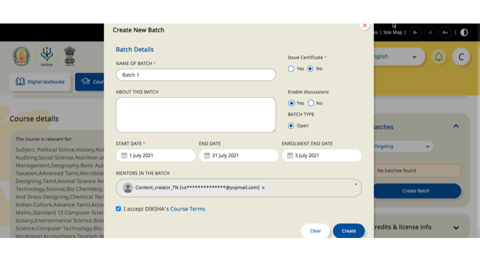
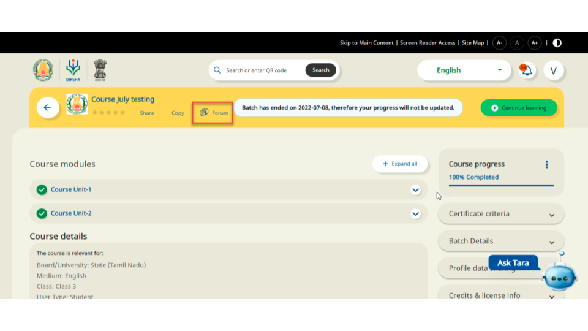
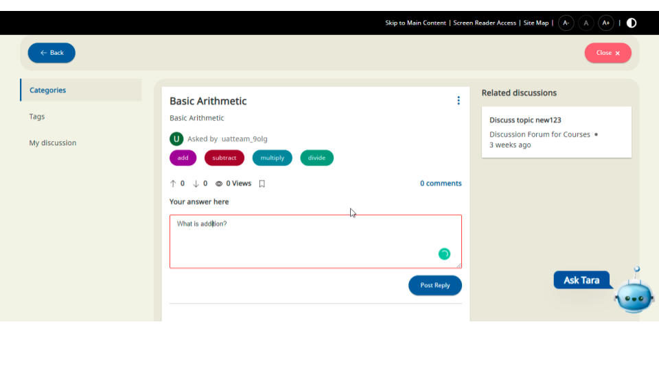

#### Who can enable a DISCUSSION FORUM for a course batch?  

The person who created the course can decide whether he needs to enable/activate the Discussion for that particular Course/Batch

#### How can a Course Creator activate/enable the Discussion for a Batch?  

The creator of the course, at the time of creating the **batch**, will be shown the option to
enable the DISCUSSIONS.

#### How can a course enrolled user participate in the Discussion forum?   

Once the user is enrolled in a course batch, the user can access the Discussion forum by clicking on the "Forum" link that appears in the course modules page. (Note: The user sees the "Forum" link only if the Discussion Forum is enabled in the course batch)  

#### I have enrolled in a course where the Discussion Forum is enabled. Can I start a new discussion?  

Yes, you can start a new discussion. Once you click on "Forum" link,
   - then click on **Discussion Forum for Courses**
   - and then click on **Start Discussion**  
This allows you to create a new **Discussion Topic**  

#### I have created a "Discussion Topic" for the topic(s) that I want to discuss with others. What is next?  

Once the topic is created, you can click on this topic from the "category" section(on the left side of the screen) and post your Question/Comments related to the topics that you have created.  

#### Who all will see and can participate in the Discussion forum / the discussion topic that I have created?  

Any user, who has enrolled to the SAME course batch, can see and participate (by replying to your topic) the Discussion forum topic that you have created.

#### I am the creator of the Course / Batch. How do I see all the discussion topics created by various participants?  

Once you login, click on the course for which you have enabled the discussions,
- Click **View course dashboard** 
- Click **Forum** 
- Click **Discussion Forum for Courses**

