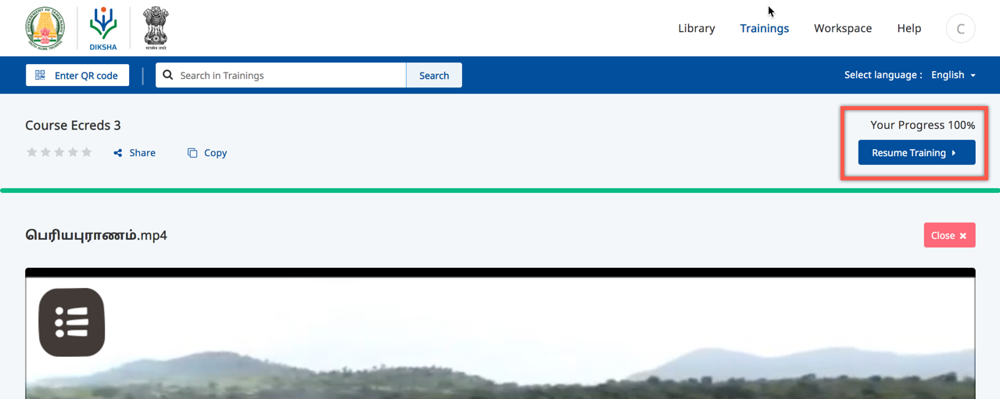
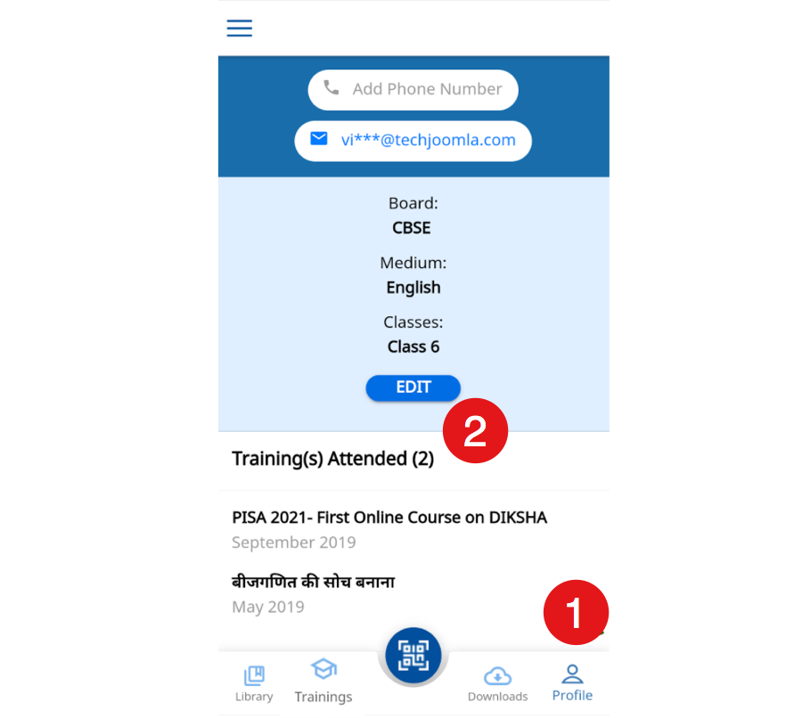
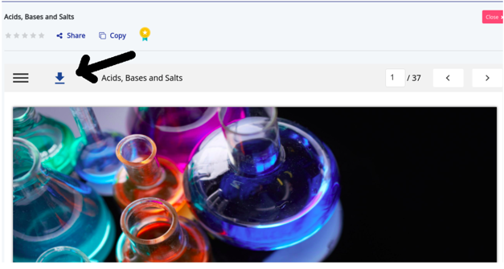

#### How do I know the progress of my course?

To know the progress of your course, click on the course and the progress is displayed on top right in your course details page

#### How do I view the course to consume?

Ensure to sign in with valid credentials:

To view the course:
 - Click the **Courses** tab
 - Go to **My Courses** section. The list of enrolled courses is displayed.
Or 
 - Search the course using filters and enrol

#### How do I use the QR code to access the course?

The QR code can be used to access the course either using the DIKSHA Mobile App or through DIKSHA Portal. The QR code can be used to get into the course detail page directly without doing a search.

To scan a course QR code using DIKSHA Portal:
1. Go to DIKSHA Portal
2. Click on **Enter QR code** textbox

3. Enter the 6 digit QR code and click on **Submit**. The corresponding course detail page is displayed.

#### How do I join a batch?

To join a batch 

 - Search the course.
 - Open the course details page.
 - Click **Join Course** button.

#### Why do I have to login again to continue a course that I have already started?

If you have multiple accounts on DIKSHA, check for the user account and ensure to log in with the same account.

#### How do I know that I have completed the course?

On the course details page Your progress 100% appears.

#### How do I view the list of the completed courses on DIKSHA?

- Login to the DIKSHA portal
- Click **Profile**
- Go to **Course(s) Attended**. The completed course list appears in this section .

On the DIKSHA App, Click the **Profile** > Go to **Courses attended** section. The list of courses is displayed here.

#### How do I print resources in DIKSHA? 

Currently, the DIKSHA portal allows the download and print only of PDF contents.

- Click **Download** icon 
- Save the content as a PDF file
- Click **Print** 

