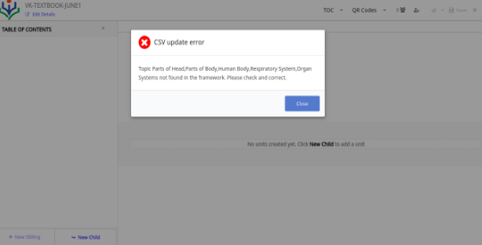
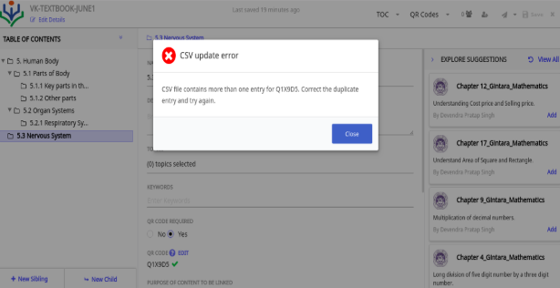
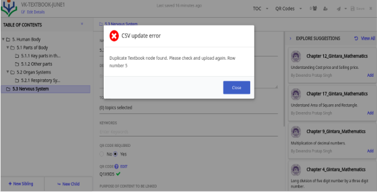
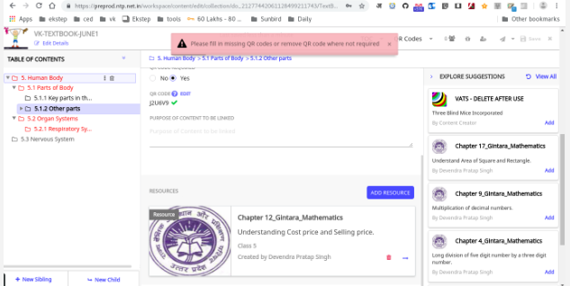
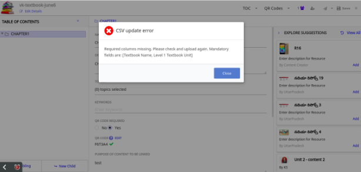
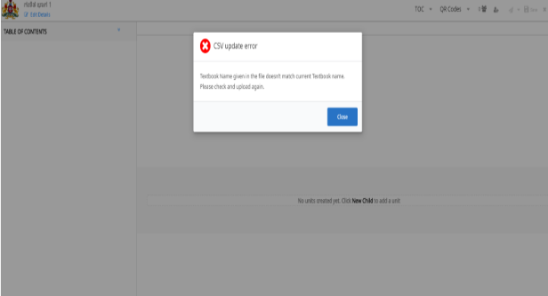
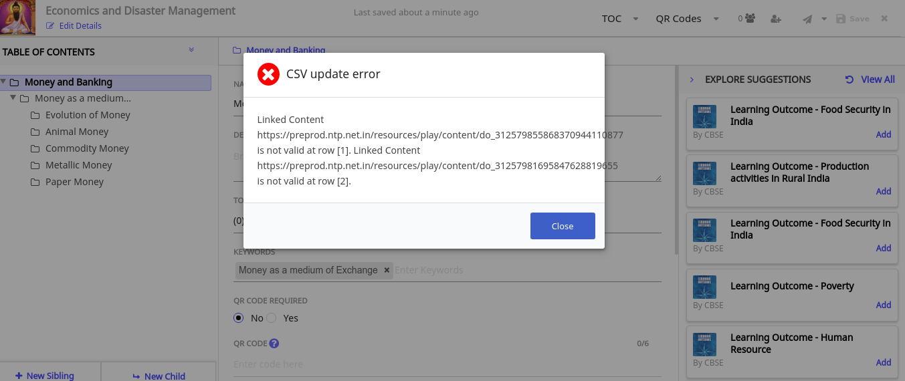
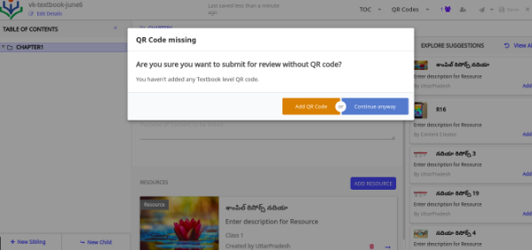
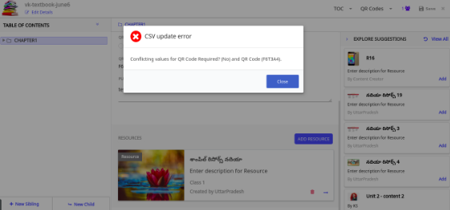
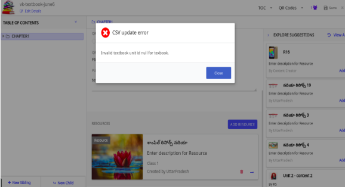

## Textbook Errors

This sections encompasses the commonly encountered error while creating book ToC using CSV file. 

### Different values in CSV for Topics 

Topic Parts: Level 1 Textbook Unit and subsequent levels data is not found in the framework

<table>
    <tr>
        <th style="width:50%;">Reason</th>
        <th style="width:50%;">Solution</th>
    </tr>
    <tr>
    <td colspan="2">

</td>
    </tr>
    <tr>
        <td>The value entered in the Mapped Topics column in the CSV file does not map to the framework due to a typo error. 
         For example: Head, Parts of Body, Human Body, Respiratory System, Organ Systems not found in the framework</td>
        <td>1. Remove the values from the Mapped Topics column or enter the correct values in that column
         2. Check the spelling of the entries
         <b>Note</b>: The values are case sensitive</td> 
    </tr>
</table>

### QR Code Errors

<table>
    <tr>
        <th style="width:50%;">Error</th>
        <th style="width:50%;">Description</th>
    </tr>
    <tr>
    <td>Duplicate QR Codes</td>
    <td> CSV file contains more than one entry for Q1X9D5. Correct the duplicate entries and try again
    </td>
    </tr>
    <tr>
    <td colspan ="2"></td>
    </tr>
    <tr>
        <th style="width:50%;">Reason</th>
        <th style="width:50%;">Solution</th>
    </tr>
    <tr>
        <td>You have used the same QR code in two different Textbook Units in the same textbook.</td>
        <td>Ensure to use different QR codes for different TOCs in the textbook.</td>
    </tr>
</table>

### Duplicate Textbook Node

<table>
    <tr>
        <th style="width:50%;">Error</th>
        <th style="width:50%;">Description</th>
    </tr>
    <tr>
        <td>Duplicate Textbook node found </td>
        <td>Duplicate Textbook node found. Check and upload again. Row number 5.</td>
    </tr>
    <tr>
        <td colspan ="2"></td>
    </tr>
    <tr>
        <th style="width:50%;">Reason</th>
        <th style="width:50%;">Solution</th>
    </tr>
    <tr>
        <td>Check the row (Row number mentioned in the error message +1). The values entered in this line/row is duplicate, check all the lines before this row number for a similar entry</td>
        <td>Check rows for any duplicate entry and remove them and re-upload the CSV</td>
    </tr>
</table>

### Missing QR Codes

<table>
    <tr>
        <th style="width:50%;">Error</th>
        <th style="width:50%;">Description</th>
    </tr>
    <tr>
    <td>Missing QR Codes</td> 
    <td colspan = "2">Fill in missing QR codes or remove QR code where not required.
    </td>
    </tr>
    <tr>
    <td colspan ="2"></td>
    </tr>
    <tr>
        <th style="width:50%;">Reason</th>
        <th style="width:50%;">Solution</th>
    </tr>
    <tr>
        <td>For ToCs that are highlighted in red, the <b>QR Code Required</b> field is set to <b>Yes</b>. However, the code is not entered.</td>
        <td>Either enter a valid QR code for or set the <b>QR Code Required</b> field to <b>No</b></td>
    </tr>
</table>

### Required Columns Missing

Mandatory fields in the CSV file are not entered. The mandatory fields are: [Textbook Name, Level 1 Textbook Unit]
<table>
    <tr>
        <th style="width:50%;">Reason</th>
        <th style="width:50%;">Solution</th>
    </tr>
    <tr>
    <td colspan ="2"></td>
    </tr>
    <tr>
        <td> When you upload the CSV file to update the textbook, either the <b>Textbook Name</b> or the Level 1 of the <b>Textbook Unit</b> column is empty.</td>
        <td>Verify the textbook name in the CSV, correct the name and re-upload</td>
    </tr>
</table>

### Column Mismatch 

<table>
    <tr>
        <th style="width:50%;">Error</th>
        <th style="width:50%;">Description</th>
    </tr>
    <tr>
    <td>Textbook Name mismatch current Text Name</td>
    <td>Textbook Name given in the file doesn’t match current TextName 
    </td>
    </tr>
    <tr>
    <td colspan = "2"></td>
    </tr>
    <tr>
        <th style="width:50%;">Reason</th>
        <th style="width:50%;">Solution</th>
    </tr>
    <tr>
        <td>This happens while uploading the CSV file, to update the textbook. The TEXTBOOK name given while creating the textbook and the Textbook Name given in the CSV are different/not matching</td>
        <td>Verify the textbook name in the CSV file, correct the name and re-upload</td>
    </tr>
</table>

### CSV Update error. Do_xxxx is not valid

<table>
    <tr>
        <th style="width:50%;">Error</th>
        <th style="width:50%;">Description</th>
    </tr>
    <tr>
    <td>CSV Update error</td>
    <td>Textbook Name given in the file doesn’t match current TextName 
    </td>
    </tr>
    <tr>
    <td colspan ="2"></td>
    </tr>
    <tr>
        <th style="width:50%;">Reason</th>
        <th style="width:50%;">Solution</th>
    </tr>
    <tr>
        <td>In the <b>Linked Content</b> column in the CSV, you have used URL which is not VALID /supported any more.</td>
        <td>In the <b>Linked Content</b> column in the CSV, use only the do_id of the content(eg. do_3127766564139909121441)</td>
    </tr>
</table>

### QR Code Missing

<table>
    <tr>
        <th style="width:50%;">Error</th>
        <th style="width:50%;">Description</th>
    </tr>
    <tr>
    <td>QR Code missing</td>
    <td>QR Code missing. Are you sure you want to submit for review without QR code? 
    </td>
    </tr>
    <tr>
    <td colspan ="2"></td>
    </tr>
    <tr>
        <th style="width:50%;">Reason</th>
        <th style="width:50%;">Solution</th>
    </tr>
    <tr>
        <td>You have not added a QR code at the TEXTBOOK level (NOT at the TEXTBOOK UNIT level)</td>
        <td>Click on <b>Edit Details</b> and add QR Code in the <b>QR Code</b> field</td></tr>
</table>

### Conflicting values for QR Code Required? and QR Code

<table>
    <tr>
        <th style="width:50%;">Error</th>
        <th style="width:50%;">Description</th>
    </tr>
    <tr>
    <td>Conflicting values in QR code field and value</td>
    <td> Conflicting values for QR Code Required? (No) and QR Code (F6T3A4)
    </td>
    </tr>
    <tr>
    <td colspan ="2"></td>
    </tr>
    <tr>
        <th style="width:50%;">Reason</th>
        <th style="width:50%;">Solution</th>
    </tr>
    <tr>
        <td>While uploading the CSV, in the column <b>QR Code Required</b> you have mentioned <b>No</b>, but in <b>QR Code</b> field you have entered a QR Code</td>
        <td>If you are setting value in <b>QR Code Required</b> column to <b>No</b>, then do NOT enter any value in the <b>QR Code</b> Column</td>
    </tr>
  </table>

### Invalid textbook Unit

<table>
    <tr>
        <th style="width:50%;">Error</th>
        <th style="width:50%;">Description</th>
    </tr>
    <tr>
    <td>Invalid Text book ID</td>
    <td>Invalid textbook unit ID null for textbook.
    </td>
    </tr>
    <tr>
    <td colspan ="2"></td>
    </tr>
    <tr>
        <th style="width:50%;">Reason</th>
        <th style="width:50%;">Solution</th>
    </tr>
    <tr>
        <td>While uploading the CSV, the <b>identifier</b> column in one or more of the rows is empty. While updating (not while CREATING) the textbook by uploading the CSV, the identifier column should NOT BE empty while <b>updating</b> textbook by uploading the CSV.
        </td>
        <td>After downloading the CSV of a textbook, DO NOT REMOVE any value in the identifier column for ToC</td>
    </tr>
</table>
