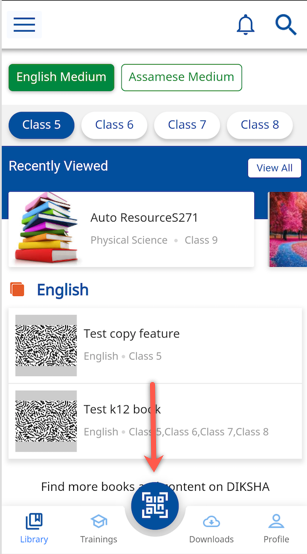
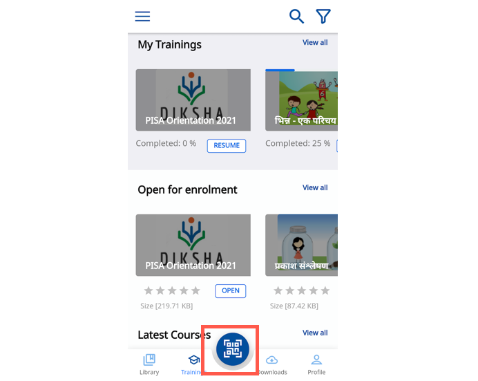

#### How do I access the TEXTBOOK in DIKSHA Mobile App?

You can access the Textbooks in the DIKSHA Mobile App by following ways:
1. Open the DIKSHA App and tap **Library**. The library page displays the textbooks and other contents for a particular board, medium, and class. You can set your default board, medium, and grade while creating your profile in the app.
 
2. Open DIKSHA App and tap the Scan icon to scan the QR Code printed on your physical textbook. Once the scan is successful, the textbook will appear on the mobile.

#### How can I upload content using the app?

The DIKSHA Mobile App is only for Consumption. You cannot create or upload contents using the App. If you have **Content Creator** role (a user role is assigned by state/school authorities), then you can log in to DIKSHA portal (https://diksha.gov.in) and create content.

#### Why I am unable to see my profile settings?

This is caused by an outdated version of **Android System Webview** component on your phone. To update the webview use:  
1. Google Playstore 
2. https://play.google.com/store/apps/details?id=com.google.android.webview link.

This solves the issue of profile setting not appearing on the DIKSHA App.

#### Why I am unable to see QR code scan button? 

This is caused by an outdated version of **Android System Webview** component on your phone. To update the webview use:
1. Google Playstore 
2. https://play.google.com/store/apps/details?id=com.google.android.webview link .

This solves the issue of QR Code scan button not appearing on the DIKSHA App.

#### How do I use the QR code?

The QR code can be used to access the course either using the DIKSHA Mobile App or through DIKSHA Portal. The QR code can be used to get into the course detail page directly without doing a search.

To scan a course QR code using mobile app:
1. Open the DIKSHA App
2. Load the QR code by tapping on the image as highlighted in the below screenshot

3. Once the QR code scanning application opens, focus the phone to the QR code. On successful scan of the QR code, the corresponding course detail page will be shown.

Important note: Though you can also use any other external Scanning App to scan the course QR code, we will ONLY recommend/support scanning the course QR code through DIKSHA Mobile App.

#### Is there a place in DIKSHA Mobile App where I can see the list of courses which I have completed?

1. Open the DIKSHA Mobile App  
2. Tap **Profile**   
3. The completed courses list is present under the section **Course(s) Attended**  

