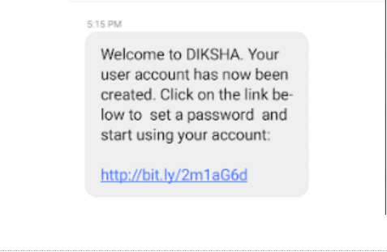

#### How can I register on DIKSHA?

DIKSHA has the provision to register a user in following ways: 
 - Self sign-up: registration of individual user using mobile number or email ID. 
 - Google sign-in: registration of individual user using their google account
 - State login: The states and organizations decides to permit registration of an individual users. 
 

#### How do I know that my DIKSHA state account is created?

Once the account is created on DIKSHA either using the registered mobile number or email address, you will get a welcome message on mobile or email address with a link to set the password. Click the **Set Password** link to provide a password.

#### How can I log in to DIKSHA using SMS from HP-INDKSH/BZ-DIKSHA?

You will receive the SMS on the mobile number provided during the registration. Click the link in the SMS to set the password and log in to DIKSHA.

#### I forgot the Password for my account. What should I do?

To reset the password follow the below steps

1. Go to Sign In page
2. Click on **Forgot** password link
3. Enter the mobile number or email address 
4. Click **Reset**. An OTP will be sent to the mobile number or email address (provided in step 3) 
5. Enter the OTP that you have received 
6. Click Submit
7. Enter the New password 
8. Click **Reset**, a new password is created and you will be directed to the DIKSHA Library Page.
