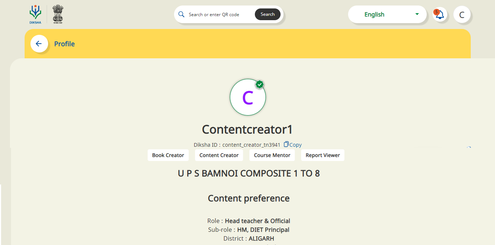
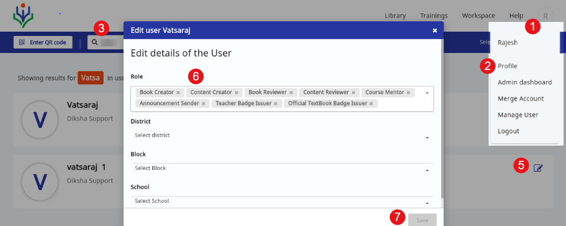

#### How would I know my rights and permission (ROLES) that I currently have in DIKSHA?

Login to DIKSHA website, go to Profile page. The Profile page displays the various roles assigned to the user. For details about the rights and permission of various roles refer the [User Type](https://diksha.gov.in/help/getting-started/user-types/).

#### How do I change my user Roles or Who can change the user roles?

User's current roles can be changed by the Organisation Administrator of the state. 
To change the user role:
1. Login as Administrator
2. Go to **Profile** page
3. In the search box, enter the name of the user for which you need to change the role 
4. Click **Submit**. The relevant results appears 
5. Click **Edit** icon against the user name to edit the user profile (roles)
6. Edit the details
7. Click **Save**

#### How do I view workspace tab on my screen?

Workspace appears for content creation or content review. Ensure to login with correct credentials.

