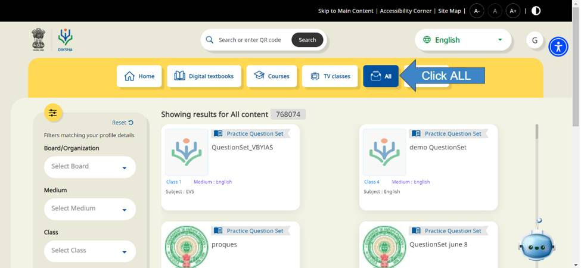
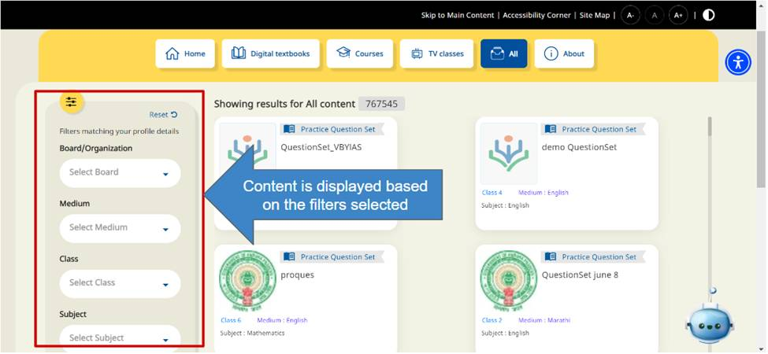

## Overview

ALL tab typically refers to a section or feature where you can view all available content on the platform. When you access the ALL tab a comprehensive list or collection of all the educational content that is available on the platform is displayed. This tab is useful for browsing through a wide range of resources across different subjects, grade levels, and types of educational materials.

Here are step-by-step instructions to access content in ALL tab.

### ALL

<table>
  <tr>
    <td>
      
    </td>
  </tr>
  <tr>
    <td>
      </td>
  </tr>
</table>

