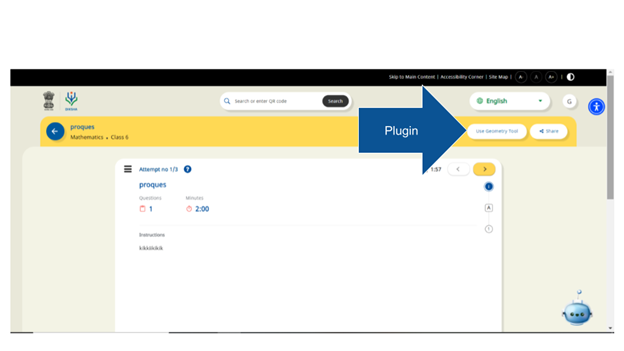
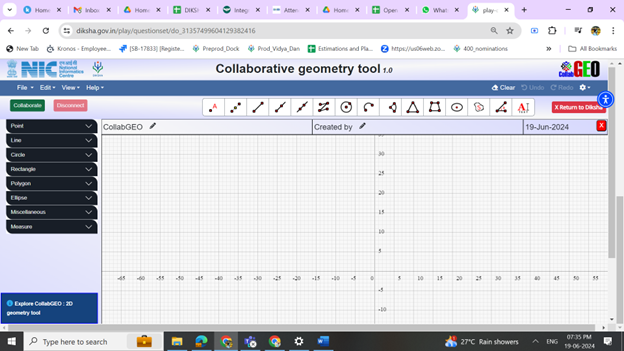

## Overview

When the user plays the content/ collection/ Question set collabgeo plugin would be available. On click a separate new tab will be opened with all the existing functionalities. Close button would be available. Instead of the close button, it would the button would be replaced with the Back to DIKSHA. Content created by the user will not be retained. Plugin will be available on the consumption portal from class 5 to Class 9.

<table>
  <tr>
    <td>
      
    </td>
  </tr>
  <tr>
    <td>
      </td>
  </tr>
</table>