## Overview

DIKSHA houses an inbuilt content player which can be used to play content anytime, anywhere. This section provides details on how to play content for different file types.

Any content available on DIKSHA regardless of its format opens and displays on the content player.

### Prerequisites

You must be registered and logged in to DIKSHA.

## Operating the content player

On clicking any content card, the content is displayed on the content player.

The controls are different for different kinds of files. For example, the controls are different for video files when compared to PDF files or the controls are different for an interactive page when compared to a textbook player and so on.

### Video player

<table>
  <tr>
    <th>Image with instructions</th>
  </tr>
  <tr>
    <td>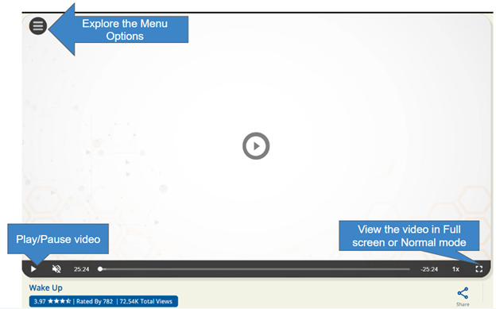</td>
  </tr>
  <tr>
    <td>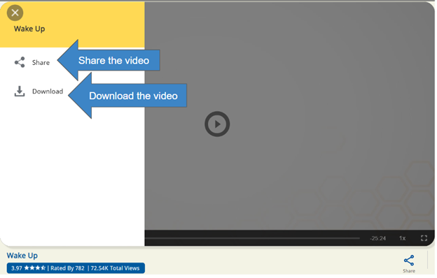</td>
  </tr>
  <tr>
      <td>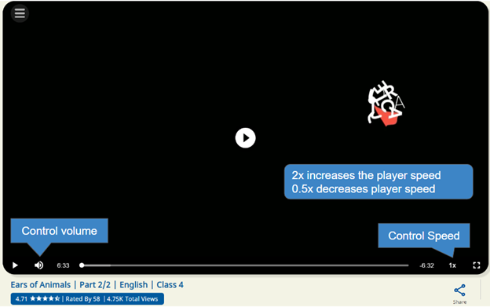</td>
  </tr>
  <tr>
      <td>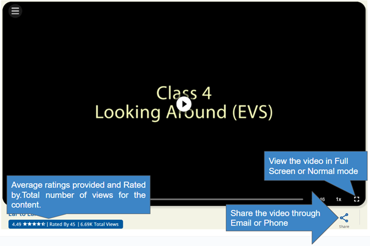</td>
  </tr>
</table>

### PDF player

<table>
  <tr>
    <th>Image with instructions</th>
  </tr>
  <tr>
    <td>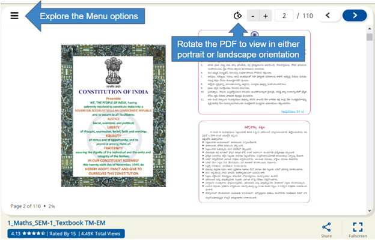</td>
  </tr>
  <tr>
    <td>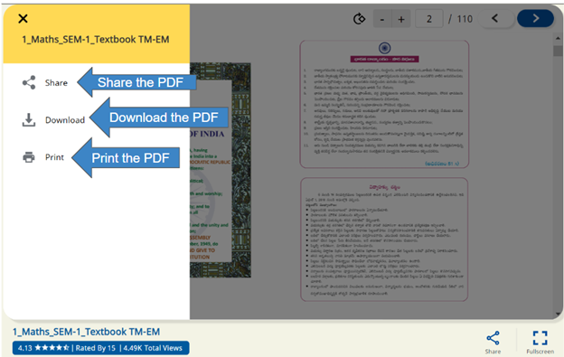</td>
  </tr>
  <tr>
      <td>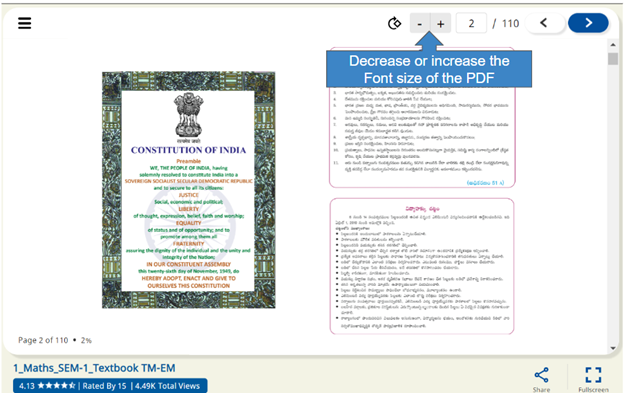</td>
  </tr>
  <tr>
      <td>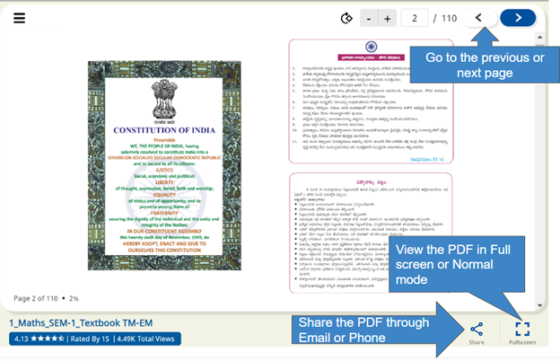</td>
  </tr>
  <tr>
      <td>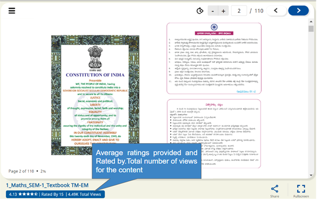</td>
  </tr>
</table>

### Textbook player

<table>
  <tr>
    <th>Image with instructions</th>
  </tr>
  <tr>
    <td>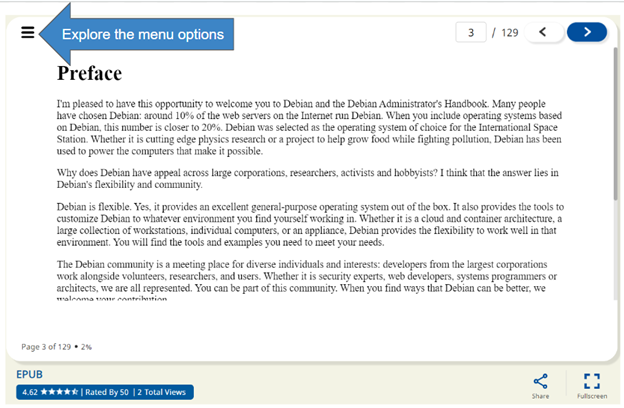</td>
  </tr>
  <tr>
    <td>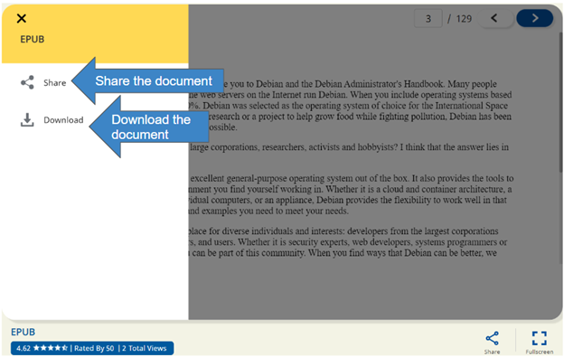</td>
  </tr>
  <tr>
    <td>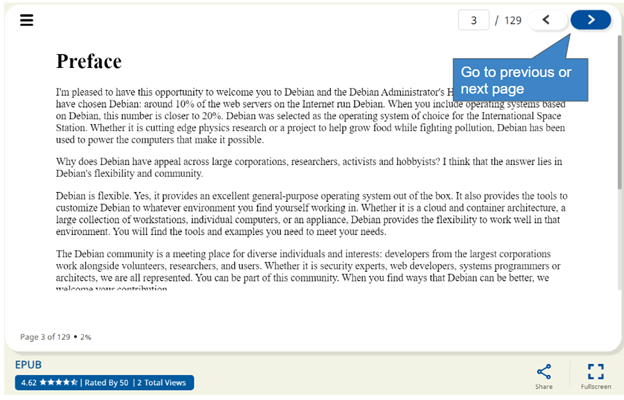</td>
  </tr>
  <tr>
    <td>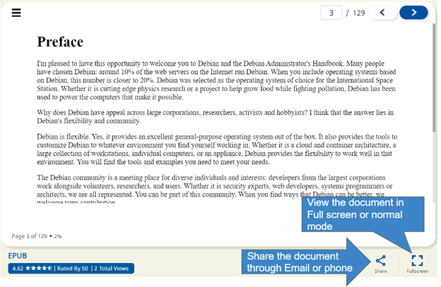</td>
  </tr>
  <tr>
    <td>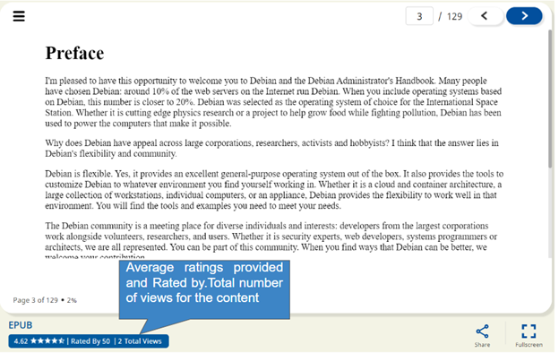</td>
  </tr>
</table>

### Interactive player (For examples, multiple choice questions, quizes and so on):

<table>
  <tr>
    <th>Image with instructions</th>
  </tr>
  <tr>
    <td>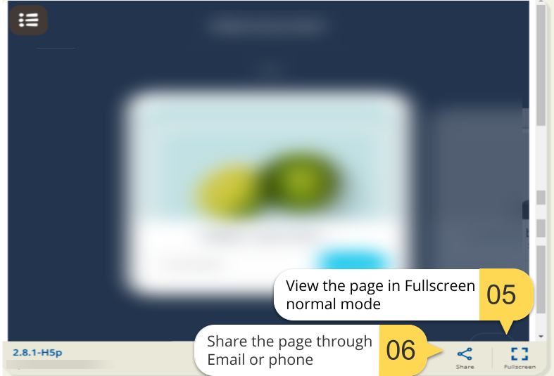</td>
  </tr>
  <tr>
    <td>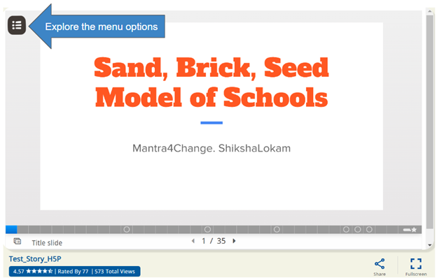</td>
  </tr>
  <tr>
    <td>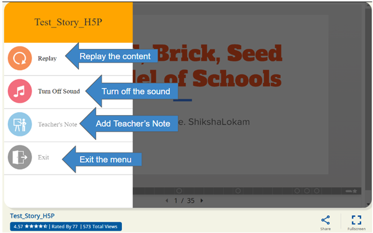</td>
  </tr>
  <tr>
    <td>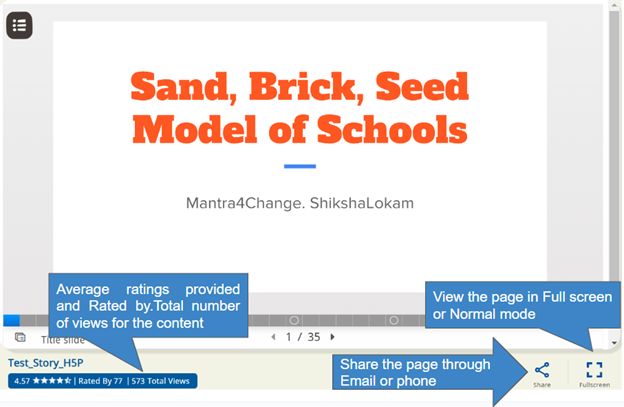</td>
  </tr>
</table>

### QUML player (For example, Practice question papers, test question papers and so on)

<table>
  <tr>
    <th>Image with instructions</th>
  </tr>
  <tr>
    <td>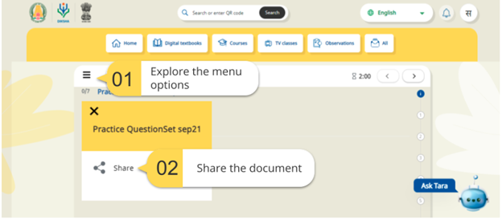</td>
  </tr>
  <tr>
    <td>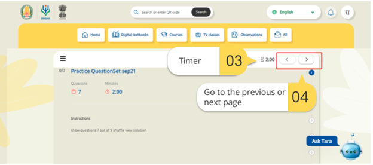</td>
  </tr>
  <tr>
    <td>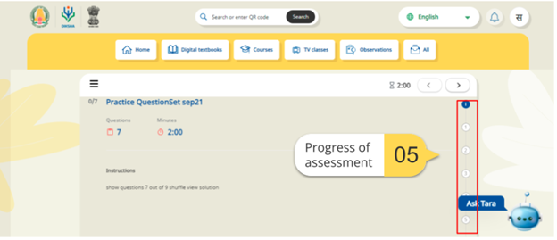</td>
  </tr>
  <tr>
    <td>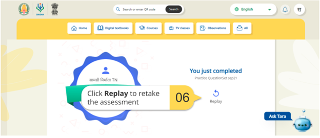</td>
  </tr>
</table>