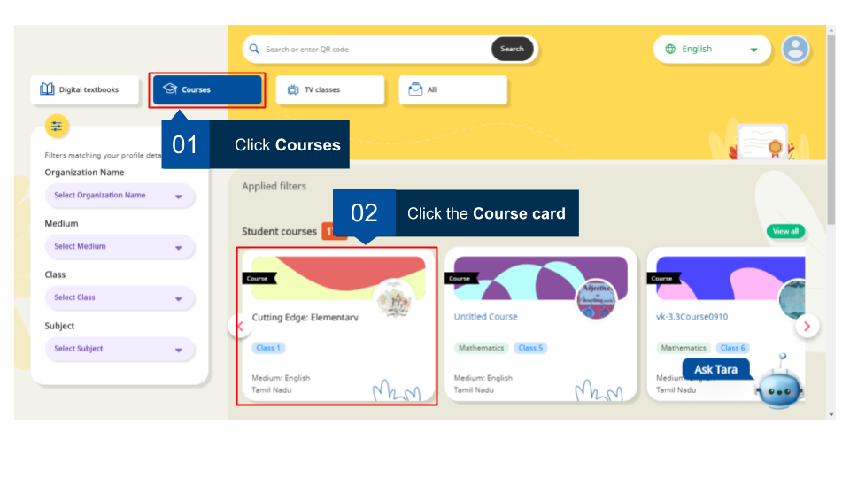
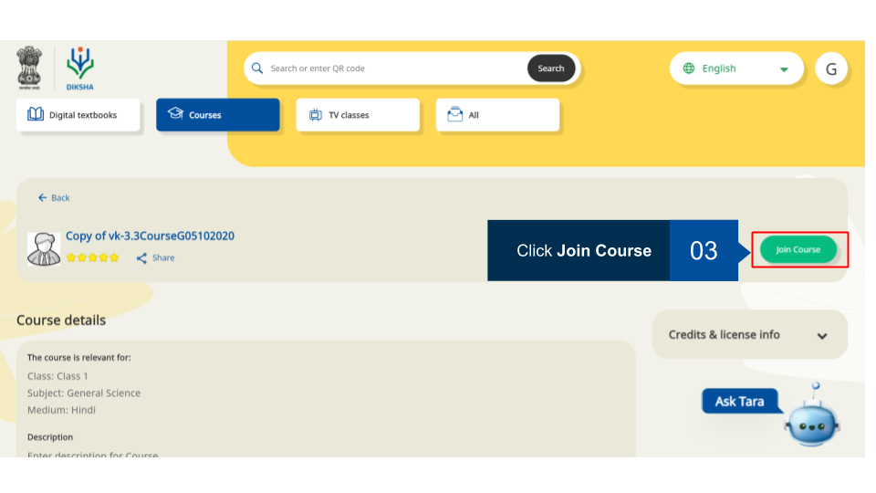
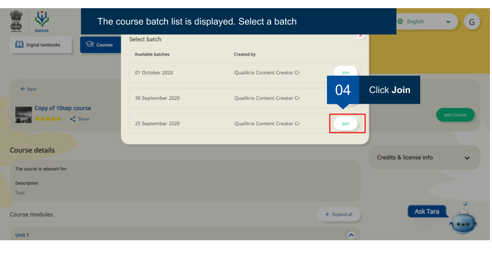
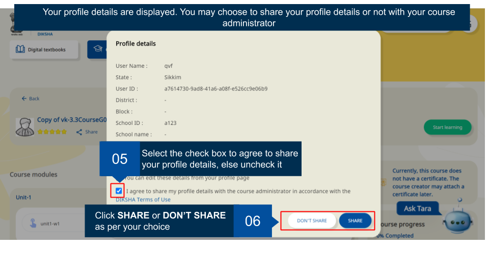
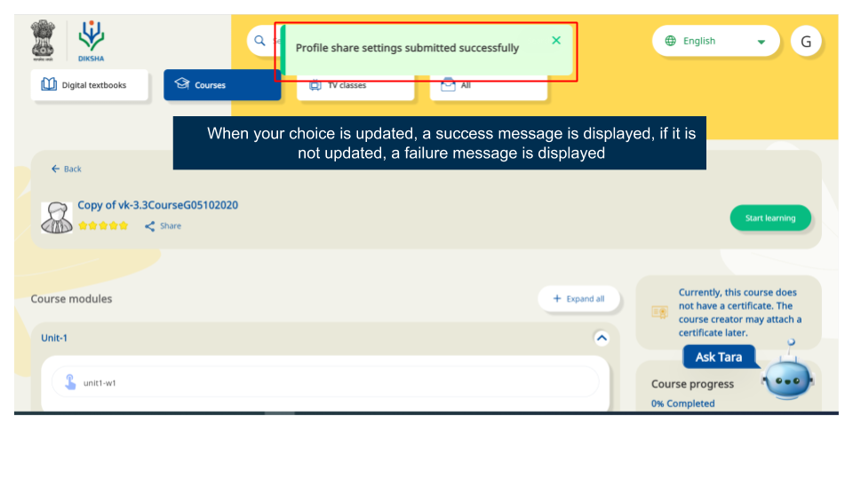
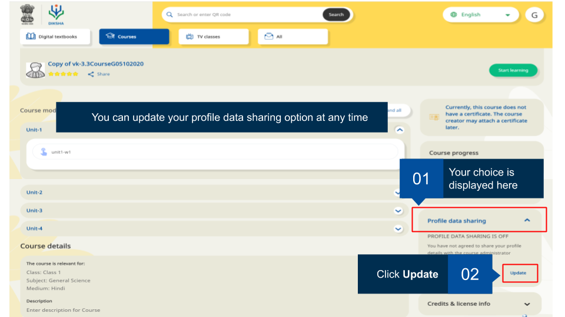
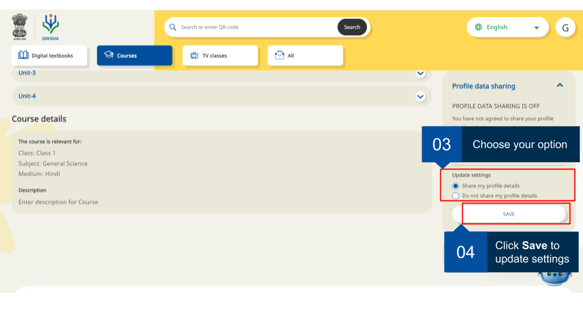

## Overview

When you enrol for a course, you have the option to share or not share your profile data with the course administrator. 

### Sharing Profile Data 

<table>
  <tr>
    <th style="width:35%;">Image with instructions</th>
 </tr>
 <tr>
  <td></td>
  </tr>
  <tr>
    <td></td>
  </tr>
  <tr>
    <td></td>
  </tr>
  <tr>
    <td></td>
  </tr>
  <tr>
    <td></td>
  </tr>
  </table>

### Updating Profile Data Sharing Details 

<table>
  <tr>
    <th style="width:35%;">Image with instructions</th>
 </tr>
 <tr>
  <td></td>
  </tr>
  <tr>
    <td></td>
  </tr>
  </table>
