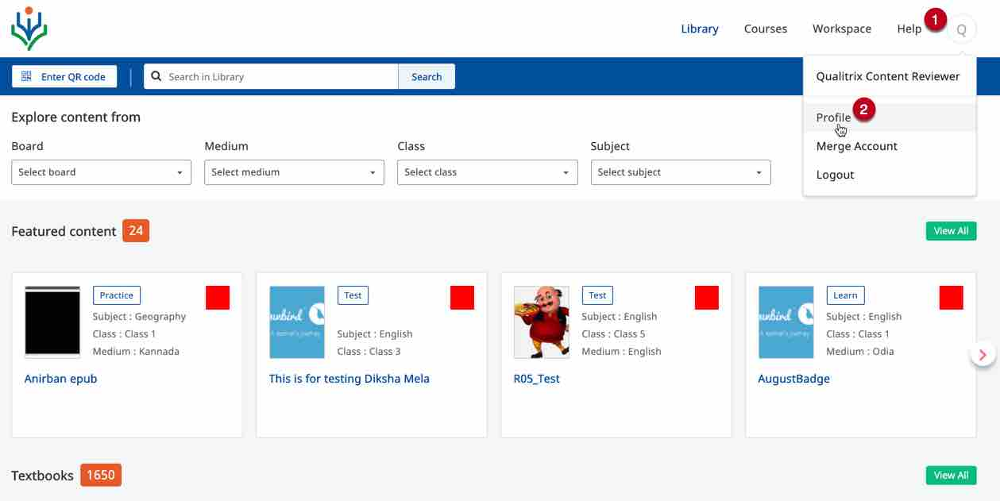
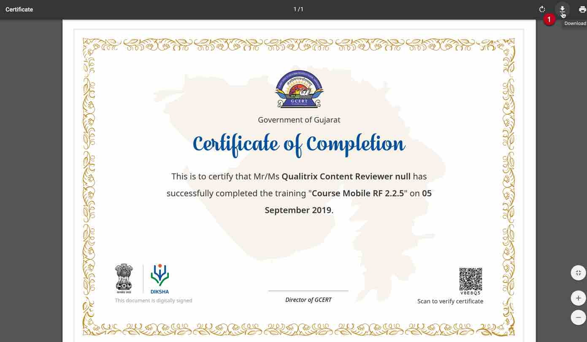

## Overview

DIKSHA offers certificates after you complete a recommended course. The course details card specifies if the course offers a certificate. Certificate are issued on completion of the course with the criteria of merit and best score of the user. An email or SMS is sent to the user when the certificate issued. The users can view them on the profile page.  

 Users can verify their certificate by scanning the QR code printed on the certificate with your mobile app.  After verifying the certificate, users can publish them on their profile. They are then visible to other users. Registered users can view and download the certificates in PDF and PNG formats. 

This section provides detailed instructions to view and download certificates for completed courses.

### Prerequisites

<table>
  <tr>
    <th style="width:35%;">Step</th>
    <th style="width:65%;">Screen</th>
  </tr>
  <tr>
    <td>You are logged in 
     1. You have clicked on the <b>Profile</b> tab 
     2. You have clicked on <b>Profile</b> from the drop-down menu</td>
    <td></td>
  </tr>
</table>

### Downloading Course Certificate

You can view and download certificates even when you are not connected to the internet. However, to be able to do so you should open the certificate at least once when you are connected to the internet. 

<table>
  <tr>
    <th style="width:35%;">Step</th>
    <th style="width:65%;">Screen</th>
  </tr>
  <tr>
    <td>1. Scroll down to <b>Courses attended</b> section of the Profile page
       2. Courses that offer a certification has a <b>Download Certificate</b> option. Click <b>Download Certificate</b> </td>
    <td></td>
  </tr>
   <tr>
  <td> The certificate opens up in a new tab. Click the <b>Download</b> icon and select the folder where you would like to download the certificate
     <b>Note</b>: The certificate is downloaded in a pdf format </td>
     <td></td> 
  </tr>
</table>

### Verifying Certificate

You can scan the QR code on the e-certificate using any QR code scanner and verify your certificate. After a successful scan a URL is generated, tap to open the URL in a browser. For details refer <a href="../diksha-mobile-app/certificates.html#verifying-a-certificate" target="_blank">Verifying Certificates</a>

#### Exceptions

- Certificates sometimes are not attached to the course when it published and batches are available. The course creators may attach a course at a later date. In such a scenario, the users will get a certificate on successfully completing the course

- An exisiting certificate that was attached to a course may get edited or updated at a later date. In such a scenario, users who have already completed the course and received the certificate will not receive the  updated certificate . Users can contact their state administrators for further details

  

