## Overview

DIKSHA offers a wide range of courses. After you log in, you can join the course on your own, or your organization may invite you to join the course. The course categories are:  

- **My courses**: This category displays the list of courses that you have undertaken, have partially completed or recently joined. This list also includes the courses that you have been invited to join. You can view your enrolled courses based on enrolment date and locate your courses easily.  

- **My State's courses**: This category displays the list of State-specific courses that are created and uploaded by the user's State. This list is visible only to users registered in that specific State. If you log in as an authenticated State user, you can join the course for any batch that is open for enrolment. The list displays the most recently created course at the top.  

- **Featured courses**: This category displays all available courses, irrespective of the organization that created it. Any logged-in user can join the course shown in this category.   

- **Latest courses**: This category displays a list of the courses most recently added to DIKSHA.  

The guidelines to take the courses vary for each course. The creator or mentor decides the guidelines applicable for that specific course.

<table>
  <tr>
    <th style="width:35%;">Step</th>
    <th style="width:65%;">Screen</th> 
  </tr>
  <tr>
    <td>1. You are logged in 
     2. You have clicked on the <b>Courses</b> tab </td>
      <td>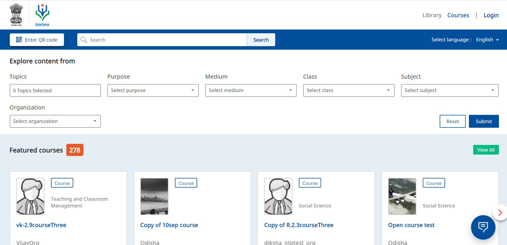</td>
  </tr>
</table>

## Joining a Course

Before starting the chosen course, the user needs to agree to the terms and policies of DIKSHA. The 'Continue' button on the pop-up is enabled only after the user checks the box. The user cannot exit the pop-up without agreeing. 

<table>
<tr>
  <th>Image with instructions</th>
</tr>
<tr>
  <td>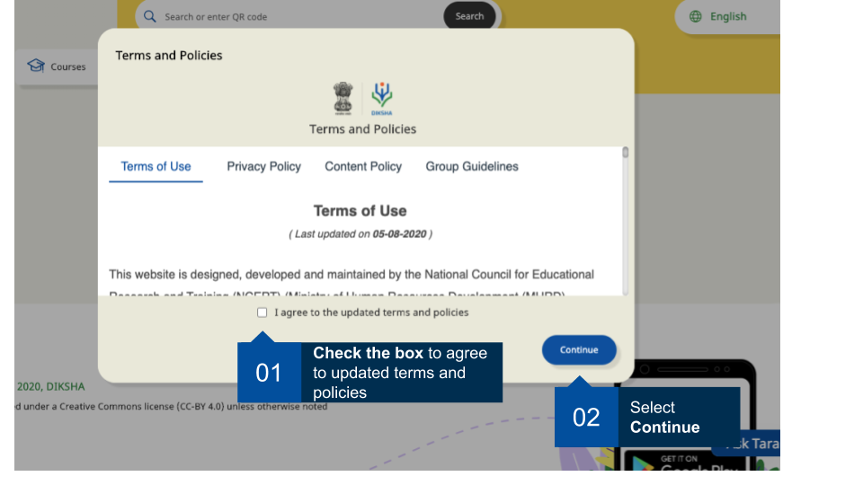
</td>
</tr>
</table>

Registered users can join any available batch of a course. The available batch dates are displayed for all courses. Messages are displayed for the following batch status:

- If the enrolment date has been crossed
- For batches whose enrolment isn't open yet

When the user joins a batch, the duration within which the batch will expire is displayed below the batch name and is updated until the batch ends.

<table>
  <tr>
    <th style="width:35%;">Step</th>
    <th style="width:65%;">Screen</th>
  </tr>
  <tr>
    <td>Select a course from <b>My State's courses</b>,<b> Latest courses</b> or <b> Featured courses</b> sections. The course details page is displayed 
     1. Click <b>Join</b> to join the course
     <b>Note</b>: A user can voluntarily join or leave an open course</td>
    <td>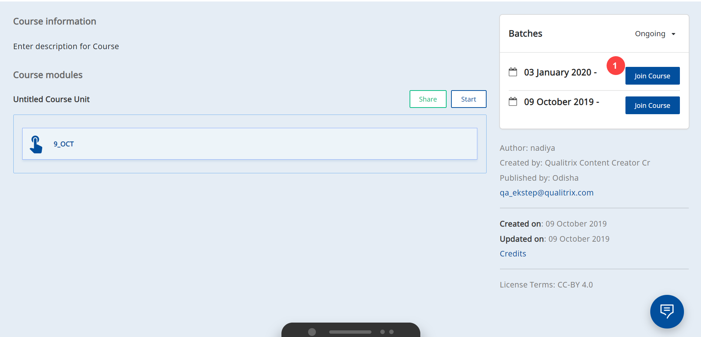</td>
  </tr>
  <tr>
    <td>1. Click <b>Join course</b> on the course pop-up screen
     2. Click <b>X</b> icon to go back to the previous screen. When you enrol for a course, you have the option to share or not share your profile data with the course administrator. For details refer <a href="./consent-profile.html" target="_blank">Share Profile Details</a>
      </td>
    <td>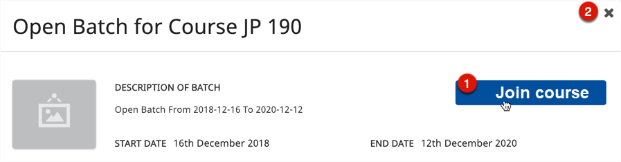</td> 
  </tr>
   <tr>
      <td>Click <b>Join course</b>, a pop-up is displayed. The name given in your profile is present on the certificate, you can make the required changes on this pop-up to edit your name</td>
    <td>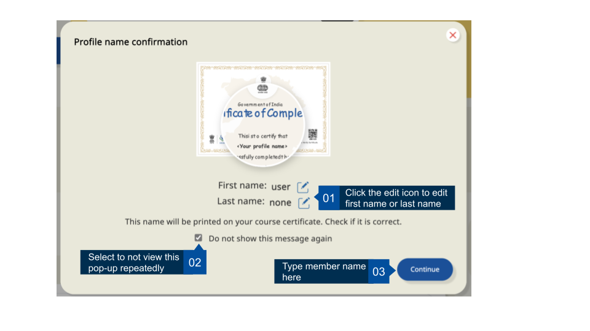</td> 
  </tr>
  <tr>
    <td>The following details about the course are displayed:
     1. Name of the course
     2. Rating assigned to the course 
     3. Click the <b>Share</b> icon to share the course link. Alternatively, you can also share each module within the course individually
     4. Description about the course
     5. Click <b>Folder</b> icon or <b>(v)</b> icon, to view the content of the course under the <b>Course Structure</b> section. The table of contents of the course is displayed here
     <b>Note</b>: Signed in users can view the content covered within each unit of a course, through a table of contents</td>
    <td>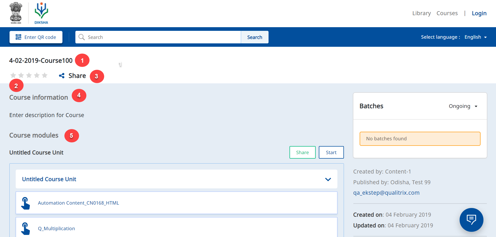</td>
  </tr>
  <tr><td>
       1. Click <b>Continue Learning</b> to revisit the section of the course you last visited. To know more, refer <a href="#resuming-a-course">Resuming a course</a>   
     2. Details of when the course was last updated is displayed here
     3. This section indicates if there is a certificate associated with the course
   4. View the upcoming and ongoing batch details in <b>Batch details</b> section
   5.  The progress of the user is captured and displayed here
   <b>Note</b>: When the course ends the course progress bar is greyed out in the <b>Courses Card</b> and <b>Course TOC</b> page. To know more, refer <a href = "#accessing-training-after-batch-expiry">Accessing a Course after Batch Expiry </a> 
     6. Click <b>Credits & license info</b> to view all attribution details</td>
    <td></td>
    </tr>
</table>

## Completing a Course

On DIKSHA, there are two types of courses, those with certificates and those with no certificates. A note is displayed on the course details page to indicate if the course has a certificate. On successfully completing a course, a course completion message is displayed. For courses with certificates, details of the certificate are also mentioned. For details on downloading course certificate refer <a href="./course-certificates.html" target="_blank">Course Certificates</a>

Courses can also have assessments. Completing the assessments are sometimes determiners to indicate the completion of a course. Course mentors can add assessments at the end of the course or for each module of the course. 
There can be one or many attempts to take the assessment. Each time a user attempts the assessment a message is displayed to notify the remaining attempts for the user. Once the user crosses the permissible attempts, they cannot retake the assessment. Additionally, when the user initiates an assessment, a timer indicates and warns the user for the remaining time before the assessment is automatically submitted.

Some courses are also available within the Digital Textbook section. These course do not have a certificate associated with them and you cannot track the progress of these courses, but you can take them and complete them akin to the courses available in the Courses section.

## Inbuilt Content Player

Click the course material link to display the course content in the inbuilt content player

<table>
  <tr>
    <th style="width:35%;">Step</th>
    <th style="width:65%;">Screen</th>
  </tr>
  <tr>
    <td>1. Click <b>Menu</b> to view the player options available 
     2. Click <b>left scroll</b> icon to go to previous page or slide of course content
     3. Click <b>right scroll</b> icon to go to the next page or slide of course content 
     4. Click <b>Previous</b>, to view study material preceding the current material in the course content list 
     5. Click <b>Next</b> to view study material immediately subsequent to current material from the course material list 
     6. Click <b>Take Note</b> to make any notes on the current course material 
     7. Click <b>Resume course</b> to continue from where you had stopped earlier 
     8. Click <b>X</b> icon to exit the course. In case you click on the close icon before the course is completed, you can still resume the course. For details refer <a href="#resuming-a-course">Resuming a course</a></td>
    <td>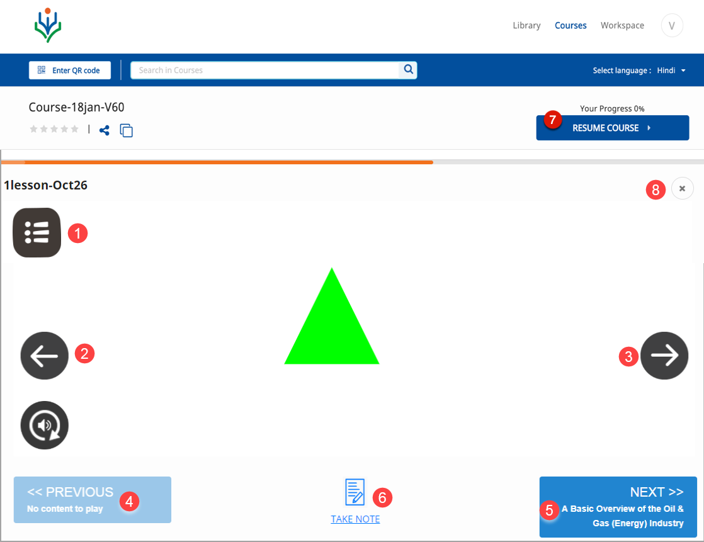</td>
  </tr>
</table>

### Content Player Menu

Click the course player menu in the content player to display the name of the course

<table>
  <tr>
    <th style="width:35%;">Step</th>
    <th style="width:65%;">Screen</th>
  </tr>
  <tr>
    <td>1. Click <b>Replay</b> to replay the study material  2. Click <b>Sound on</b> to turn on or off sound for audio or video study material  3. Click <b>Teacher’s Note</b> to view teacher’s notes for the current course material  4. Click <b>Home</b> to navigate to the Homepage </td>
      <td>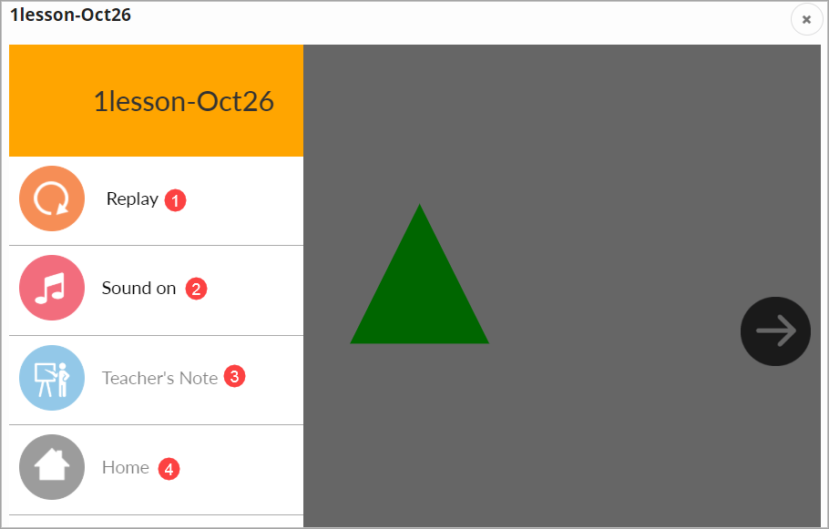</td>
  </tr>
</table>

### Taking Notes

You can maintain separate notes for each course that you take. 

<table>
  <tr>
    <th style="width:35%;">Step</th>
    <th style="width:65%;">Screen</th>
  </tr>
  <tr>
    <td>Click <b>Take a Note</b> option to take notes 
     1. Enter an appropriate <b>Title</b> for your note, such that you can easily identify and retrieve the note 
     2. Enter <b>Details</b> of the note 
     3. The toolbar comprises of various text formatting options 
     4. Click <b>Clear</b>, to delete and rewrite your notes. On clicking clear, the title is also cleared 
     5. Click <b>Save</b> to save the changes</td>
    <td></td>
  </tr>
</table>

## Resuming a Course

When you close your current course, deliberately or accidentally, even before you complete the course, you can resume and continue it. To resume the course,  ensure that the course batch has not expired. You can open the course from the **My Courses** section. 

<table>
  <tr>
    <th style="width:35%;">Step</th>
    <th style="width:65%;">Screen</th>
  </tr>
  <tr><td>1. Click <b>Continue Learning</b> to revisit the section of the course you last visited 
   or
   2. Click on the topic/unit from the table of content to directly view the section of the course 
  </td>
  <td>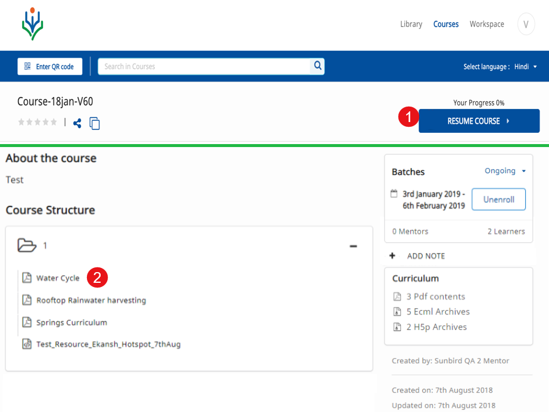</td>
  </tr>
</table>

## Accessing a Course after Batch Expiry

When a user opens the course for which the batch has expired:

<table>
<tr>
    <th style="width:35%;">Step</th>
    <th style="width:65%;">Screen</th>
  </tr>
  <tr>
    <td>An alert message appears "<b>This course has ended and your progress is locked. However, you may continue using the remaining content</b>”
   The user can proceed with the course, however the user's progress of the course completion will not be captured.</td>
  <td>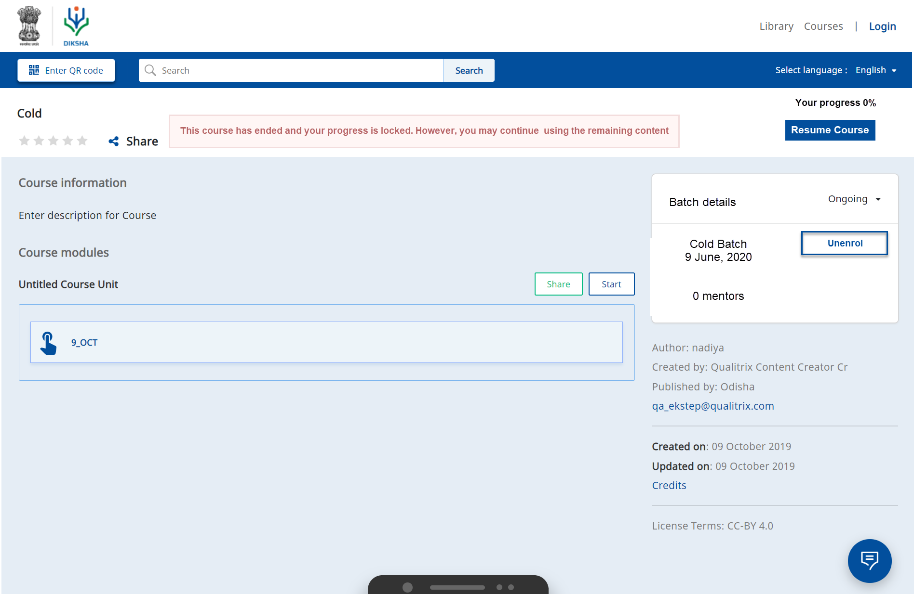</td>
  </tr>
  <tr>
  <td><b>Multiple Batches</b>
   Consider a scenario: you have joined in a batch and that batch has expired. To continue with the course, you must join another batch of the course. To find any upcoming or ongoing batch of the course, use the search and filter option on the Courses tab.
   1. Click <b>Resume</b> to continue with the course in an expired batch. 
   <b>Note</b>: The progress for this batch will not be captured 
   2. Click <b>Enrol</b> to register for an ongoing or upcoming batch</td>
   <b>Note</b>: The cumulative progress is captured when you proceed with the batch
  <td>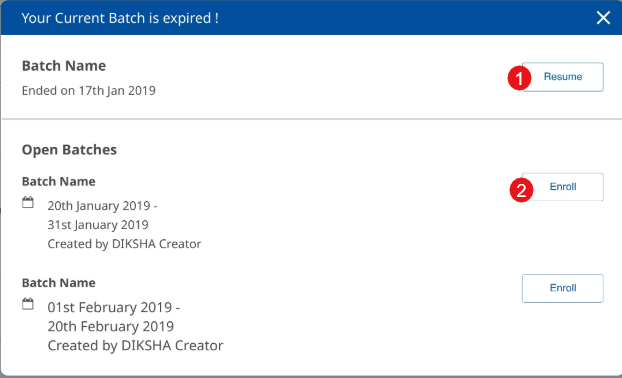</td>
  </tr>
  <tr><td>Once you join the ongoing or upcoming batch for the course, the course card appears under <b>My courses</b> tab. There are individual course card for each batch.
   1. Search for the course name using search bar 
   2. Browse and select the course with ongoing batch under <b>My Courses</b> tab 
   3. Click to open and proceed with the course
   4. This progress bar represents an incomplete and expired course
   5. This progress bar represents a current course 
   <b>Note</b>: The user can resume a course in an ongoing batch, provided the enrolment end of the date has not been crossed. Also, they can resume the course from the section they conducted just before the batch expired. It captures the cumulative progress of the two courses.   
  </td>
  <td>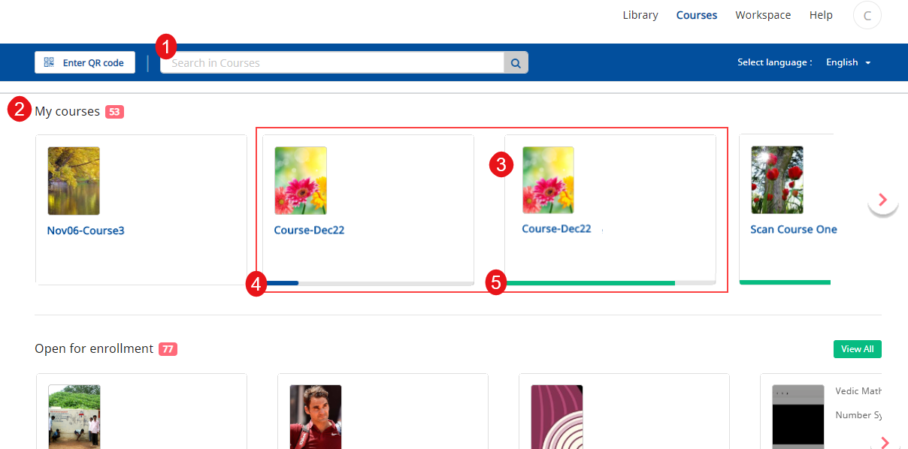</td>
  </tr> 
</table>

## Leaving a Course 

<table>
  <tr>
    <th style="width:35%;">Step</th>
    <th style="width:65%;">Screen</th>
  </tr>
  <tr>
    <td>Search for the course by entering the course name in search bar. The course is displayed as a search result
     1. Select a course from the <b>My courses</b> section 
    2. Tap the course to open the course details page
        <b>Note</b>: Each time a course is updated, the details of the update are displayed 
    </td>
    <td>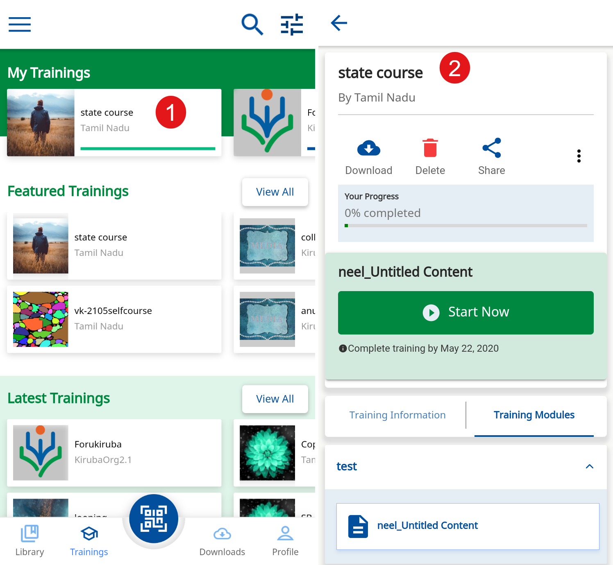</td>
  </tr>
  <tr>
    <td>
      1. Tap the burger menu icon
       2. Tap <b>Leave Course</b>
       3. The Leave course pop-up box is displayed
       4. Tap <b>Confirm</b> to leave the course
       5. Tap <b>Cancel</b>
    </td>
    <td>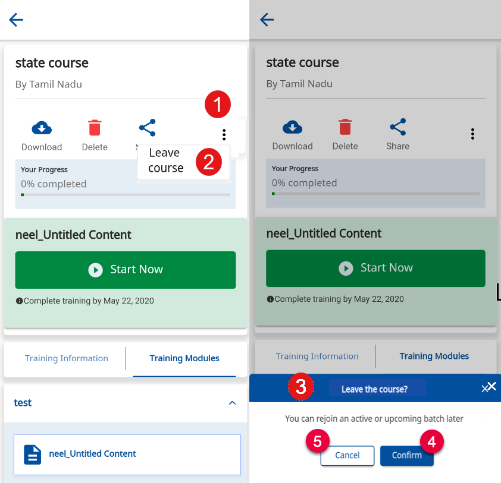</td>
  </tr>
</table>

- is selected from the **Open for enrolment** section
- is not completed
- batch has not expired

<table>
  <tr>
    <th style="width:35%;">Step</th>
    <th style="width:65%;">Screen</th>
  </tr>
  <tr>
    <td>1. Click <b>Leave course</b> to leave and withdraw from the course. A prompt window is displayed
     2. Click <b>Leave course</b>. On successfully leaving the course, a confirmation message is displayed 
     <b>Note</b>: Once a user leaves a course, the <b>Leave course</b> button is disabled. The user will receive an email notification on leaving the course
     3. Click <b>Cancel</b> to go back to the previous screen</td> 
    <td>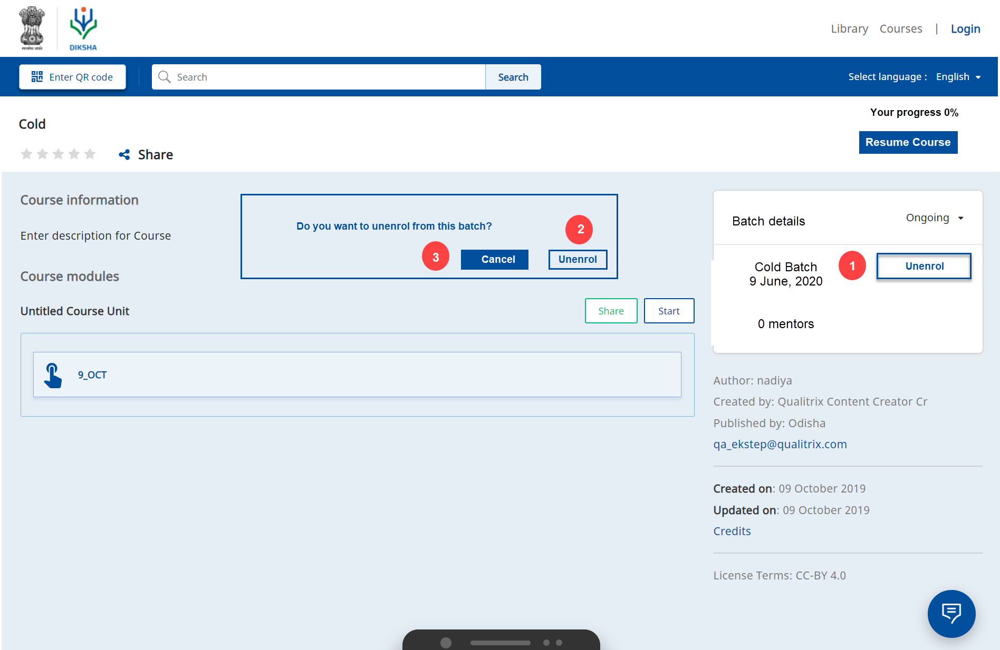</td>
  </tr>
</table>
