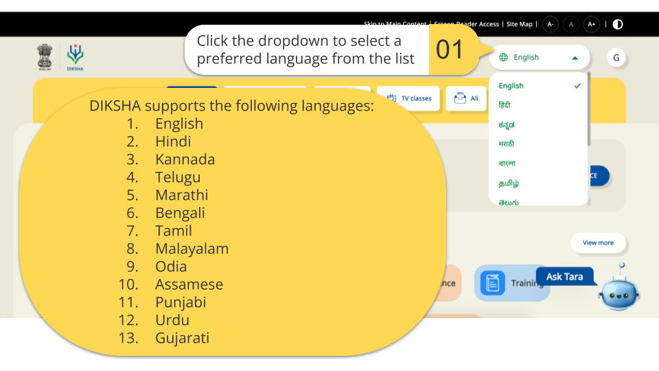
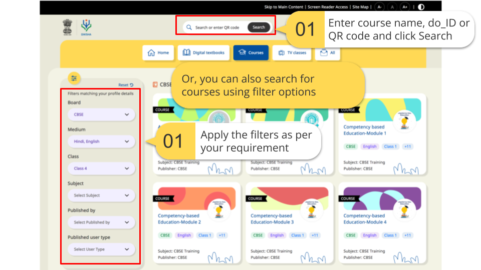
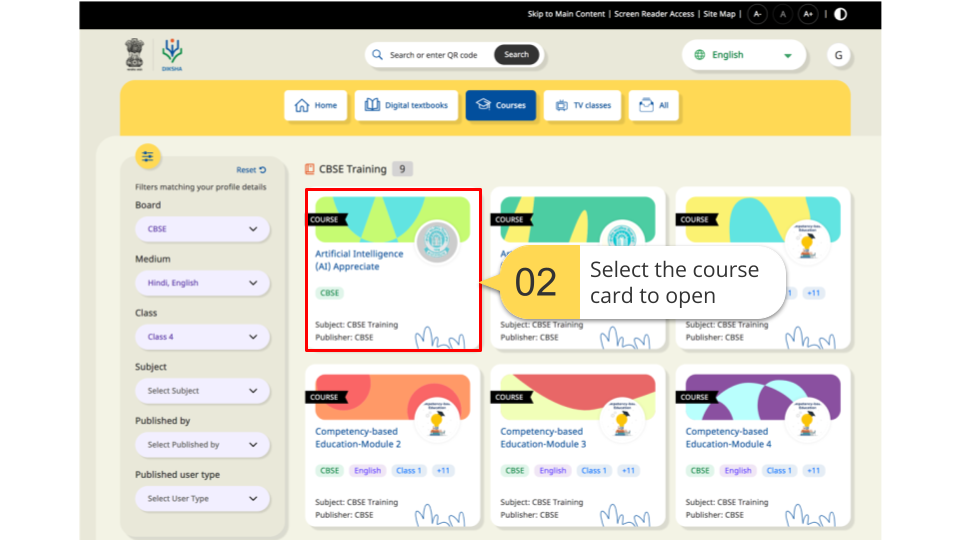
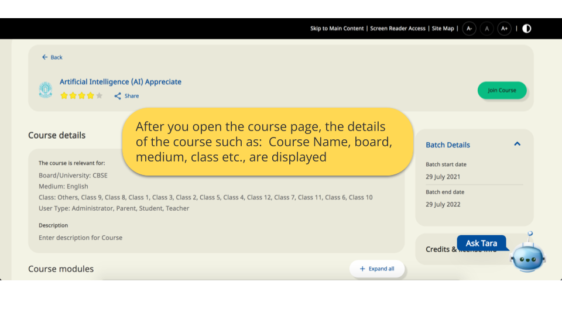
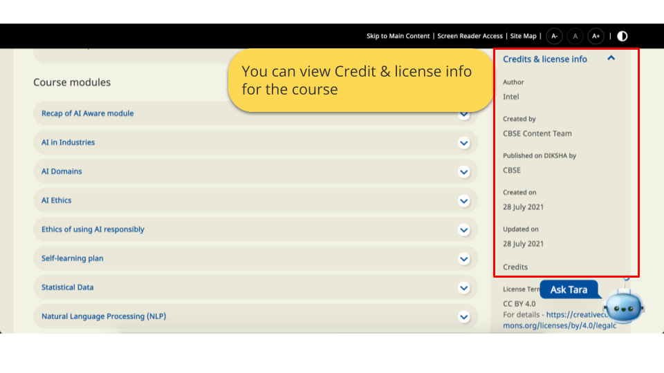
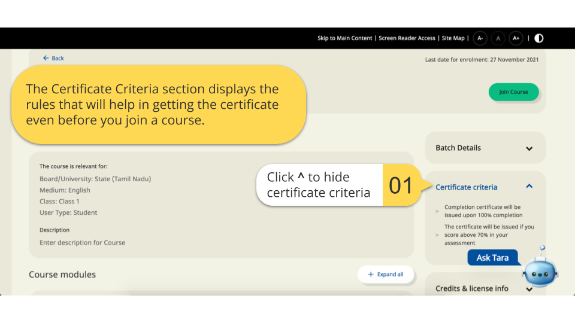
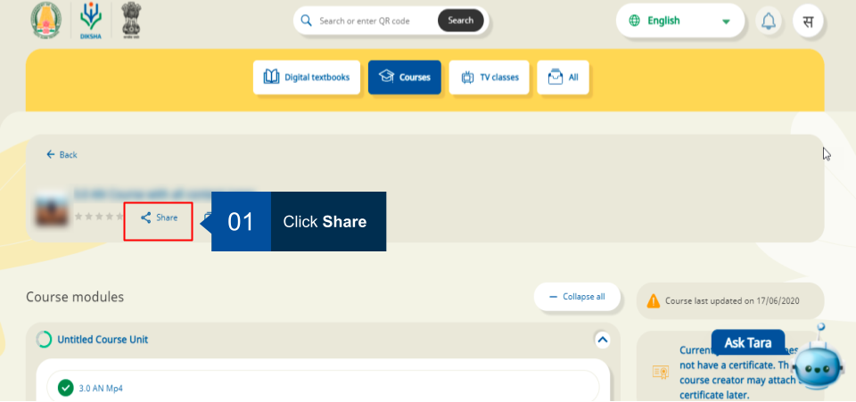
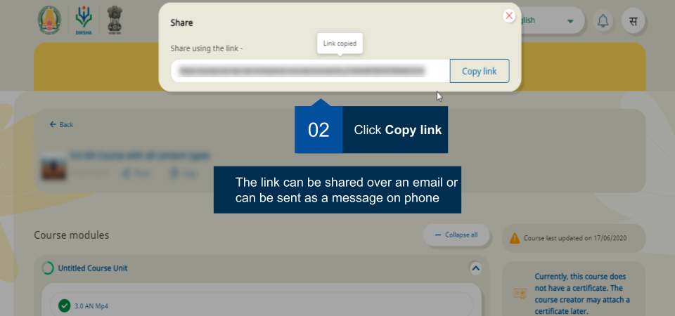

## Overview

DIKSHA courses are created by course creators or mentors and can be viewed by both guest users and signed-in users. A guest user can only open and view the structure of the course on the DIKSHA portal while a signed-in user can also <a href="../courses/enrolling-course.html" target="_blank">join a course</a>. Guidelines to join a course vary for each course and depend on the discretion of the creator or mentor. 

### Prerequisites  

- You are logged-in as course creator or course mentor
- You are on the **Courses** tab

## Guest User 

A guest user can use the DIKSHA to:

  - Select a preferred language 
  - Search and explore courses 
  - View the course structure 
  - View the course batch details
  - Share a course
  - Access and share the textbooks
  - Access and share TV classes

### Selecting Language

<table>
<tr>
  <th>Image with instructions</th>
</tr>
<tr>
  <td></td>
  </tr>
</table>

### Searching and Exploring Courses

<table>
<tr>
  <th>Image with instructions</th>
</tr>
<tr>
  <td></td>
  </tr>
<tr>
  <td></td>
  </tr>
</table>

### Viewing Course Details

<table>
<tr>
  <th>Image with instructions</th>
</tr>
<tr>
  <td></td>
  </tr>
  <tr>
  <td>Click on <a href = "./enrolling-course.html" target="_blank">Join course</a> to access the course.
   Click on the Share icon to share the link of the course. For more details, refer <a href="#deleting-content">Sharing a course</a></td>
  </tr>
<tr>
  <td></td>
  </tr>
</table>

## Viewing Certificate Criteria

Course creator attaches certificate in their course, these certificates are issued to the user once they complete the course. The certficates can be allocated based on criteria which a user has to fulfill. 
A user can view whether they will be issued an certificate, or the type of certificate after completing the course. This section is displayed with the courses that have certificates attached.    

<table>
<tr>
  <th>Image with instructions</th>
</tr>
<tr><td></td></tr>
</table>

## Sharing a course

Courses can be shared without enrolling for that particular course. But you can consume the course only after enrolling.

<table>
<tr>
  <th>Image with instructions</th>
</tr>
<tr><td></td></tr>
<tr><td></td></tr>
</table>

## Signed in user

A signed in user can perform more activities than an anonymous user. Any registered user can enrol in a course which is open for enrolment in the course for which they are invited.

### Join a Course

You can take up a course by enrolling for it. For details, refer <a href = "./enrolling-course.html" target="_blank">Join course</a>

