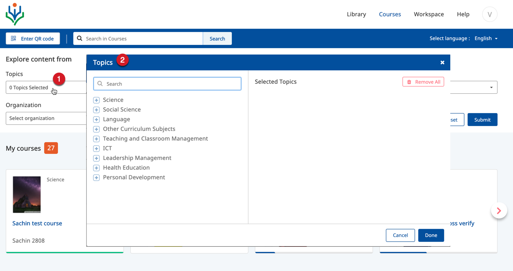
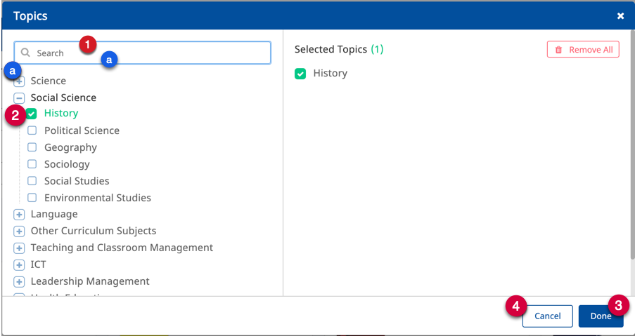
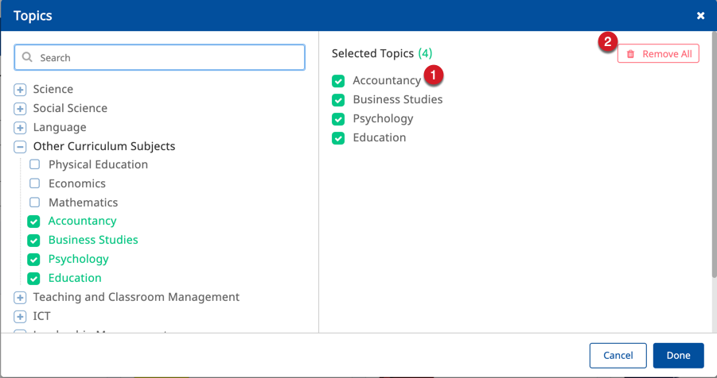

## Overview

All content on DIKSHA has various details associated with it that provide information about the content. For example;
the details include information about the Subject, Board, Medium, and Contributor. Each organization on DIKSHA decides and configures which information about the content is mandatory when creating or updating content. To elaborate, some organization may mandate having only the name of the content to be recorded during creation. Another organization may mandate that all information details about the content such as the classes for which the content is appropriate, the topics covered by the content, content creator details, etc. are captured.

This section provides detailed instructions on how to search content associated with such topics

<table>
  <tr>
    <th style="width:35%;">Step</th>
    <th style="width:65%;">Screen</th>
  </tr>
  <tr>
    <td>1. Click the text box below the <b>Topics</b> option
     2. The Topics selection page is displayed
    </td>
    <td></td>
  </tr>
  <tr>
    <td>1. You can find the topic using the following options:
       &emsp;a. Type the topic name on the search bar
       &emsp;b. Click the <b>+</b> icon to expand the list of topics
      2. Click on the checkbox to select a topic. Selected list of topics are listed on the right
      3. Click <b>Done</b> to save and submit the topics selected
      4. Click <b>Cancel</b> or <b>X</b> icon on the top right of the screen to exit the screen
    </td>
    <td></td>
  <tr>
    <td> <b>Removing a selected topic</b>:
       1. Click on the topic you want to remove. Clicking on the topic unselects and removes the topic from the list
     2. Click <b>Remove All</b> to remove all the selected topics</td>
    <td></td>
  </tr>
</table>

