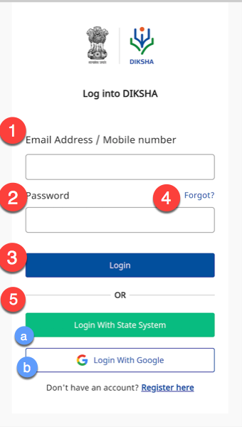
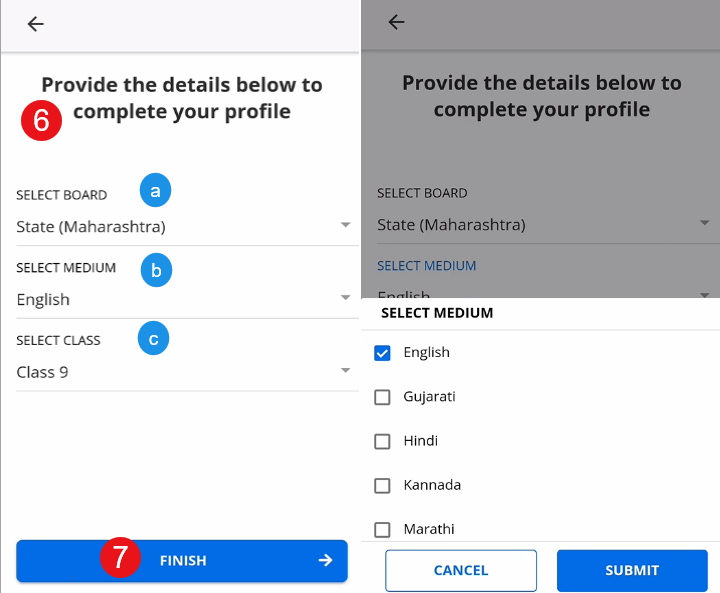
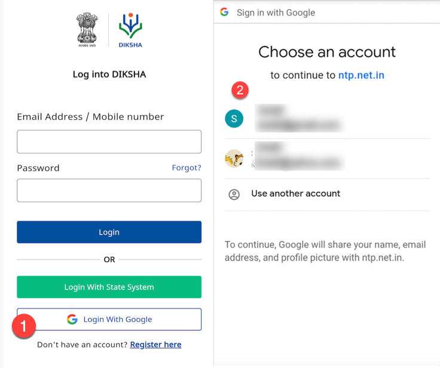
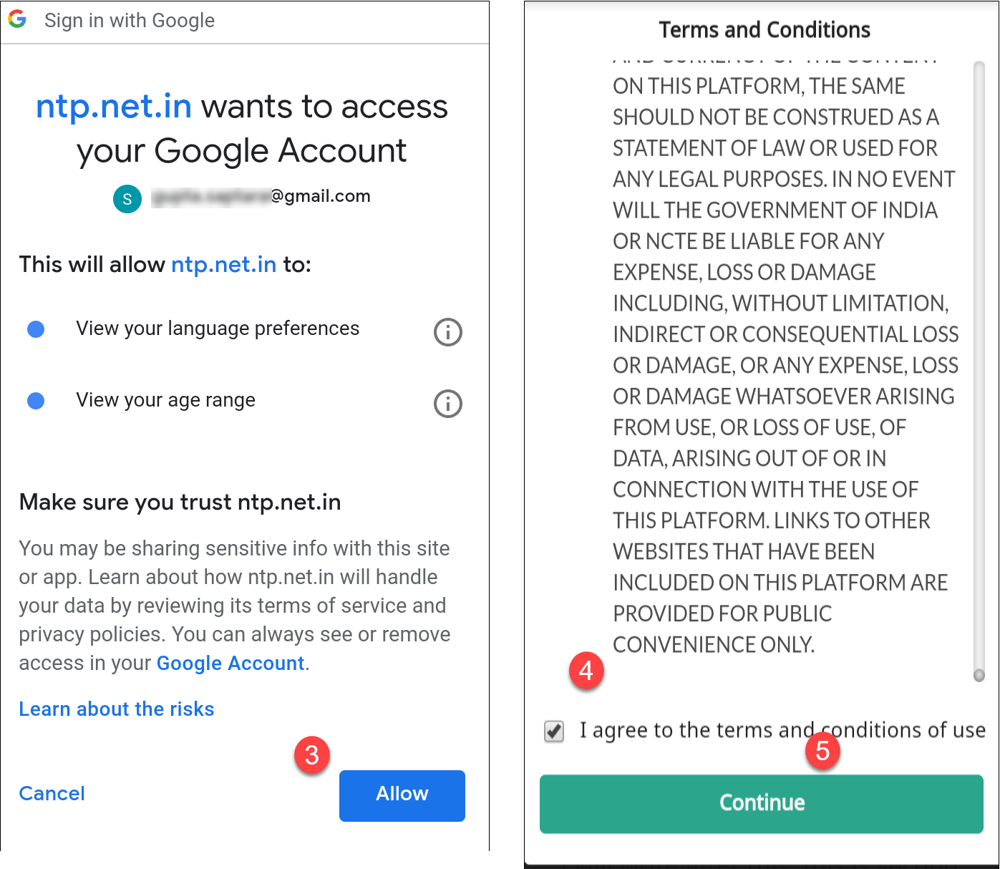
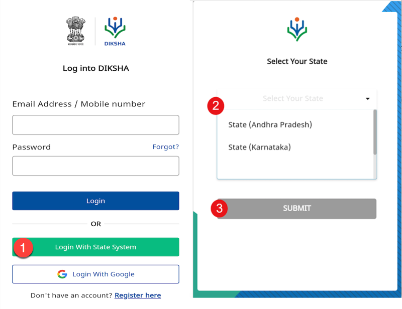
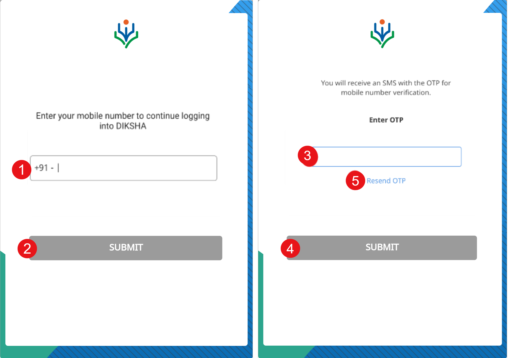

## Overview 

DIKSHA contains a variety of resources. You can access the unlimited resources of DIKSHA by registering on the DIKSHA mobile app. You can register using your google account, State account or choose a registration process. 

## Prerequisites

* A mobile device with Android OS 5.0 and above
* Access to Play Store to download and install the DIKSHA Mobile App

## Logging In

The <b>Login</b> feature allows authorized users to access unlimited DIKSHA content using the app. Different contents are available for each user on the basis of their profile selections. An anonymous or guest user can view only a limited number of courses and resources, while a registered user has access to all the content available in the Library.

<table>
  <tr>
    <th style="width:35%;">Step</th>
    <th style="width:65%;">Screen</th>
 </tr>
 <tr>
    <td>Log in to DIKSHA mobile app using your registered credentials 
     1. Enter your registered <b>Email Address</b> or <b>Mobile Number</b> 
     2. Enter the <b>Password</b> 
     3. Tap <b>Login</b> 
     4. If you have forgotten your password, tap <b>Forgot?</b>
     For details on recovering password, refer <a href = "../recover-password/index.html" target="_blank">Recovering Password</a>
     5. Alternatively, you can login on DIKSHA app using your: 
     &emsp;a. <a href="#logging-in-with-google">Google Account Credentials</a> 
     &emsp;b. <a href="#logging-in-with-state-system">State Credentials</a>
  </td>
  <td></td>
  </tr>
  <tr>
    <td>On successful login, a pop-up window is displayed
     6. Select the following from the respective drop-down menus to discover content relevant to you:
     &emsp;a. <b>Board</b>
     &emsp;b. <b>Medium</b>
     &emsp;c. <b>Class</b>
     7. Tap <b>FINISH</b> to complete updating the profile. The library page is displayed with content suggestions based on the selected search criteria</td>
    <td></td>
  </tr> 
</table>

### Logging In with Google

You can log in to DIKSHA app using your Google account credentials. To log in with your Google account:
  <table>
  <tr>
    <th style="width:35%;">Step</th>
    <th style="width:65%;">Screen</th>
  </tr>
  <tr>
  <td>
   1. Tap <b>Login with Google</b>
   2. Select the account with which you would like to log in
  </td>
  <td></td>
  </tr>
  <tr>
  <td>
   3. Tap <b>Allow</b> for providing permission to DIKSHA app to access your Google account. A <b> Terms and Conditions</b> page is displayed
   4. Tap <b>I agree to the terms and conditions of use</b>
   5. Tap <b>Continue</b>
  </td>
  <td></td>
  </tr>
</table>

### Logging In with State System 

You can log in to DIKSHA app using your State account credentials. 

<table>
  <tr>
    <th style="width:35%;">Step</th>
    <th style="width:65%;">Screen</th>
  </tr>
  <tr>
    <td>1. Tap <b>Login with State System</b>. State selection page is displayed
     2. Select the state from the drop-down list
     3. Tap <b>SUBMIT</b>. You are redirected to the home page of the respective state website
     Login with valid credentials provided by the state. On successfully logging in, you are redirected to DIKSHA app as a logged in user
    </td>
    <td></td>
  </tr>
  <tr>
    <td>First time users must enter the mobile number which is registered with the state portal. An OTP is sent to this registered number for verification
     1. Enter your mobile number 
     2. Tap <b>SUBMIT</b>
     3. Enter the OTP received on your registered mobile number
     4. Tap <b>SUBMIT</b>
     5. Tap <b>Resend OTP</b>, in case you have not received the OTP </td>
    <td></td>
  </tr>
</table>

**Note**: On logging in for the first time, it is mandatory to accept the DIKSHA terms of use.