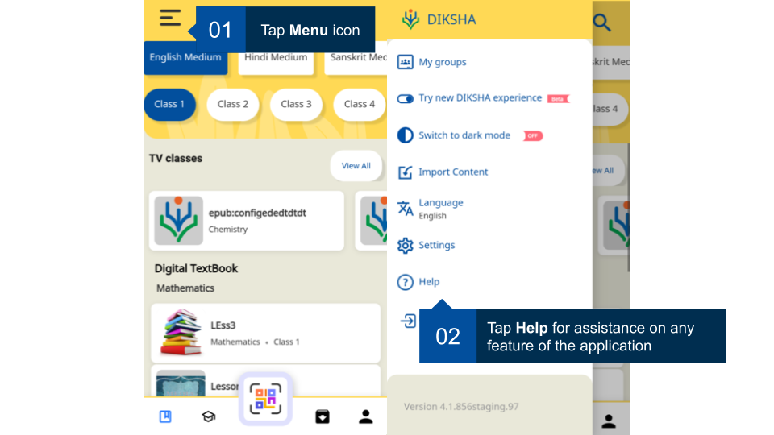

## Overview

The help section within the DIKSHA mobile app assists users get answers to the common problems they may encounter. It also provides a channel for user feedback and triggers an email for any problems encountered. You can access the help section from the main menu of the app. 

<table>
<tr>
  <th>Image with instructions</th>
</tr>
<tr>
  <td></td>
  </tr>
</table>
