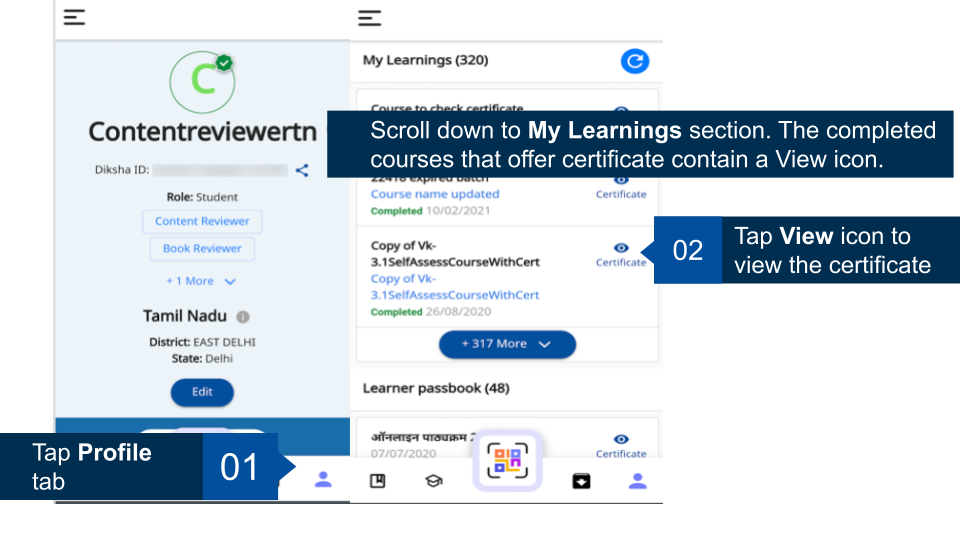
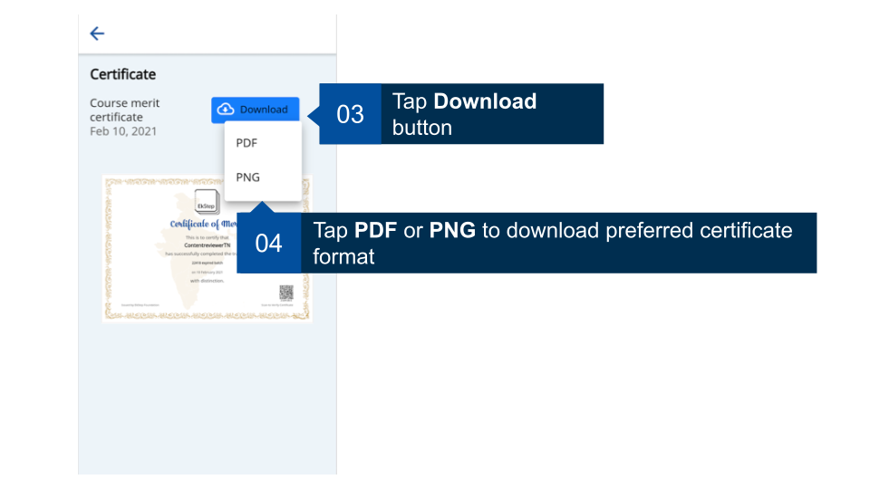
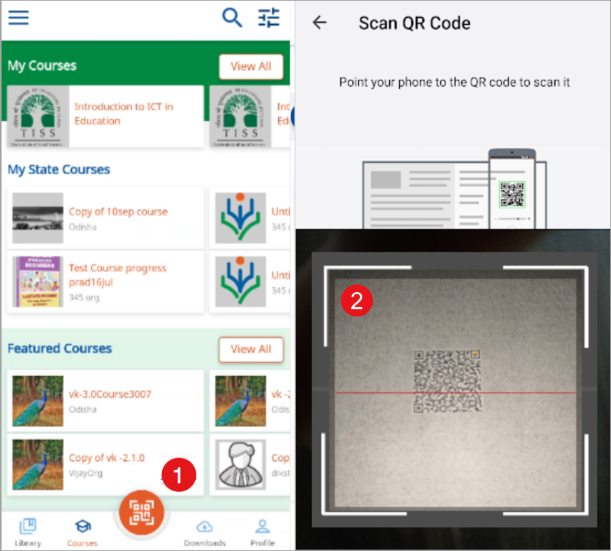
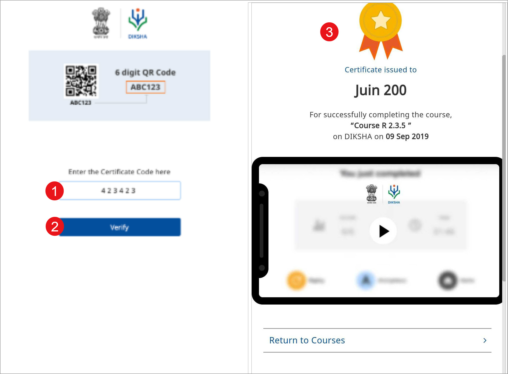

## Overview

DIKSHA offers certificates after you complete a recommended course. The course details card specifies if the course offers a certificate. Certificate are issued on completion of the course with the criteria of merit and best score of the user. An email or SMS is sent to the user when the certificate issued. The users can view them on the profile page.  

 Users can verify their certificate by scanning the QR code printed on the certificate with your mobile app.  After verifying the certificate, users can publish them on their profile. They are then visible to other users. Registered users can view and download the certificates in PDF and PNG formats. 

## Viewing and Downloading Certificates

Registered users can view the certificates on their profile details page. Once viewed, there will be an option to download the certificate. 
You can view and download certificates even when you are not connected to the internet. However, to be able to do so you should open the certificate at least once when you are connected to the internet. 

<b>Note</b>: The certificate is downloaded into your mobile storage
<table>
<tr>
  <th>Image with instructions</th>
</tr>
<tr>
  <td></td>
  </tr>
  <tr>
  <td></td>
  </tr>
</table>

## Verifying a Certificate

You must verify your certificate to ensure that all information such as name, date of completion and so on. 
To verify a certificate, print the certificate and scan the QR code printed on the bottom right corner of the certificate. 

<table>
  <tr>
    <th style="width:35%;">Step</th>
    <th style="width:65%;">Screen</th>
  </tr>
  <tr>
    <td>Using any of scaning app 
     1. Tap <b>Scan</b> 
     2. Focus the scanner over the printed QR code on the certificate to scan it</td>
    <td></td>
    </tr>
    <tr>
    <td>After a successful scan a URL is generated, tap to open the URL in a browser
     1. Enter the six digit code, printed on bottom of the QR code, of your certificate
     2. Tap <b>Verify</b> 
     <b>Note</b>: Correct QR code successfully validates the certificate. If the code is incorrect then re-enter the correct QR code as printed on the certificate.
     3. The details of the verified certificate is displayed
    </td>
    <td></td>
  </tr>
</table>
