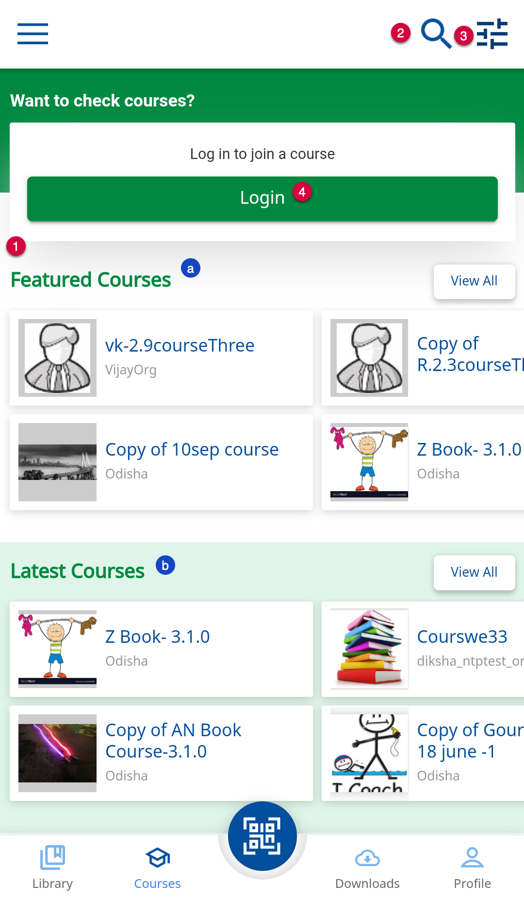
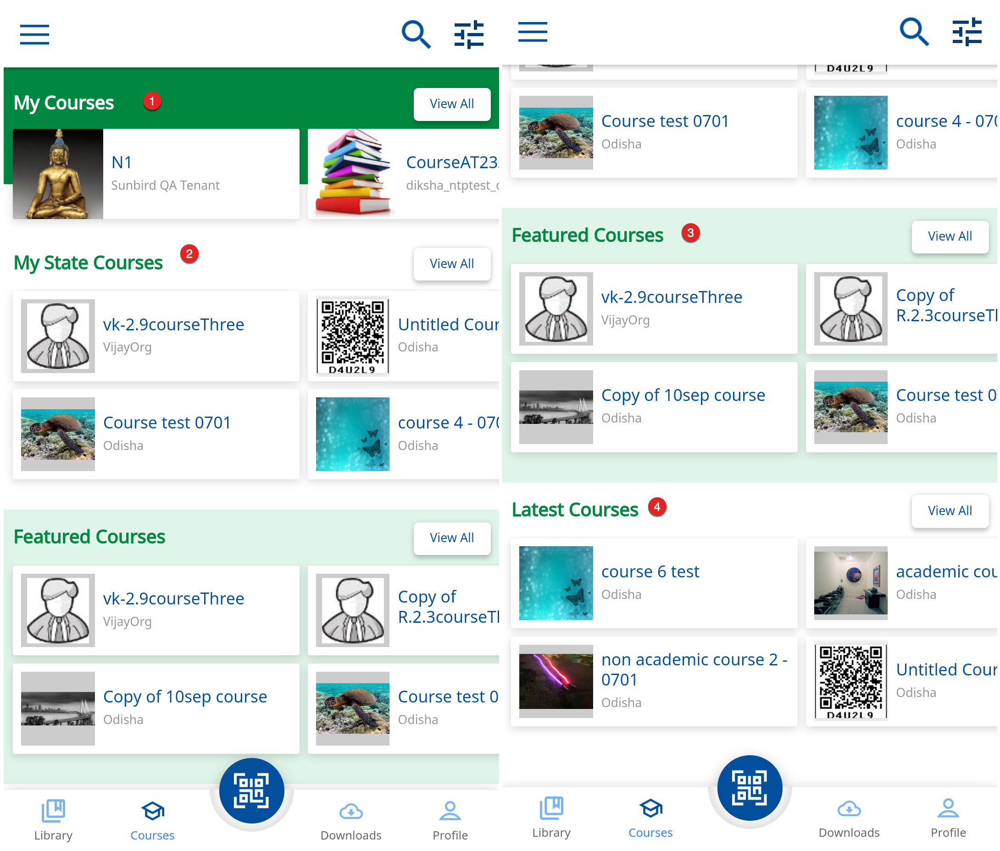
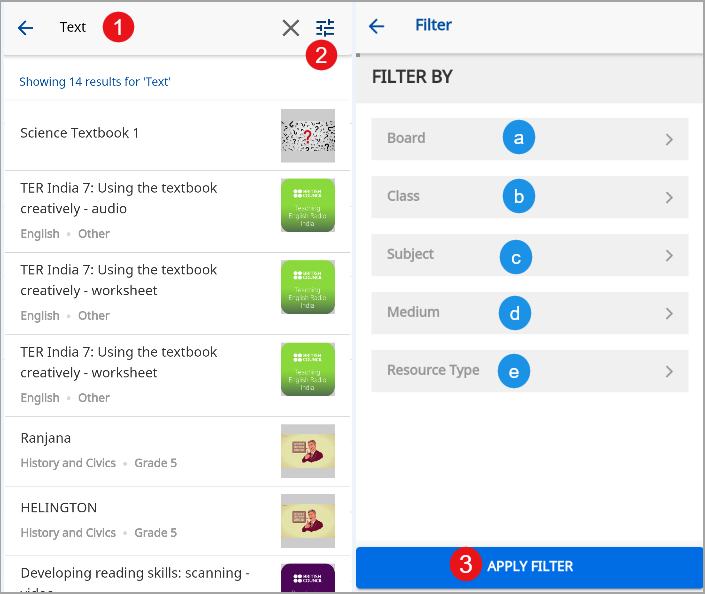
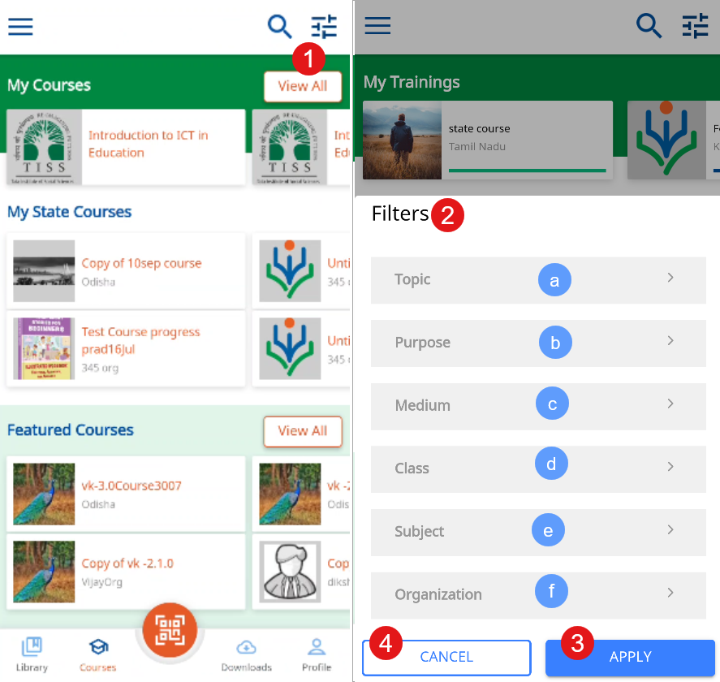
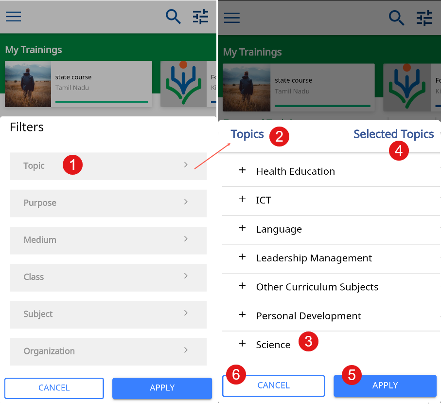
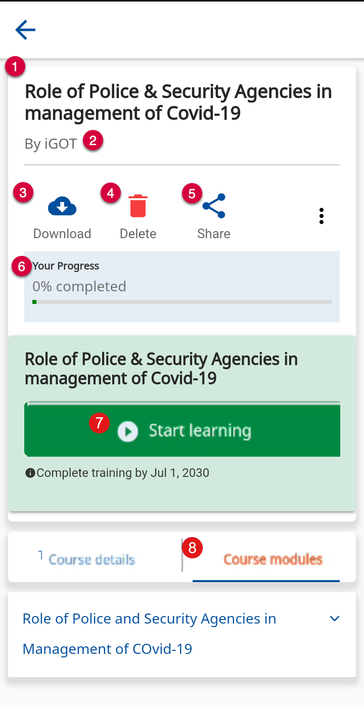
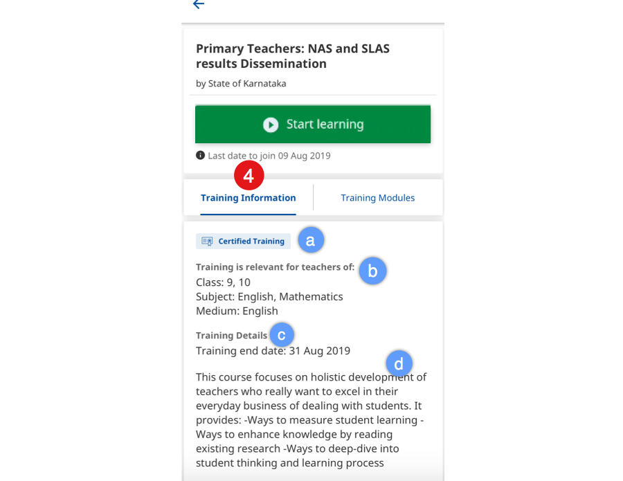
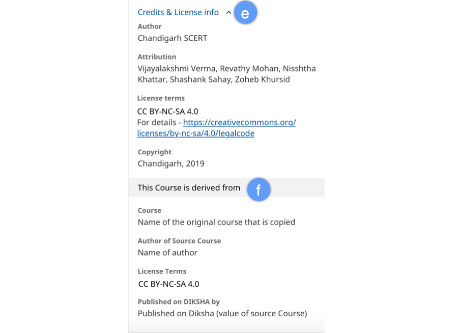
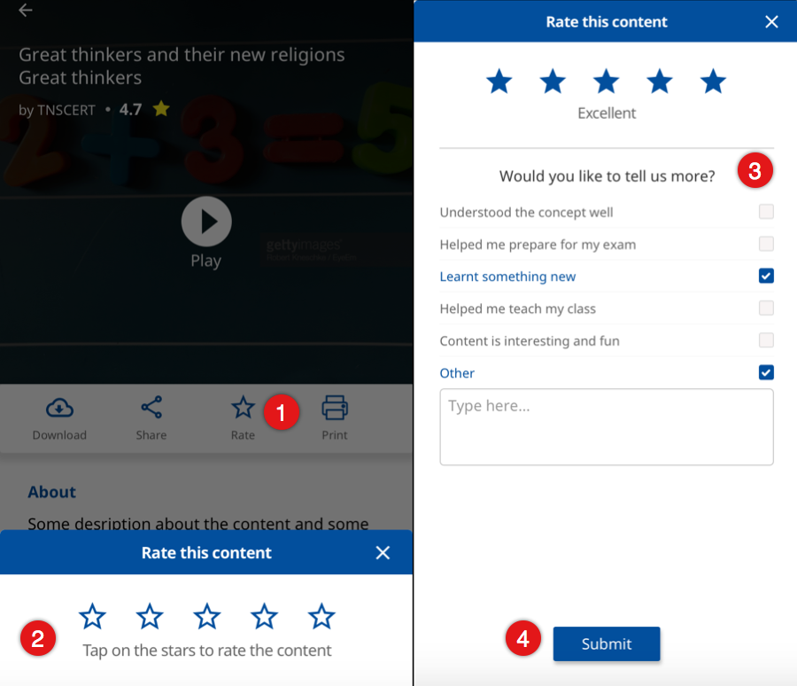
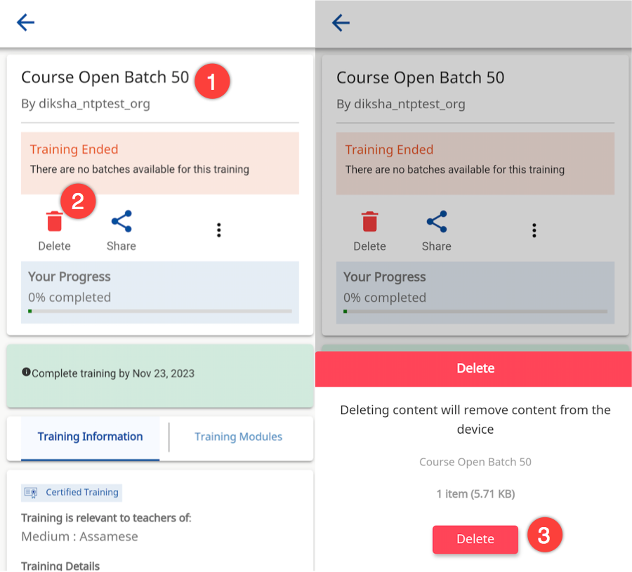

## Overview

The <b>Courses</b> tab lists the courses on DIKSHA that you can join. Here, you can perform the following actions:

- Explore and search for course
- View Courses details
- Join a course
- Take a course
- Leave a course
- Share a course with others
- Download a course on your device
- Delete a downloaded course
- Download certificate after completion of course

## Prerequisite

You are on the Course tab

### Searching and Filtering Courses

<table>
  <tr>
    <th style="width:35%;">Step</th>
    <th style="width:65%;">Screen</th>
  </tr>
  <tr>
    <td>For a guest user (one who has not logged in on DIKSHA), 
       1. The available courses are categorized as:
       &emsp;a. Featured Courses
       &emsp;b. Latest Courses
       2. Tap the <b>Search</b> icon and enter relevant keywords
       3. Tap the <b>Filter</b> icon to apply filters on your library content. For details refer, Search Using Filters
       4. Tap <b>Login</b> to login and join any course
    </td>
    <td></td>
  </tr>
  <tr>
  <td>For a logged in user, the available courses are categorized as:
       &emsp;a. My Courses
       &emsp;b. My State's Courses
       &emsp;c. Featured Courses
       &emsp;d. Latest Courses
    </td>
    <td></td>
  </tr>
  <tr>
    <td><b>Search Using Text</b>
       1. Enter the relevant text in the search textbox. The search results are displayed here
       2. Tap <b>Filter</b> button and refine the search result on the basis of
       &emsp;a. Board
       &emsp;b. Class
       &emsp;c. Subject
       &emsp;d. Medium
       &emsp;e. Resource Type
       3. Tap <b>APPLY FILTER</b> to refine the search results</td>
    <td></td>
  </tr>
  <tr>
    <td><b>Search Using Filters</b>
       1. Tap the <b>Filter</b> icon on the Courses screen
       2. Select one or more options from the following filter options:
       &emsp;a. <b>Topic</b>   For details refer <b>Searching with Topics</b>
       &emsp;b. <b>Purpose</b>
       &emsp;c. <b>Medium</b>
       &emsp;d. <b>Class</b>
       &emsp;e. <b>Subject</b>
       &emsp;f. <b>Organization</b>
       3. Tap <b>APPLY</b> to apply the filters
       4. Tap <b>CANCEL</b> to exit the screen</td>
    <td></td>
  </tr>
  <tr>
    <td><b>Searching with Topics</b>
       1. Tap <b>Topic</b> filter option
       2. The <b>Topics</b> screen is displayed with list of topics
       3. Tap <b>plus</b> icon and select one or more topic
       4. <b>Selected Topics</b> displays the number of topics selected
       5. Tap <b>APPLY</b> to search
       6. Tap <b>CANCEL</b> to go back to the previous screen</td>
    <td></td>
  </tr>
</table>

### Viewing Course Details

Tap a course card to view the course details page

<table>
  <tr>
    <th style="width:35%;">Step</th>
    <th style="width:65%;">Screen</th>
  </tr>
  <tr>
    <td>1. Name of the course
     2. Name of the course creator
     3. Click download icon to download the course
      4. Click delete icon to delete this course from the list of courses
      5. Click share icon to share this course with others
      6. The progress bar tracks the user's progress in completing the course
      7. Tap <b>Start Learning</b> to join in the course
     8. Tap <b>Course Modules</b> to view the different modules in the course
    </td>
    <td></td>
  </tr>
  <tr>
  <td>
    4. Tap <b>Course Information</b> to view the Course details. It contains the following sections:
     &emsp;a. <b>Certified Course</b>. This information is present only for the courses that are certified
     &emsp;b. Course is relevant for teachers of Class, Subject, and Medium
     &emsp;c. <b>Course details</b>
     &emsp;d. <b>Course description</b>
    </td>
    <td></td>
  </tr>
  <tr>
    <td>&emsp;e. <b>Credits and License info</b> 
      &emsp;f. <b>This course is derived from</b> contains the information of the source from where the course is copied
  </td>
  <td></td>
  </tr>
</table>

### Rating Content

Once you view the content the Rating Content option is displayed here

<table>
  <tr>
    <th style="width:35%;">Step</th>
    <th style="width:65%;">Screen</th>
  </tr>
  <tr>
    <td>1. Tap the <b>Exit</b> button once you finish the course
       A <b>Rate Content</b> pop up appears where you can rate the course
       2. Use the <b>Star</b> icons to rate
       3. Provide your feedback in the <b>Feedback</b> field
       Adding comments as feedback is optional
       4. Tap <b>Submit</b> to submit your rating and feedback
       <b>Note</b>: Rating option is not available for all kind of content apart from HTML content</td>
    <td></td>
  </tr>
</table>

### Deleting Content

<table>
  <tr>
    <th style="width:35%;">Step</th>
    <th style="width:65%;">Screen</th>
  </tr>
  <tr>
    <td>To delete the course content from your device
       1. Tap the course card under <b>My Courses</b> section
       2. Tap <b>Delete</b> icon. A <b>Delete</b> pop up is displayed
       3. Tap <b>Delete</b> The content will be deleted from your device storage
    </td>
    <td></td>
  </tr>
</table>

## Joining a Course

A registered user on DIKSHA can join, view, and leave the Course. For details refer <a href ="./enrolling-course.html">Join a Course</a>
