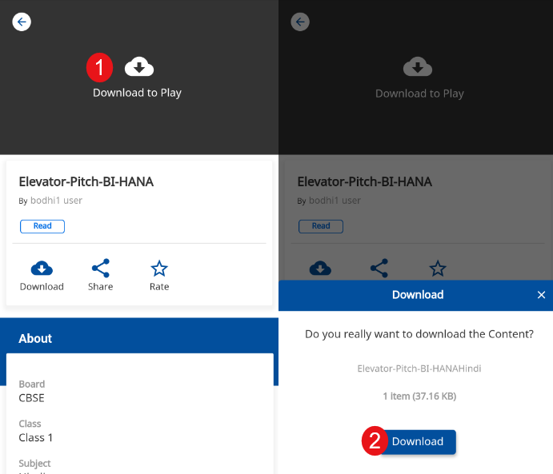
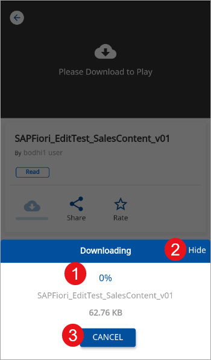
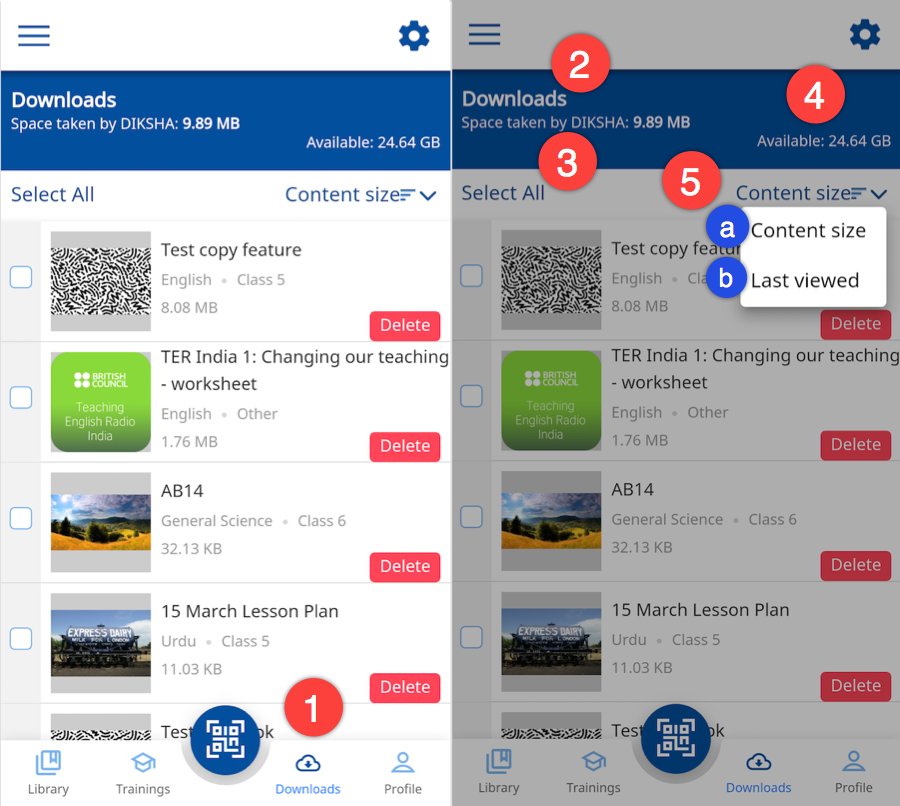
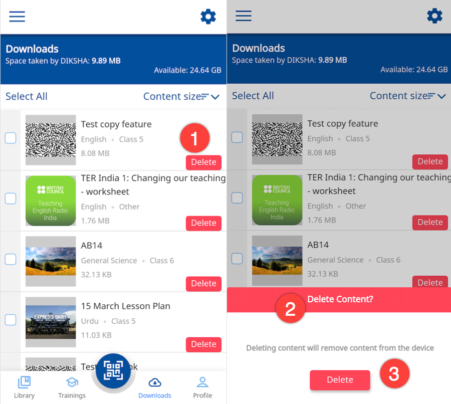
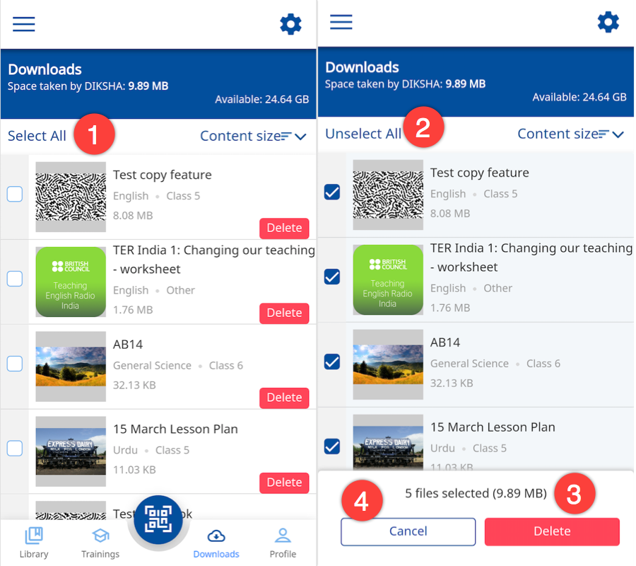
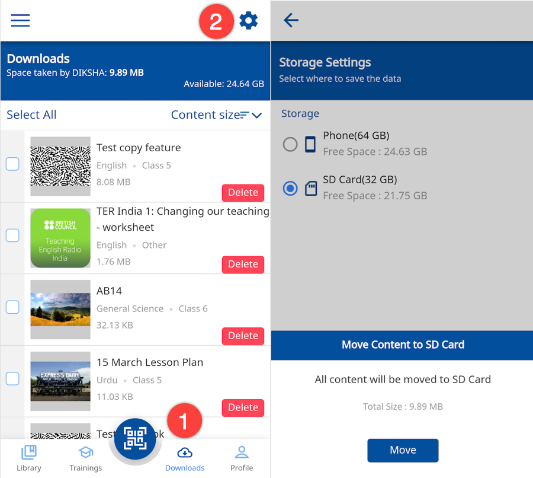
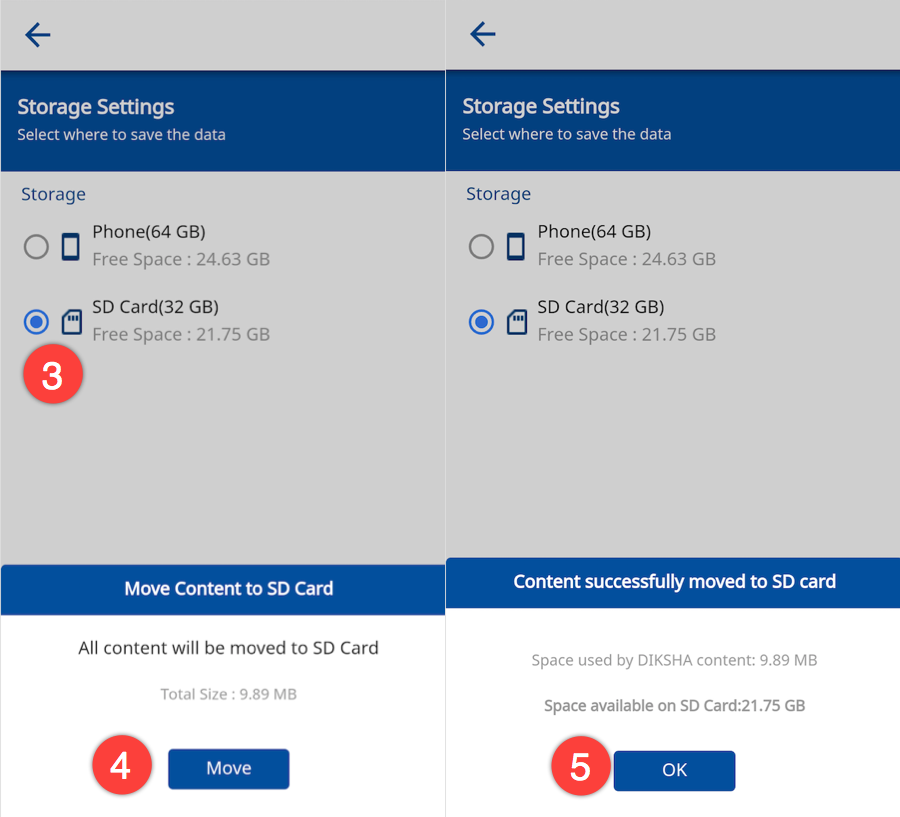
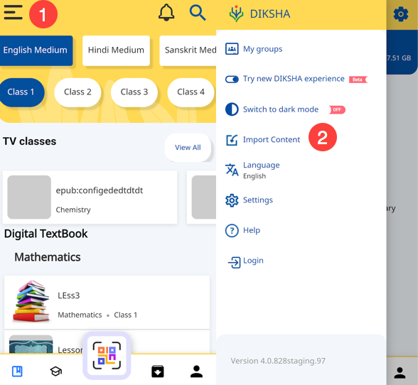
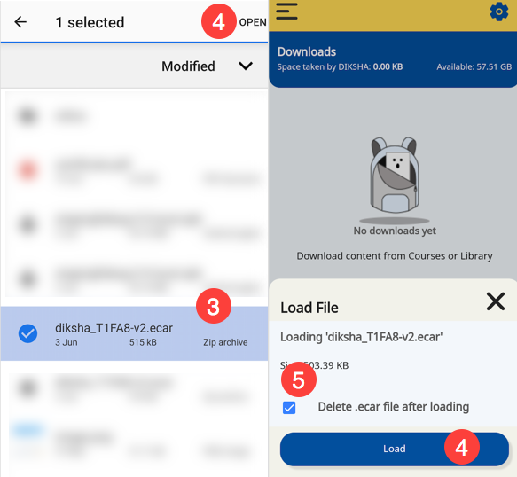

## Overview

DIKSHA offers users a wide range of content. The content available is either internal (hosted on the DIKSHA portal) or external (hosted by any third party). External content cannot be downloaded. However, you can view it using DIKSHA's in-built player. In case you are unable to play external content, you will see the content URL and can use it to view the content on an external browser. You can view all the content hosted internally on the DIKSHA portal. You can only download the internally hosted content of the following formats:

- EPUB
- WebM
- HTML zip file
- YouTube content
- PDF
- H5P
- MP4

## Downloading Content

<table>
  <tr>
    <th style="width:35%;">Step</th>
    <th style="width:65%;">Screen</th>
  </tr>
  <tr>
    <td>To download content on your device
       1. Tap any <b>Content card</b>
       2. Tap <b>Download</b></td>
    <td></td>
  </tr>
  <tr>
    <td>A temporary pop-up is displayed while the content is being downloaded
     1. You can view the progress of the download  
     2. Tap <b>Hide</b> to prevent the download pop-up being seen
     3. Tap <b>CANCEL</b> to stop downloading the content
     <b>Note</b>: The content is downloaded into your mobile storage</td>
    <td></td>
  </tr>
</table>

## Managing Downloads

<table>
  <tr>
    <th style="width:35%;">Step</th>
    <th style="width:65%;">Screen</th>
  </tr>
  <tr>
    <td>1. Tap the <b>Downloads</b> tab  
     2. The downloaded content is displayed here 
     3. Displays the space utilized by DIKSHA app on your mobile device 
     4. Displays the empty space on your mobile device 
     5. Tap <b>Content size</b> button to sort the content by: 
     &emsp;a. <b>Content size</b> 
     &emsp;b. <b>Last viewed</b>
     <b>Note</b>: The content list by default is sorted based on content size. It displays the largest file first</td>
    <td></td>
  </tr>
</table>

## Deleting Downloaded Content

The downloaded contents can be managed using the **Download** tab on the taskbar. To delete a downloaded content:  

<table>
  <tr>
    <th style="width:35%;">Step</th>
    <th style="width:65%;">Screen</th>
  </tr>
  <tr>
    <td><b>Deleting Single Content</b>
     1. Tap the <b>Delete</b> button on the content card to remove the content from your mobile
     2. The <b>Delete Content</b> pop-up is displayed
     3. Tap <b>Delete</b> button on the pop-up to confirm the deletion of the content from your mobile</td>
    <td></td>
  </tr>
  <tr>
    <td><b>Deleting Multiple Content</b>
     1. Tap <b>Select All</b> to select all the content. 
    Or, select multiple content by selecting the check-box placed beside each content card.
     2. The selected contents are highlighted
     3. Tap <b>Delete</b> to remove all the selected contents from your mobile
     4. Tap <b>Cancel</b> to go back to the previous page
    </td>
    <td></td>
  </tr>
</table>

## Managing Storage 

Once you download content using the DIKSHA app, the downloaded content gets saved in your phone storage. You can see all the downloaded content by tapping the <b>Download</b> tab.
 The downloaded content takes up phone storage space. To free space on your phone, you can transfer the downloaded content to an SD card.

<table>
  <tr>
    <th style="width:35%;">Step</th>
    <th style="width:65%;">Screen</th>
  </tr>
  <tr>
    <td><b>To manage your phone storage space: </b>
     1. Tap the <b>Downloads</b> tab. 
     2. Tap the <b>Settings</b> icon in the right top corner of the <b>Downloads</b> page.
     It displays the available device storage spaces (Phone and SD card). The default storage (Phone) is highlighted.
     <b>Note</b>: The SD card option is disabled if you do not have an SD card in your mobile. 
     
    </td>
    <td></td>
  </tr>
  <tr>
    <td> To move the downloaded content from your phone storage to SD card:
     3. Select the <b>SD Card</b> option
     4. Tap <b>Move</b> to transfer the content from your phone storage to SD card
      The transfer is successful when all the content is copied from Phone storage to SD card. You receive a success message "Content successfully moved to SD card"
     5. Click <b>OK</b> to go back to home page
     <b>Note</b>: If you cancel the transfer, the content is not moved to the SD card memory
      You can transfer the content back from SD card to phone storage using the same method
    </td>
    <td></td>
  </tr>
</table>

## Importing Content 

Import content in DIKSHA allows uesrs to import .ecar, .epar, and .gsa files from the mobile's downloads folder into the app. The user can then play the content online.

<table>
  <tr>
    <th style="width:35%;">Step</th>
    <th style="width:65%;">Screen</th>
  </tr>
  <tr>
    <td><b>To import content from your mobile's storage </b>
     1. Tap <b>Menu</b> 
     2. Tap <b>Import Content</b> 
    </td>
    <td></td>
  </tr>
  <tr>
    <td>
     3. Select the content file you want to import
     Note: Allow DIKSHA permissions
     4. Tap <b>OPEN</b>
     5. Select the option to load the content into your DIKSHA app and delete it from your phone's storage
     6.Tap <b>Load</b> 
    </td>
    <td></td>
  </tr>
  <tr>
    <td>
     The content file is imported and is present in the Downloads folder of your DIKSHA app.
    </td>
    <td></td>
  </tr>
</table>