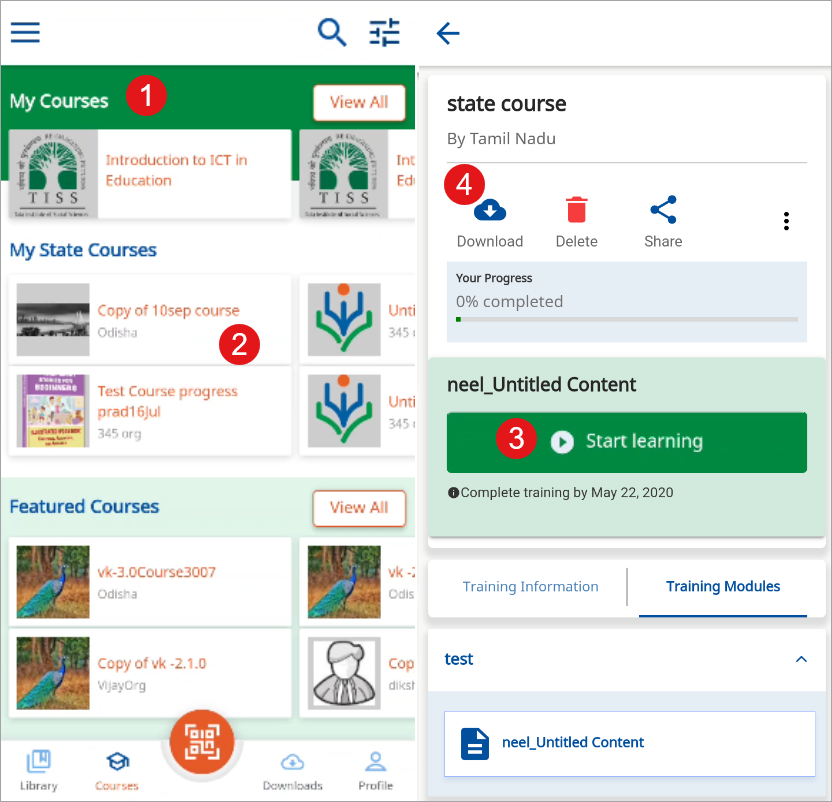
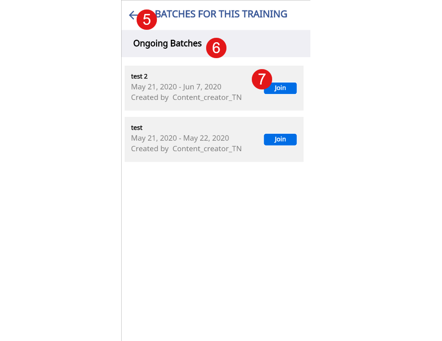
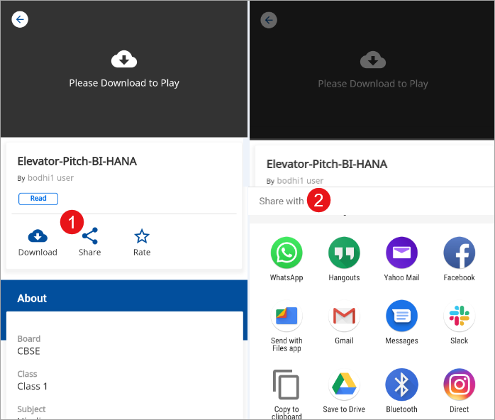

## Overview

DIKSHA offers a wide range of courses. Registered users can join these courses or are invited to join courses by the institute they are associated with. There are following types of courses available on DIKSHA:

- **My Courses**: This category displays the list of course that you have undertaken, have partially completed or recently joined. This list also includes the course that you are invited to join.   

- **My State Courses**: This category displays the list of State-specific course that is created and uploaded by the user's State. This list is visible only to users registered in that specific State. If you log in as an authenticated State user, you can join the course for any batch that is open for enrolment. The list displays the most recently created course at the top.   

- **Featured Courses**: This category displays all available course, irrespective of the organization that created it. Any logged-in user can join the course shown in this category.    

- **Latest Courses**: This category displays a list of the course most recently added to DIKSHA.  

Registered users can join any available batch of a course. The avaialble batch dates are displayed for all courses. If the enrolment date has been crossed, then a message, is displayed. For batches whose enrolment isn't open yet, a message, indicating the same is displayed.

The guidelines to take the course vary for each course. The creator or mentor decides the guidelines applicable for that specific course.   

### Joining a course

<table>
  <tr>
    <th style="width:35%;">Step</th>
    <th style="width:65%;">Screen</th>
  </tr>
  <tr>
    <td>1. Browse the course under <b>My courses</b> section
       2. Tap the course to open
       3. Tap <b>Start Learning</b> to start your course
       4. Tap <b>Download</b> icon to download the course
       <b>Note:</b> You can view all downloaded content offline</td>
    <td></td>
  </tr>
  <tr>
    <td>5. The <b>Batches for this course</b> page is displayed
       6. The following details of an upcoming or an ongoing batch is displayed
       &emsp;a. Start and end date of the batch
       &emsp;b. Batch creator
       &emsp;c. Last date of enrolment in a batch
       7. Tap <b>Join</b> to join the course
       <b>Note</b>1. You can join a course only when logged in as a registered user, else you have to log in and then join the course.
       2. Before starting the chosen course, you must to agree to the terms and policies of DIKSHA. The ‘Continue’ button on the pop-up is enabled only after you check the box. You cannot exit the pop-up without agreeing. 
       3. On clicking <b>Start Learning</b>, a pop is displayed. The name diplayed here is what would be dispalyed on the certificate, you can edit the name on this pop-up to make any changes required
       <b>Note</b>: You can resume a course in an ongoing batch,
        i.  provided the enrolment end date has not passed. 
        ii. from the section conducted just before the batch expired. 
It captures the cumulative progress of the two courses. You cannot join an expired batch, and once a batch has expired, the course's progress will not get updated.
      </td>
    <td></td>
  </tr>
</table>

To know more on features of taking a course, refer

- <a href = "../courses/enrolling-course.html#resuming-a-course" target="_blank">Resuming a Course</a>  
- <a href = "../courses/enrolling-course.html#accessing-course-after-batch-expiry" target="_blank">Accessing Course after Batch Expiry</a>

### Completing a Course

On DIKSHA, there are two types of courses, those with certificates and those with no certificates. A note is displayed on the course details page to indicate if the course has a certificate. On successfully completing a course  a course completion message is displayed. For courses with certificates, details of the certificate are also mentioned. For details on downloading course certificate refer <a href="./certificates.html" target="_blank">Course Certificates</a>

Courses can also have assessments. Completing the assessments are sometimes determiners to indicate the completion of a course. Course mentors can add assessments at the end of the course or for each module of the course. While taking assessments, there can be one or many attempts to take the assessment. When the user is on the final attempt, a message is displayed to notify the user. Once the user has crossed the assessment's maximum attempts, they can not retake the assessment, and a message is displayed to inform the user.

### Leaving a Course

Any registered user can use the <b>Leave course</b> feature if they want to leave from the course.

 Users can leave a course under the following conditions:

- The course is selected from **Featured course** section
- The course is not completed
- The course batch is not expired

<table>
  <tr>
    <th style="width:35%;">Step</th>
    <th style="width:65%;">Screen</th>
  </tr>
  <tr>
    <td>Search for the course by entering the course name in search bar. The course is displayed as a search result
     1. Select a course from the <b>My courses</b> section   
    2. Tap the course to open the course details page
        <b>Note</b>: Each time a course is updated, the details of the update are displayed 
    </td>
    <td></td>
  </tr>
  <tr>
    <td>
      1. Tap the burger menu icon
       2. Tap <b>Leave Course</b>
       3. The Leave course pop-up box is displayed
       4. Tap <b>Confirm</b> to leave the course
       5. Tap <b>Cancel</b>
    </td>
    <td></td>
  </tr>
</table>
### Sharing Content

<table>
  <tr>
    <th style="width:35%;">Step</th>
    <th style="width:65%;">Screen</th>
  </tr>
  <tr>
    <td>Tap a course card to open the course
       1. Tap <b>Share</b> icon to share the course content 
       2. Select a channel to share the course from different options
    </td>
    <td></td>
  </tr>
</table>

To understand the various feature offered by the content player while taking the course

  - [Inbuilt Content Player](../courses/enrolling-course.html#inbuilt-content-player){:target="_blank"}: On clicking on the course material links, the course content is displayed in the inbuilt content player

  - [Content Player Menu](../courses/enrolling-course.html#content-player-menu){:target="_blank"}: On clicking the course player menu for the content player options, the name of the course is displayed on the header

  - [Taking Notes](../courses/enrolling-course.html#taking-notes){:target="_blank"}: You can maintain separate notes for each course that you take

After you complete the course <a href = "./certificates.html" target="_blank">Download Certificates</a>, <a href = "./certificates.html" target="_blank">Verify Certificates</a>
