## Overview

You can create multiple groups with different roles and permissions to access DIKSHA content. These groups can have multiple members and different activities assigned to group or members.

### Prerequisites

<table>
<tr>
  <th>Image with instructions</th>
</tr>
<tr>
  <td>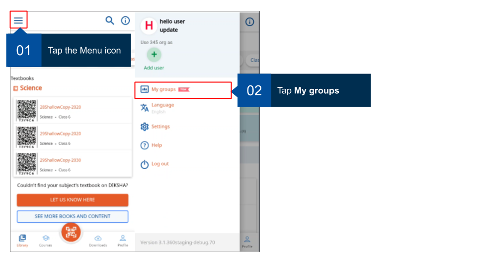</td>
  </tr>
</table>

### Creating Group

Any registered user can create groups. The user who creates the group automatically becomes the group administrator. 
A group administrator can 

- add members to the group
- designate another user as administrator
- monitor group
- share content with other members
- monitor member activity for usage, progress and performance statistics of each activity assigned to the group.

As a Group Admin, I want to see usage metrics of all activities assigned to the group, So that I can monitor the health of Group and take necessary actions as needed activities on the mobile app

This section provides step-by-step instruction on how to create groups on DIKSHA.

**Note**: It is mandatory to accept DIKSHA's terms of use to create a group. An error message is displayed when trying to create a group without accepting the terms of use.

<table>
<tr>
  <th>Image with instructions</th>
</tr>
<tr>
  <td>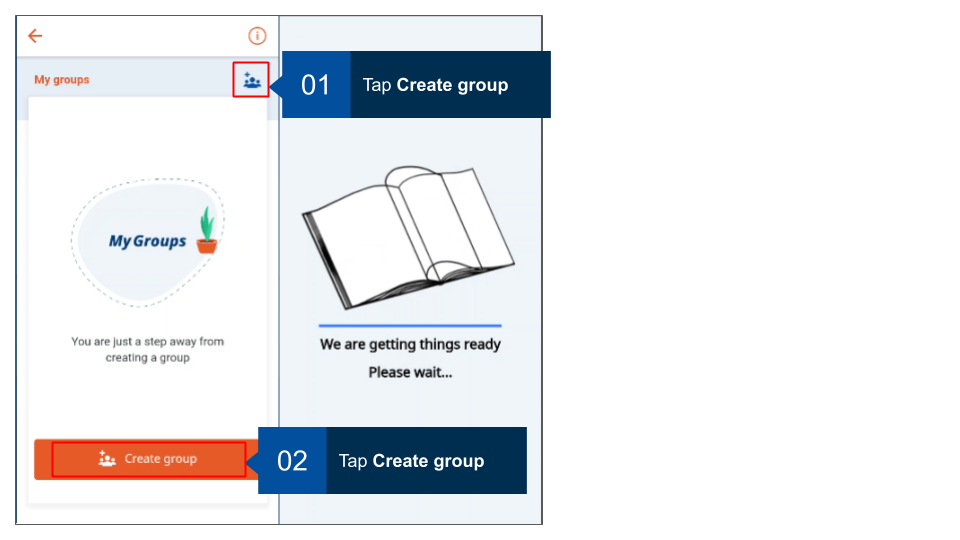</td>
  </tr>
  <tr>
  <td>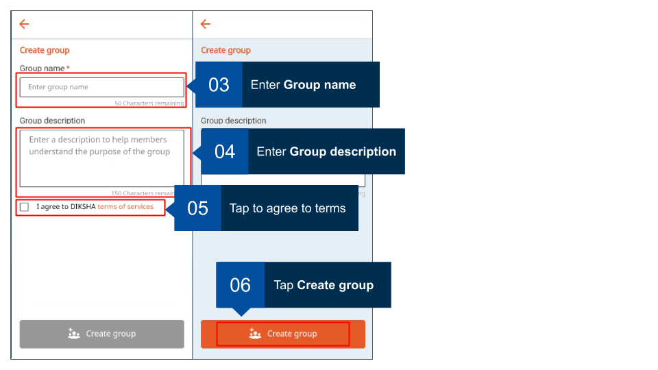</td>
  </tr>
  <tr>
  <td>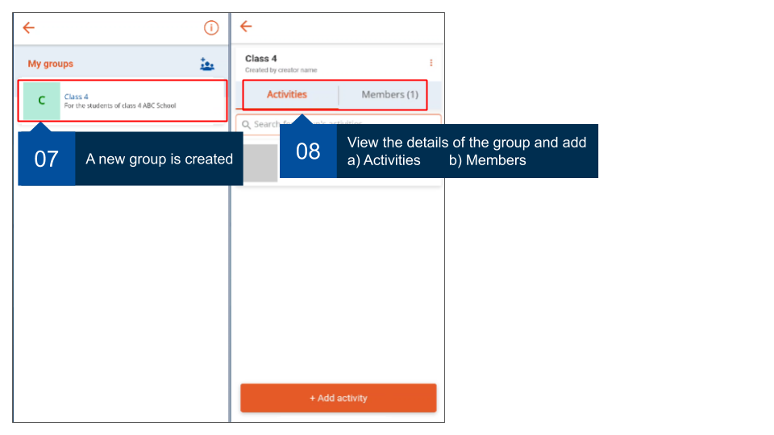</td>
  </tr>
    <tr>
  <td>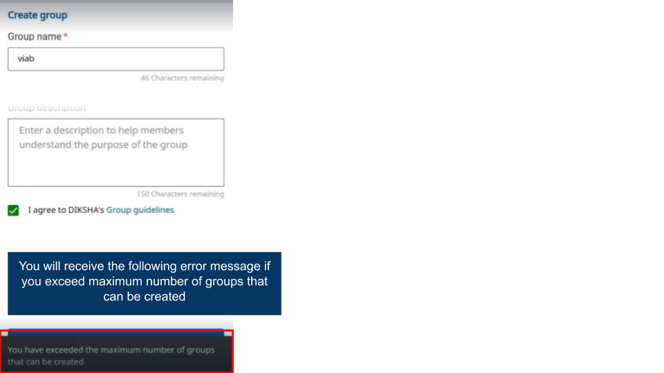</td>
  </tr>
</table>

### Editing a group

<table>
<tr>
  <th>Image with instructions</th>
</tr>
<tr>
  <td>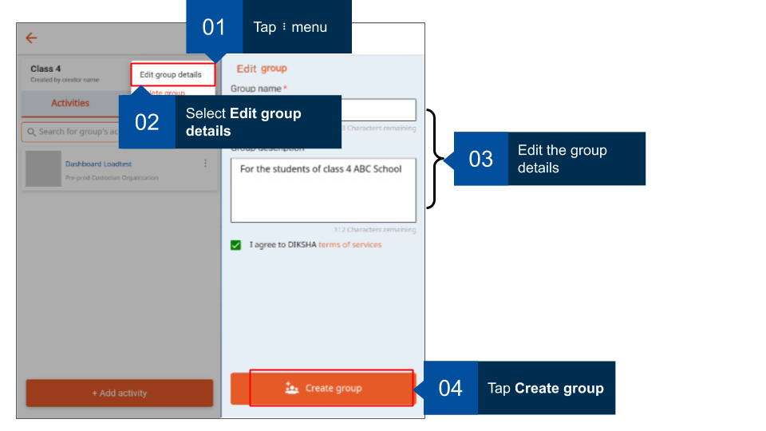</td>
  </tr>
</table>

### Deleting a group

<table>
  <tr>
    <th>Image with instructions</th>
  </tr>
<tr>
  <td></td>
</tr>
</table>

### Adding members to the group

As a group administrator, you can add members to your groups. Ensure you have the valid DIKSHA ID of all users that you would like to add as members. 

<table>
<tr>
  <th>Image with instructions</th>
</tr>
<tr>
  <td>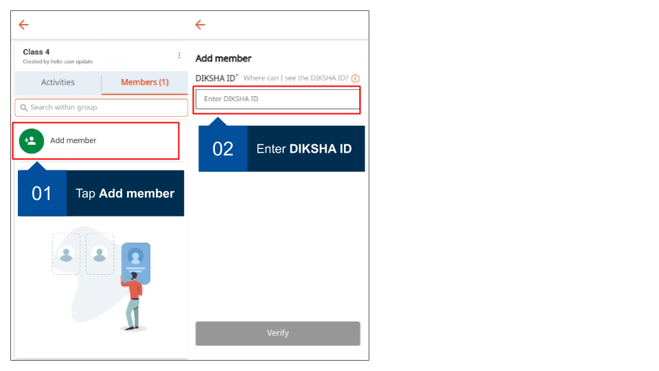</td>
  </tr>
    <tr>
  <td>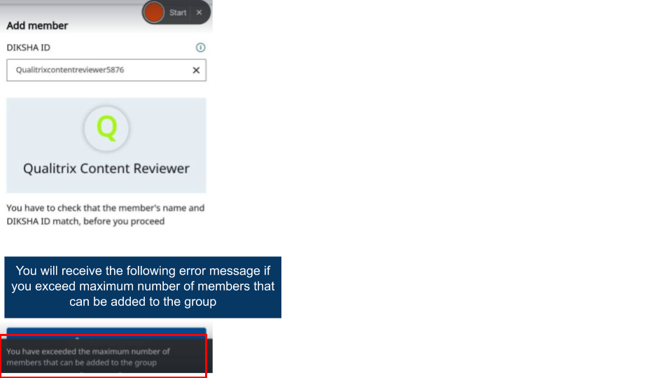</td>
  </tr>
</table>

### Assigning admin role to member

The default group administrator (the group creator) can promote group members as group admins thereby giving them additional rights and permissions. 

<table>
<tr>
  <th>Image with instructions</th>
</tr>
<tr>
  <td>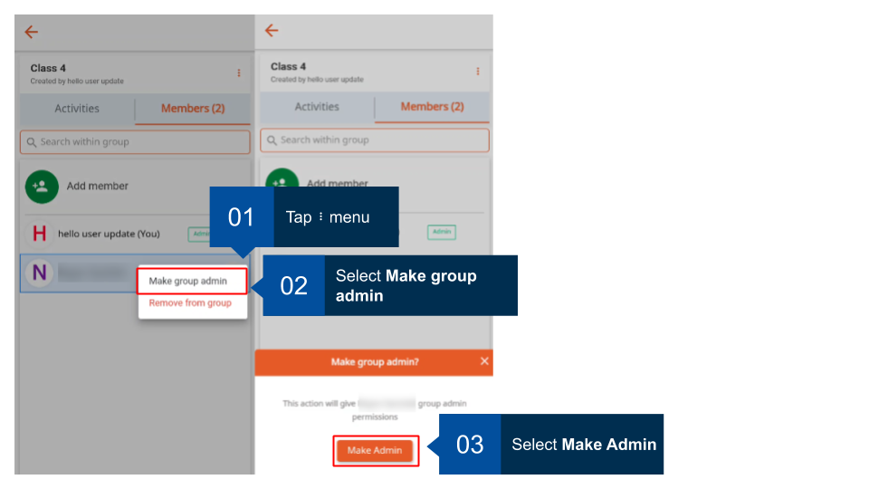</td>
  </tr>
</table>

### Dismiss as admin

The registered user who creates a group is the default group administrator. Only the default group administrator can take away group admin status from other members who are designated group administrators.

<table>
<tr>
  <th>Image with instructions</th>
</tr>
<tr>
  <td>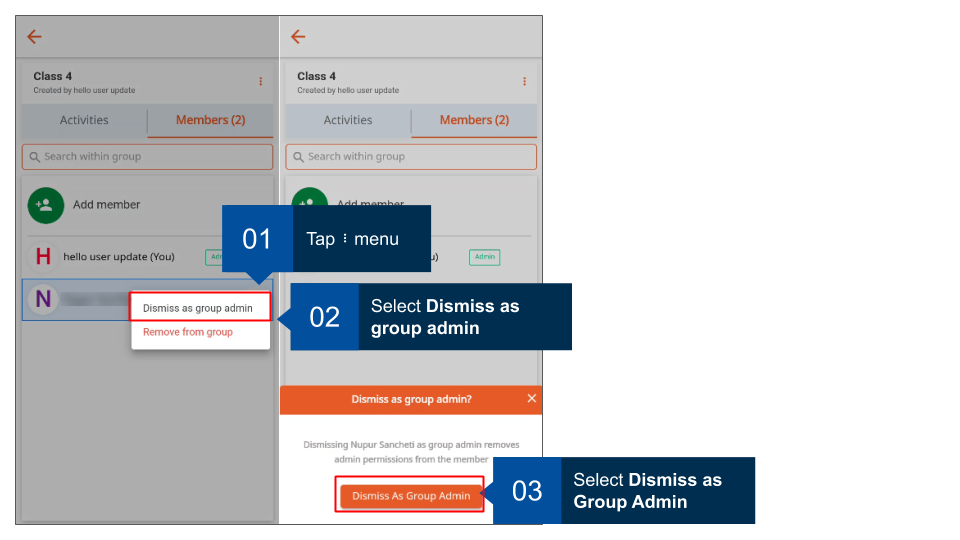</td>
  </tr>
</table>

### Removing members from a group

Group administrators can remove members from the group. 

<table>
<tr>
  <th>Image with instructions</th>
</tr>
<tr>
  <td>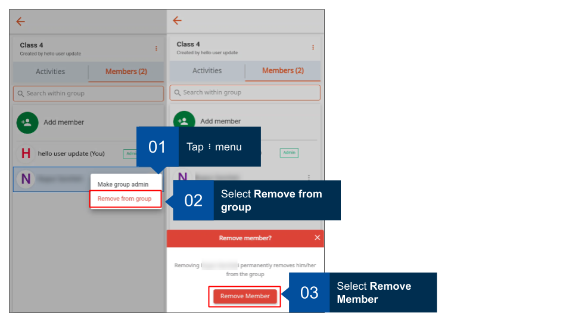</td>
  </tr>
</table>

### Adding activity to group

As a group administrator, you can add activities for the group. Courses too are added as activities. Members can join and complete these courses. 

<table>
<tr>
  <th>Image with instructions</th>
</tr>
<tr>
  <td>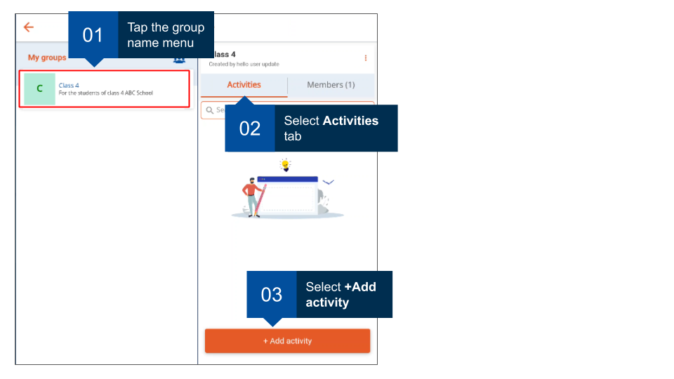</td>
  </tr>
  <tr>
  <td>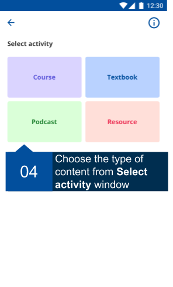</td>
  </tr>
  <tr>
  <td>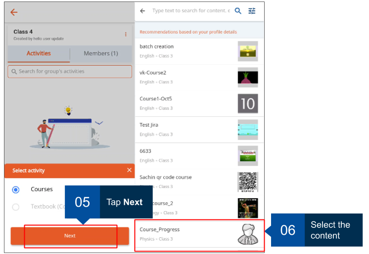</td>
  </tr>
    <tr>
  <td>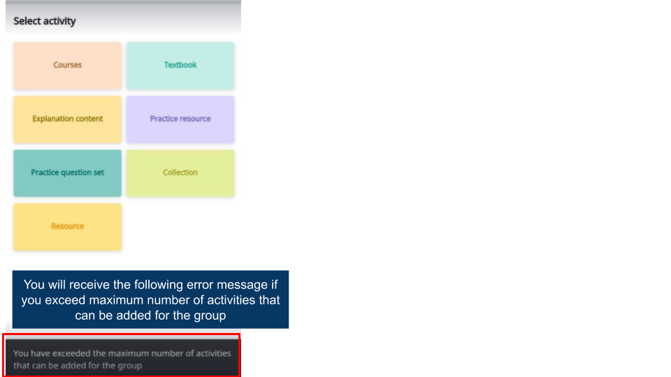</td>
  </tr>
</table>

### Removing activity from a group

Group administrators can remove any activity that has been added for the group. 

<table>
<tr>
  <th>Image with instructions</th>
</tr>
<tr>
  <td>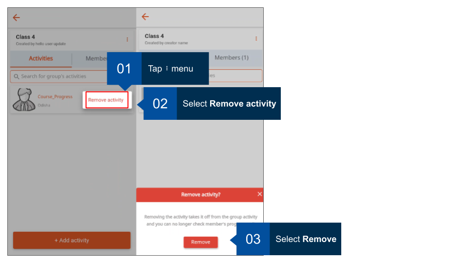</td>
  </tr>
</table>

### Tracking member's progress

Group administrators can track progress made by each member in the group. 

<table>
<tr>
  <th>Image with instructions</th>
</tr>
<tr>
  <td>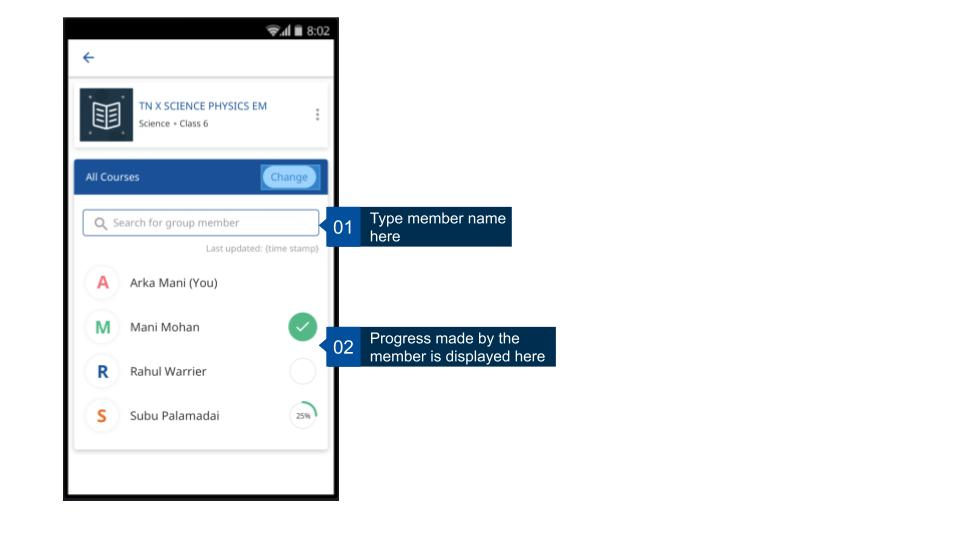</td>
  </tr>
</table>
